# LAEF Framework Architecture Overview

| Field | Value |
|-------|-------|
| Document ID | LAEF-004 |
| Document Title | LAEF Framework Architecture Overview |
| Book | LAEF — LOUTAS AI Engineering Framework |
| Knowledge Base Area | 16-AI-Engineering-Framework |
| Framework Layer | Core / Governance |
| Version | 1.0 |
| Status | Approved |
| Owner | Enterprise AI Governance Office |
| Approval Authority | Product Owner |
| Review Cycle | Annual, and on every major LAEF milestone |
| Last Updated | 2026-07-29 |

---

# Purpose

This document is the **definitive architecture overview** of the LOUTAS AI Engineering Framework (LAEF).

It describes the layered structure of the framework, the responsibility of each layer, how a contribution flows through the framework, how an AI Agent interacts with the surrounding systems, and how the framework relates to the two-tier governance/execution model and the Knowledge Base. Each architectural view is provided as narrative plus a diagram in both **Mermaid** (for GitHub readability) and **PlantUML** (for enterprise documentation), and every diagram is accompanied by an explanatory paragraph so the architecture is fully understandable even when diagrams cannot be rendered.

This document establishes architectural structure, invariants, and boundaries. Detailed layer specifications and the internal design of the core engines are deferred to later LAEF documents.

---

# Scope

This document applies to every AI system that contributes to LOUTAS Care — referred to throughout as **"The AI Agent"** — and to every human role that directs or reviews that contribution.

It defines the architecture of the framework itself, not the architecture of the LOUTAS Care product. It is subordinate to *LAEF-001 Framework Vision & Mission*, expresses the principles of *LAEF-002 Core Principles & Philosophy* as architecture, and operates within the boundary defined by *LAEF-003 Scope & Objectives*.

---

# 1. Architectural Invariants

The architecture is bound by a small set of non-negotiable properties. Every layer, every diagram, and every future detailed design shall preserve these:

- **Model-agnostic.** No layer depends on the identity of a specific AI system. Any AI Agent can occupy the Agent Layer without redesign.
- **Knowledge-authoritative.** The Knowledge Layer is the source of truth; no layer may act against approved knowledge or architecture.
- **Human-in-the-loop at gates.** Authority to accept work rests with humans; the architecture routes every contribution through a human approval point.
- **Governance and execution are separated.** Governance layers define the rules; execution layers apply them. The separation is structural, not merely organizational.
- **Single source of truth.** Each fact, rule, and decision has one authoritative home; the architecture references rather than duplicates.

---

# 2. The Nine-Layer Internal Architecture

LAEF is organized internally into **nine layers**, grouped into four tiers. The upper tiers govern; the lower tiers execute; assurance and evolution wrap the whole. This is the *internal* structure of the framework; Section 4 gives the complementary *system-level* view.

**Mermaid**

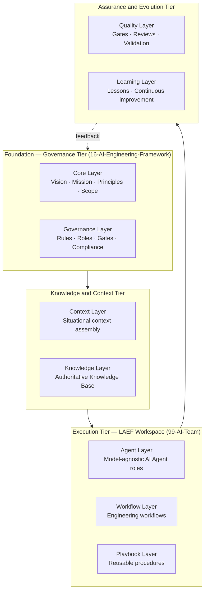

**PlantUML**

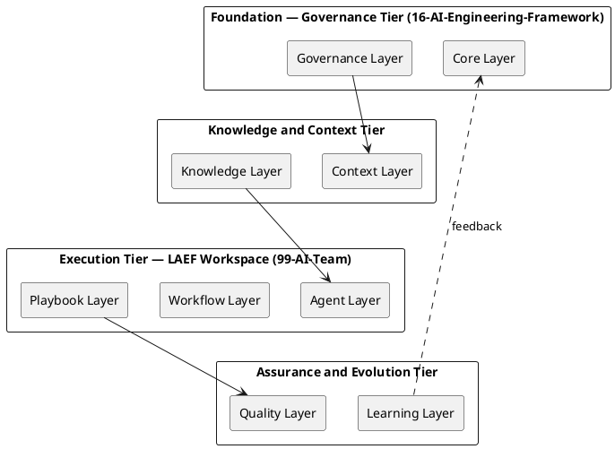

**Explanation.** The framework rests on a Foundation tier (Core and Governance) that holds its identity and rules. The Knowledge and Context tier connects the framework to authoritative knowledge and to the specifics of each task. The Execution tier — the LAEF Workspace — is where the AI Agent actually performs work through defined workflows and playbooks. The Assurance and Evolution tier applies quality gates and captures learning, feeding improvements back to the Foundation. Work always moves downward from governance into execution and outward into assurance, while learning loops back upward.

## 2.1 Foundation Tier (Governance)

- **Core Layer.** The foundational identity of the framework — vision, mission, principles, and scope. Defined by LAEF-001, LAEF-002, and LAEF-003.
- **Governance Layer.** The rules, roles, approval gates, compliance expectations, and exception handling. Defined by LAEF-005.

## 2.2 Knowledge and Context Tier

- **Context Layer.** Assembles the situational context for a task: current project state, active work, the request, and constraints.
- **Knowledge Layer.** Integrates the authoritative Knowledge Base — architecture, ADRs, standards, prior decisions — as the single source of truth.

## 2.3 Execution Tier (LAEF Workspace)

- **Agent Layer.** The model-agnostic definition of AI Agent roles and behavior — the plug-in point for any AI system.
- **Workflow Layer.** The defined engineering workflows the AI Agent follows.
- **Playbook Layer.** Reusable, task-specific procedures for recurring scenarios.

## 2.4 Assurance and Evolution Tier

- **Quality Layer.** Quality gates, reviews, validation, and acceptance criteria.
- **Learning Layer.** Capture and application of engineering lessons.

---

# 3. Layer Responsibilities

| Layer | Primary Responsibility | Governed / Executed | Defined By |
|-------|------------------------|---------------------|------------|
| Core | Framework identity and invariants | Governance | LAEF-001 / LAEF-002 / LAEF-003 |
| Governance | Rules, roles, gates, compliance | Governance | LAEF-005 |
| Context | Situational context assembly | Bridge | Detailed design *(later)* |
| Knowledge | Authoritative Knowledge Base integration | Bridge | Detailed design *(later)* |
| Agent | Model-agnostic AI Agent roles | Execution | LAEF Workspace |
| Workflow | Engineering workflows | Execution | LAEF Workspace |
| Playbook | Reusable procedures | Execution | LAEF Workspace |
| Quality | Gates, reviews, validation | Assurance | LAEF-005 / LAEF Workspace |
| Learning | Lessons and continuous improvement | Assurance | LAEF Workspace |

---

# 4. System-Level Layered View

This view zooms out from the framework's internals to show LAEF's place within the wider LOUTAS Care system as five macro layers. It is consistent with — not a replacement for — the nine internal layers of Section 2: the nine layers describe LAEF's internal structure, while these five describe how LAEF sits between governance, knowledge, and the delivered product.

**Mermaid**

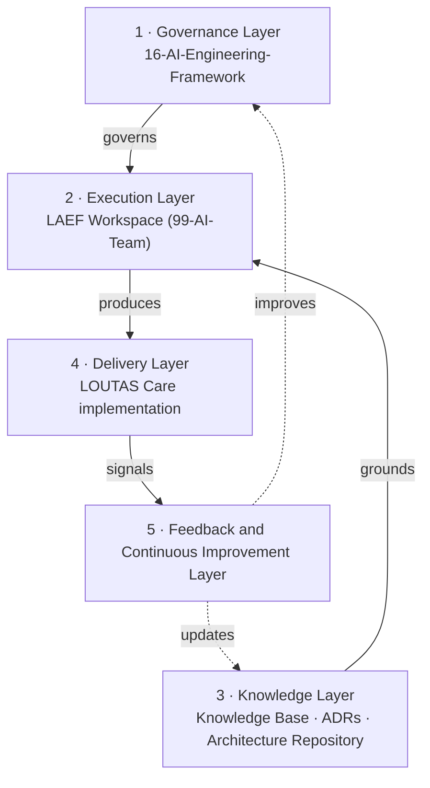

**PlantUML**

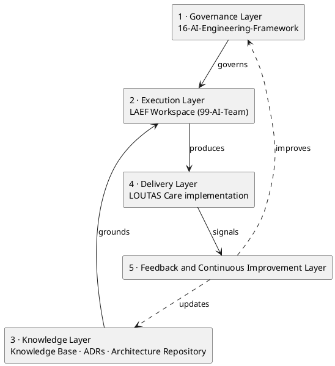

**Explanation.** The Governance Layer (16-AI-Engineering-Framework) sets the rules that govern the Execution Layer (LAEF Workspace). The Knowledge Layer — the Knowledge Base, ADRs, and Architecture Repository — grounds execution in authoritative truth. Execution produces the Delivery Layer, the actual LOUTAS Care implementation. The Feedback and Continuous Improvement Layer observes delivery outcomes and feeds improvements back into both governance and knowledge, closing the loop. This is how LAEF connects rules, knowledge, and the real product without any layer overreaching another's authority.

---

# 5. Layer Interaction Flow

This flow shows how a single contribution moves through the internal layers, enforcing the invariants at each step.

**Mermaid**

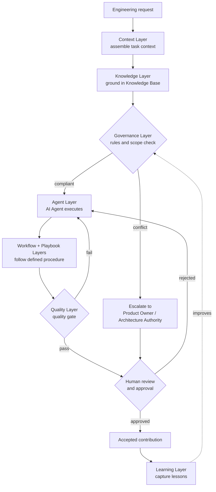

**PlantUML**

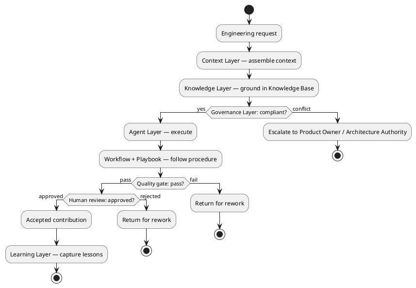

**Explanation.** A request is first given context and then grounded in the Knowledge Base before anything else happens. The Governance Layer checks it against the rules and scope; a conflict is escalated to human authority rather than resolved silently. Only compliant, knowledge-grounded work reaches the Agent Layer, which executes through defined workflows and playbooks. The Quality Layer gate returns failing work for rework. Every contribution that passes must still clear human review before it is accepted, after which the Learning Layer captures lessons that improve future governance.

---

# 6. Engineering Workflow

This is the end-to-end engineering workflow an AI Agent follows for a unit of work, expressed as ordered stages rather than layers.

**Mermaid**

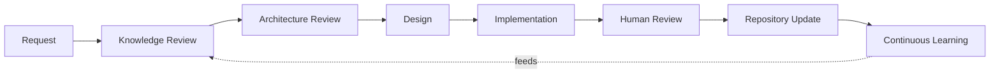

**PlantUML**

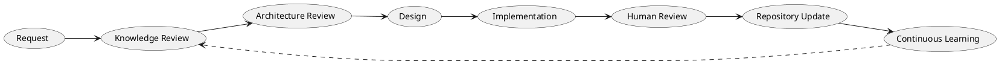

**Explanation.** Every unit of work begins with a Request and immediately a Knowledge Review, so the AI Agent starts from authoritative knowledge rather than assumption. Architecture Review confirms alignment with approved architecture before any Design or Implementation. Human Review is a mandatory gate before any Repository Update — no artifact is committed without human approval. Continuous Learning captures what was learned and feeds it back into the next Knowledge Review, so the workflow improves with use. This ordering is the operational expression of the invariants in Section 1.

---

# 7. AI Interaction Model

This view shows how the AI Agent interacts with the systems and people around it. The AI Agent is a participant governed by the framework, not an autonomous authority.

**Mermaid**

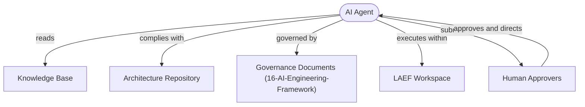

**PlantUML**

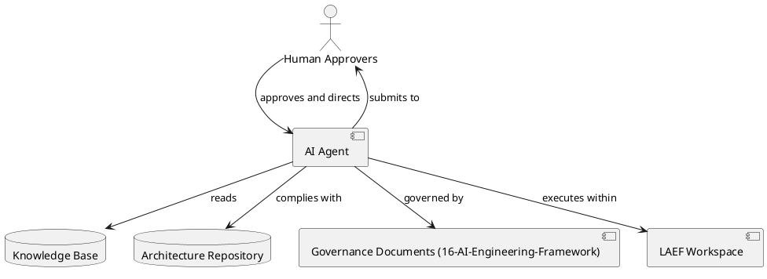

**Explanation.** The AI Agent reads from the Knowledge Base and complies with the Architecture Repository — it consumes authoritative knowledge and never overrides it. It is governed by the Governance Documents in 16-AI-Engineering-Framework and executes within the LAEF Workspace. Critically, all of the AI Agent's output flows to Human Approvers, who approve and direct it; authority runs from the humans back to the AI Agent, never the reverse. This diagram makes the human-in-the-loop invariant explicit at the interaction level.

---

# 8. Document Dependency Map

This map shows how the LAEF governance documents depend on one another. The spine is a chain from LAEF-001 through LAEF-007; each document builds on those before it.

**Mermaid**

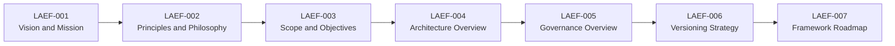

**PlantUML**

```plantuml
@startuml
left to right direction
(LAEF-001\nVision and Mission) --> (LAEF-002\nPrinciples and Philosophy)
(LAEF-002\nPrinciples and Philosophy) --> (LAEF-003\nScope and Objectives)
(LAEF-003\nScope and Objectives) --> (LAEF-004\nArchitecture Overview)
(LAEF-004\nArchitecture Overview) --> (LAEF-005\nGovernance Overview)
(LAEF-005\nGovernance Overview) --> (LAEF-006\nVersioning Strategy)
(LAEF-006\nVersioning Strategy) --> (LAEF-007\nFramework Roadmap)
@enduml
```

**Explanation.** LAEF-001 establishes vision and mission and is the root on which everything else depends. LAEF-002 derives its principles from that vision; LAEF-003 bounds the scope those principles apply to; LAEF-004 (this document) structures the architecture within that scope; LAEF-005 governs and enforces the architecture; LAEF-006 versions the whole; and LAEF-007 sequences its evolution. The chain is directional — a change high in the chain may require review of documents below it, but never the reverse — which keeps the framework internally consistent as it grows.

---

# 9. Mapping to the Two-Tier Structure

| Tier of the two-tier model | Area | Layers it owns |
|----------------------------|------|----------------|
| Governance | **16-AI-Engineering-Framework** | Core, Governance |
| Execution | **LAEF Workspace** *(evolved from 99-AI-Team)* | Agent, Workflow, Playbook |
| Shared / spanning | Both, coordinated by governance | Context, Knowledge, Quality, Learning |

The Context, Knowledge, Quality, and Learning layers span both tiers: they are *defined* by governance (16-AI-Engineering-Framework) and *operated* within execution (LAEF Workspace). Governance authority for all layers resides in 16-AI-Engineering-Framework.

---

# 10. Relationship to the Knowledge Base

The Knowledge and Context layers are the framework's connection to the LOUTAS Care Knowledge Base.

- The **Knowledge Layer** treats the Knowledge Base — architecture, ADRs, standards, governance, prior decisions — as authoritative and read-first. The framework consumes approved knowledge; it does not override it.
- The **Context Layer** narrows that knowledge to what is relevant for the specific task, combined with current project state.

Where the AI Agent's reasoning conflicts with approved knowledge or architecture, the architecture requires deference to the Knowledge Base and escalation through the Governance Layer.

---

# 11. Core Engines (Overview)

The layers are realized operationally by a set of **core engines**. Their internal design is specified later; this overview establishes only the engine-to-layer correspondence.

| Engine | Realizes | Overview role |
|--------|----------|---------------|
| Context Engine | Context Layer | Assembles task context |
| Knowledge Engine | Knowledge Layer | Retrieves and grounds authoritative knowledge |
| Task Engine | Context + Workflow | Decomposes a request into governed tasks |
| Workflow Engine | Workflow Layer | Drives the engineering workflow |
| Decision Engine | Governance Layer | Applies rules, routes escalations |
| Agent Engine | Agent Layer | Adapts any AI system to LAEF roles |
| Quality Engine | Quality Layer | Runs gates and validation |
| Learning Engine | Learning Layer | Captures and applies lessons |

The engines are **model-agnostic** by construction: the Agent Engine is the only point of contact with a specific AI system, and it exposes the same framework behavior regardless of which system is connected.

---

# 12. Extension Points

LAEF is designed to grow through additional governance documents (LAEF-008 and beyond) **without changing the existing architecture.** The following extension points make this possible:

- **Open-ended numbering.** The `LAEF` prefix (GOV-003) is sequential and unbounded. New documents take the next number (LAEF-008, LAEF-009, …) with no renumbering of existing documents.
- **Stable abstractions.** The nine internal layers (Section 2) and five macro layers (Section 4) are stable. A new document **attaches to an existing layer** — detailing or extending it — rather than adding new structure.
- **Append-only dependency map.** The Document Dependency Map (Section 8) extends by **appending** to the chain. Existing dependencies are never rewritten; a new document declares what it depends on and is added at the end.
- **Index-driven discovery.** New documents register in the 16-AI-Engineering-Framework README Document Index and Reading Order, which are designed to grow. No structural change is required to make a new document discoverable.
- **Governed introduction.** Adding a document follows the GOV-004 approval process. Introducing a new document does **not**, by itself, trigger an architectural change.

**Rule for extensions.** A new LAEF-00X document may extend, detail, or add operational content to an existing layer, but it **shall not alter the architectural invariants (Section 1), the layer set (Section 2), or the tier mapping (Section 9)** without a formal architecture revision — a new ADR and a version increment of this document (LAEF-004). This keeps the architecture stable while allowing the framework to expand indefinitely.

---

# 13. Architectural Boundaries and Deferrals

This overview intentionally defers the following to later documents:

- Detailed internal specification of each layer.
- Internal design, interfaces, and data flows of each core engine.
- The specific workflows and playbooks (defined in the LAEF Workspace).
- The verification and enforcement mechanisms of the Governance and Quality layers (defined in LAEF-005).

Nothing in those later documents may contradict the invariants (Section 1), the layered structure (Sections 2 and 4), or the tier mapping (Section 9) established here.

---

# Compliance

This document is authoritative once approved by the Product Owner.

No LAEF document, workflow, playbook, or execution asset shall define a framework architecture that contradicts the invariants, layers, or tier mapping established here. Changes to this architecture shall follow the LOUTAS Care approval and review process, and any exception shall be documented, justified, approved, and traceable.

This document complies with the LOUTAS Care documentation governance framework, including GOV-002 Document Template Standard and GOV-003 Document Numbering Standard.

---

# Dependencies

- LAEF-001 Framework Vision & Mission
- LAEF-002 Core Principles & Philosophy
- LAEF-003 Scope & Objectives
- LOUTAS Care Architecture Repository (02-Architecture)
- LOUTAS Care ADR Repository (ADR)
- GOV-002 Document Template Standard
- GOV-003 Document Numbering Standard

---

# Related Documents

- LAEF-005 Governance Overview *(Approved v1.0; defines Governance and Quality enforcement)*
- LAEF-006 Versioning Strategy *(Approved v1.0)*
- LAEF-007 Framework Roadmap *(Approved v1.0)*
- LAEF Workspace — evolved from 99-AI-Team *(execution tier; hosts Agent, Workflow, Playbook layers)*
- Core Engine specifications *(planned; Phase 3)*

---

# Revision History

| Version | Date | Description |
|---------|------|-------------|
| 1.0 (Draft) | 2026-07-29 | Initial draft issued for approval; layered architecture and task-flow Mermaid diagrams |
| 1.0 (Approved) | 2026-07-29 | Enhanced per Product Owner: dual Mermaid + PlantUML diagrams; added system-level layered view, engineering workflow, AI interaction model, and document dependency map; added Extension Points section; explanatory paragraph added under every diagram. Approved by Product Owner |
