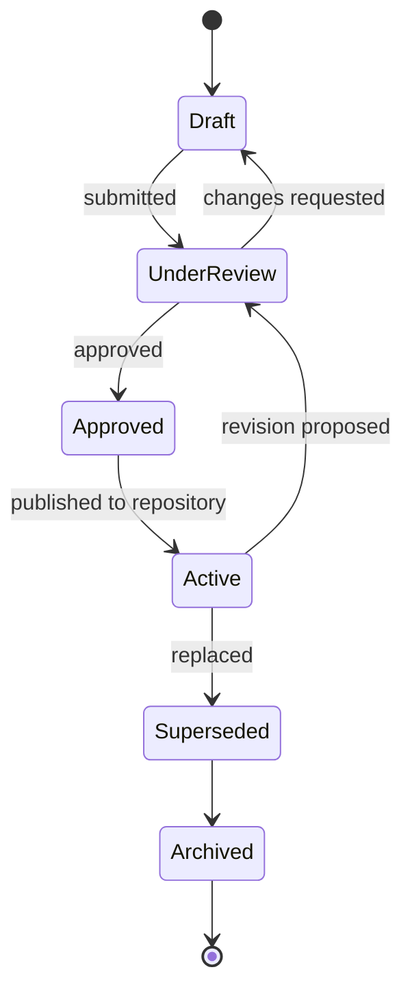
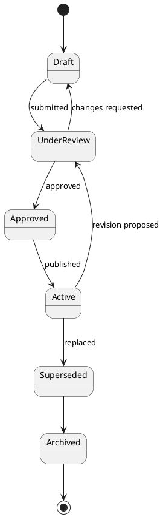
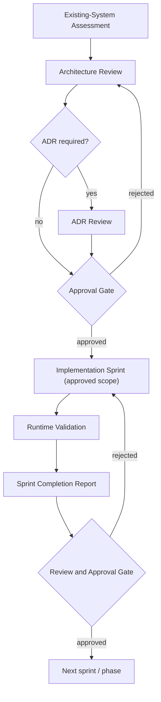
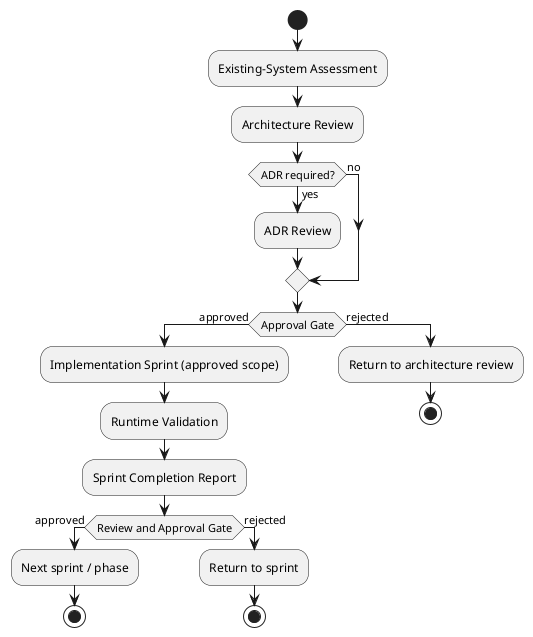
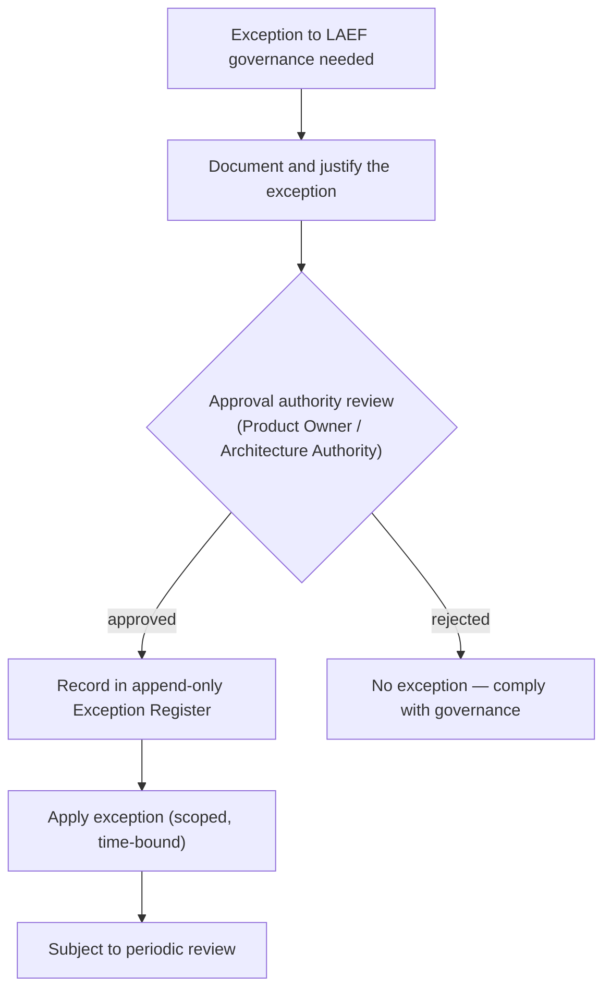
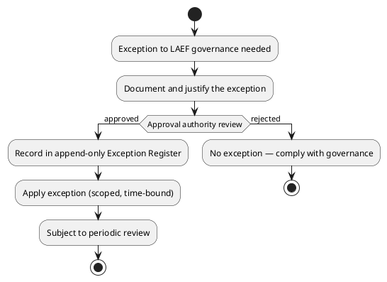

# LAEF Governance Overview

| Field | Value |
|-------|-------|
| Document ID | LAEF-005 |
| Document Title | LAEF Governance Overview |
| Book | LAEF — LOUTAS AI Engineering Framework |
| Knowledge Base Area | 16-AI-Engineering-Framework |
| Framework Layer | Governance |
| Version | 1.0 |
| Status | Approved |
| Owner | Enterprise AI Governance Office |
| Approval Authority | Product Owner |
| Review Cycle | Annual, and on every major LAEF milestone |
| Last Updated | 2026-07-29 |

---

# Purpose

This document defines how the LOUTAS AI Engineering Framework (LAEF) is **governed and enforced**.

Where LAEF-002 defines the principles and LAEF-004 defines the architecture, this document defines how compliance with them is verified, how work is approved, how the repository is governed, how exceptions are handled, how everything is made auditable, and how governance is operationally enforced. It realizes the **Governance Layer** and **Quality Layer** of the LAEF-004 architecture.

This document reuses the existing LOUTAS Care documentation governance framework (GOV-001 through GOV-005) rather than duplicating it, and adds the governance that is specific to AI-assisted engineering.

---

# Scope

This document applies to every AI system that contributes to LOUTAS Care — referred to throughout as **"The AI Agent"** — and to every human role that directs, reviews, approves, or audits that contribution.

It governs the engineering process and the LAEF documents themselves. It does not define operational metrics or KPIs (deferred to future quality governance), and it does not restate the LOUTAS Care documentation governance framework, which it inherits.

---

# 1. Governance Model

LAEF governance operates on two levels, both consistent with the LAEF-004 architecture:

- **Document governance** — how LAEF governance documents move through their lifecycle. This inherits the documentation lifecycle of **GOV-001**, the approval and review policy of **GOV-004**, and the repository governance of **GOV-005**.
- **Work governance** — how AI-assisted engineering work is assessed, approved, executed, validated, and reviewed. This is specific to LAEF and is defined here.

The guiding rule of both levels: **nothing becomes authoritative — no document, no contribution — without human approval,** in keeping with the human-in-the-loop invariant of LAEF-004.

---

# 2. Governance Lifecycle

## 2.1 Document Lifecycle

Every LAEF document follows the inherited documentation lifecycle. Only documents in **Approved** or **Active** status are authoritative.

**Mermaid**

**PlantUML**

**Explanation.** A document begins as a Draft, is submitted for review, and either returns to Draft with requested changes or is Approved. Once published to the repository it is Active and authoritative. A proposed revision sends it back through review rather than editing it in place. When replaced, it is marked Superseded and then Archived — never deleted — preserving the historical record. This lifecycle is inherited from GOV-001; LAEF adds no new states.

## 2.2 Work Governance Workflow

AI-assisted engineering work follows a gated workflow. No phase or sprint advances until the previous one is reviewed and approved.

**Mermaid**

**PlantUML**

**Explanation.** Work begins with an assessment of the existing system to maximize reuse, followed by an architecture review. Where an architectural decision affects multiple modules, an ADR review is inserted. An approval gate must be cleared before any implementation begins. Implementation is limited to the approved scope, then runtime-validated, then documented in a completion report. A second review-and-approval gate must be cleared before the next sprint or phase begins. The two gates are the operational expression of the human-in-the-loop invariant.

---

# 3. Roles and Responsibilities

| Role | Responsibility in Governance |
|------|------------------------------|
| **Product Owner** | Final approval authority for LAEF documents, scope, and major decisions; owns every final decision |
| **Architecture Authority** | Resolves architecture and principle conflicts escalated per LAEF-002; safeguards the LAEF-004 invariants |
| **Enterprise AI Governance Office** | Prepares and maintains LAEF governance documents; operates the governance process |
| **Reviewer** | Performs review at gates; confirms compliance before approval is sought |
| **Repository Maintainer** | Publishes approved documents, maintains cross-references and indexes, records repository updates |
| **The AI Agent** | Executes within governance; surfaces options, conflicts, and completion reports; never self-approves |

These roles align with GOV-004 and are designed to scale to both enterprise and small teams. One individual may perform several governance roles where appropriate — for example, in a small team the Product Owner may also serve as Architecture Authority and Reviewer — provided that approvals remain **explicit, documented, and auditable**, and that **the AI Agent never approves its own work**. The framework does not mandate a minimum number of people; it mandates that every approval is traceable to a human authority distinct from the AI Agent that produced the work.

---

# 4. Approval Workflows

Approval is **per-artifact and per-gate.** The following rules apply:

- No LAEF document is authoritative until approved by the Product Owner.
- No sprint or phase advances until the previous one has passed its review-and-approval gate.
- Approval is explicit and recorded; silence is not approval.
- The AI Agent presents work and a completion report for approval; it does not approve its own work.
- Where work conflicts with approved knowledge, architecture, or scope, it is escalated to the Product Owner or Architecture Authority rather than approved conditionally.

Each approval produces an **auditable approval record** (see Section 7).

---

# 5. Compliance

Compliance means demonstrable adherence to the LAEF-002 principles and the LAEF-004 invariants. Compliance is assessed at the gates, not assumed.

At each gate, the following are confirmed:

- **Knowledge-grounded.** The work began from the Knowledge Base, not assumption.
- **Architecture-compliant.** The work aligns with approved architecture; any conflict was escalated, not absorbed.
- **Scope-compliant.** The work stayed within approved scope; no unapproved expansion occurred.
- **Reuse-first.** Existing components were reused or extended before anything new was built.
- **Quality-met.** The work meets the quality bar and declares any known limitations or technical debt.
- **Documented.** The work is accompanied by its documentation and decision records.

Work that does not satisfy these is returned for rework or escalated. Compliance verification is a function of the Governance and Quality layers defined in LAEF-004.

---

# 6. Operational Enforcement

Enforcement is structural: the architecture itself routes work through points where non-compliance is caught.

- **Knowledge-first check** (Knowledge Layer): work not grounded in the Knowledge Base does not proceed.
- **Governance and scope check** (Governance Layer): non-compliant or out-of-scope work is escalated, not executed.
- **Quality gate** (Quality Layer): work below the quality bar returns for rework.
- **Human approval gate**: no artifact is accepted or committed without human approval.

Consequences of non-compliance are graduated and non-punitive: return for rework, escalation to the appropriate authority, or — where a deviation is genuinely warranted — the exception process of Section 7. Unapproved changes never acquire authoritative status; an artifact that bypassed a gate is not authoritative regardless of its content.

---

# 7. Exception Handling

LAEF permits exceptions, but only through a governed, traceable process. No undocumented or unapproved exception is valid.

**Mermaid**

**PlantUML**

**Explanation.** When a deviation from governance is genuinely needed, it must first be documented and justified. The appropriate approval authority reviews it; if rejected, the work must comply with governance as written. If approved, the exception is recorded in an append-only Exception Register, applied in a scoped and time-bound way, and remains subject to periodic review. Every valid exception is therefore **documented, justified, approved, and traceable** — the standard set in LAEF-001. An exception never becomes a silent precedent.

---

# 8. Repository Governance

The LAEF documents live in the Knowledge Base under the governance of GOV-005. LAEF adds the following operating rules:

- **Additive publication.** New documents are added under 16-AI-Engineering-Framework (or the LAEF Workspace for execution assets) and registered in the MASTER_INDEX and the 16-AI-Engineering-Framework README Document Index.
- **Cross-reference integrity.** When a document's status changes, dependent cross-references are updated so the repository never misrepresents state.
- **Editorial maintenance vs. revision.** A change that only updates cross-links, status tags, or typographical detail is **editorial maintenance** and does not require a version increment. A change to a document's content is a **revision**, requiring a version increment, a revision-history entry, and re-approval.
- **Repository Update List.** Each approved change is accompanied by an explicit list of the repository additions and edits required, so publication is deliberate and reviewable.
- **Authoritative status.** Only Approved or Active documents are authoritative; Draft documents are never treated as governing.
- **Version governance.** The rules for version numbering and increments are defined **exclusively in LAEF-006 Versioning Strategy**. This document refers to version increments but does not define them.

---

# 9. Auditability

LAEF governance is auditable by construction. The audit trail is **append-only**: records are added, never rewritten or deleted.

The audit trail comprises:

- **Revision History** in each document — every version and change.
- **Approval Records** — who approved what, and when, at each gate.
- **Exception Register** — every requested and granted exception (Section 7).
- **Decision Records (ADRs)** — architectural decisions and their rationale.

From any artifact it must be possible to trace back to the approval that authorized it and the knowledge that grounded it. This traceability is the governance counterpart of the append-only principle that governs financial and audit-sensitive records elsewhere in LOUTAS Care.

---

# 10. Governance Checklist

The following mandatory gates must each be satisfied for a contribution to be accepted. They summarize the compliance points defined above and serve as the standard checklist applied at review.

| # | Gate | Confirms | Layer |
|---|------|----------|-------|
| 1 | Knowledge Review | Work began from the Knowledge Base, not assumption | Knowledge |
| 2 | Architecture Review | Work aligns with approved architecture; conflicts escalated | Governance |
| 3 | Scope Validation | Work stayed within approved scope | Governance |
| 4 | Quality Gate | Work meets the quality bar; technical debt declared | Quality |
| 5 | Human Approval | A human authority approved the work | Governance |
| 6 | Repository Update | Required repository additions and edits identified and applied | Repository |
| 7 | Audit Record | Approval, revision, and any exception recorded (append-only) | Audit |

A contribution that fails any gate is returned for rework or escalated. All seven gates are mandatory; none may be waived except through the exception process (Section 7).

---

# 11. Approval Record Template

Every approval produces an **Approval Record**, stored append-only as part of the audit trail (Section 9). The standard template is:

| Field | Description |
|-------|-------------|
| Approval ID | Unique identifier for the approval |
| Artifact | The document, sprint, or deliverable approved |
| Reviewer | Role or person who performed the review |
| Approver | Role or person who granted approval |
| Decision | Approved / Approved with edits / Rejected |
| Date | Date of the decision |
| Repository Update Required | Yes or No, with reference to the Repository Update List |
| ADR Reference | Related ADR(s), if any |
| Notes | Conditions, edits, or context |

---

# 12. Consistency with the Architectural Baseline

This document realizes, and does not alter, the LAEF-004 architecture:

- The approval and review gates operationalize the **Governance Layer**.
- The compliance checks and quality gate operationalize the **Quality Layer**.
- The exception process enforces the invariant that deviations are documented, justified, approved, and traceable.
- Nothing in this document changes the LAEF-004 invariants, layer set, or tier mapping. Any such change would require a revision of LAEF-004, not merely of this document.

---

# 13. Boundaries and Deferrals

This document defines governance and enforcement at the framework level. It defers:

- **Operational metrics and KPIs** — to future quality governance.
- **Detailed workflow and playbook definitions** — to the LAEF Workspace.
- **Engine-level enforcement mechanics** — to the core engine specifications.
- **Framework versioning rules** — to LAEF-006.

---

# Compliance

This document is authoritative once approved by the Product Owner.

It inherits and does not duplicate the LOUTAS Care documentation governance framework (GOV-001 through GOV-005). It complies with GOV-002 Document Template Standard and GOV-003 Document Numbering Standard, and is consistent with LAEF-002 and LAEF-004. Any exception to the governance defined here is itself subject to the exception process of Section 7.

---

# Dependencies

- LAEF-001 Framework Vision & Mission
- LAEF-002 Core Principles & Philosophy
- LAEF-003 Scope & Objectives
- LAEF-004 Framework Architecture Overview
- GOV-001 Documentation Lifecycle
- GOV-004 Approval and Review Policy
- GOV-005 Repository Governance
- GOV-002 Document Template Standard
- GOV-003 Document Numbering Standard

---

# Related Documents

- LAEF-006 Versioning Strategy *(Approved v1.0)*
- LAEF-007 Framework Roadmap *(Approved v1.0)*
- STD-016 AI-Governance-Standards *(planned; will reference this document)*
- LAEF Workspace — evolved from 99-AI-Team *(execution tier)*
- Core Engine specifications *(planned; Phase 3)*

---

# Revision History

| Version | Date | Description |
|---------|------|-------------|
| 1.0 (Draft) | 2026-07-29 | Initial draft issued for approval; includes governance-lifecycle, work-governance, and exception-handling diagrams in Mermaid and PlantUML |
| 1.0 (Approved) | 2026-07-29 | Enhanced per Product Owner: refined separation-of-duties for enterprise and small teams; added Governance Checklist and Approval Record Template; added version-governance cross-reference to LAEF-006. Approved by Product Owner |
