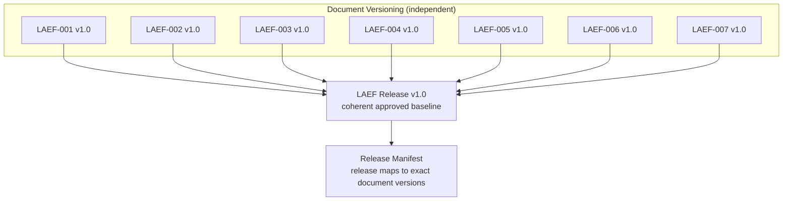
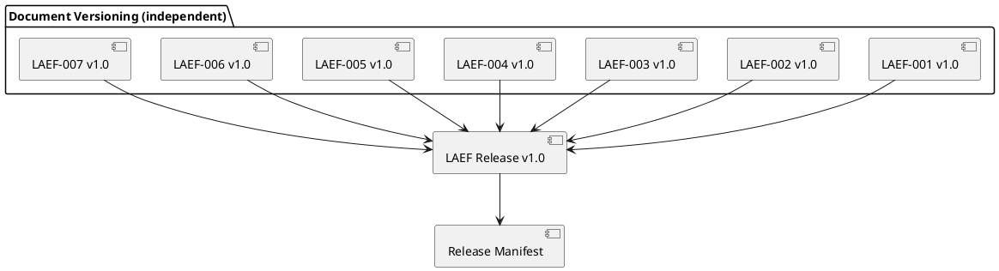
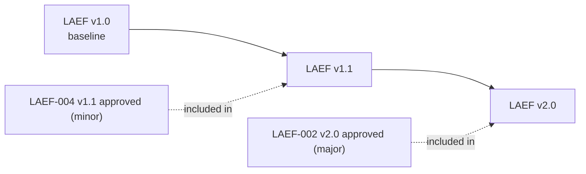
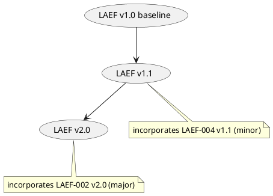

# LAEF Versioning Strategy

| Field | Value |
|-------|-------|
| Document ID | LAEF-006 |
| Document Title | LAEF Versioning Strategy |
| Book | LAEF — LOUTAS AI Engineering Framework |
| Knowledge Base Area | 16-AI-Engineering-Framework |
| Framework Layer | Governance |
| Version | 1.0 |
| Status | Approved |
| Owner | Enterprise AI Governance Office |
| Approval Authority | Product Owner |
| Review Cycle | Annual, and on every major LAEF milestone |
| Last Updated | 2026-07-29 |

---

# Purpose

This document defines how the LOUTAS AI Engineering Framework (LAEF) is **versioned**.

It is the exclusive source of version numbering and version governance for LAEF, as referenced by LAEF-005. It defines a two-level versioning strategy — independent versioning of each governance document, and bundled release versioning of the framework as a whole — together with the semantic-versioning rules, release criteria, backward-compatibility expectations, deprecation policy, release manifest, and the relationship between document revisions and framework releases.

This document reuses the semantics of **STD-013 Versioning Standards** rather than defining a new scheme, and adds the framework-release layer that is specific to LAEF.

---

# Scope

This document applies to every LAEF governance document (16-AI-Engineering-Framework) and to the framework as a whole. It also governs how execution assets in the LAEF Workspace reference framework releases.

It defines versioning only. It does not define the documentation lifecycle (GOV-001) or the approval process (LAEF-005), which it references.

---

# 1. The Two-Level Versioning Model

LAEF is versioned at two levels:

1. **Document Versioning.** Every LAEF-00X document has its own independent semantic version and lifecycle. Documents may evolve independently through approved revisions.
2. **Framework Release Versioning.** LAEF itself has an official release version (LAEF v1.0, v1.1, v2.0, …). Each release references the exact approved version of every governance document included in that release. A framework release is a coherent, approved baseline of the entire framework.

**Mermaid**

**PlantUML**

**Explanation.** Each document carries its own version and can be revised on its own schedule. A framework release freezes the exact approved version of every included document into one coherent baseline, recorded in a release manifest. This lets individual documents evolve continuously while contributors always have a stable, named baseline to work against.

---

# 2. Semantic Versioning Rules (Documents)

Each document uses semantic versioning `MAJOR.MINOR.PATCH`, consistent with STD-013.

| Level | Format | Trigger | Approval |
|-------|--------|---------|----------|
| **Major** | `X.0.0` | A breaking change — altering an architectural invariant, scope boundary, governance meaning, or anything that invalidates a prior baseline | Product Owner approval; ADR where architecture is affected |
| **Minor** | `x.Y.0` | A backward-compatible addition or enhancement — a new section, expanded content, or a new non-breaking rule | Product Owner approval |
| **Patch** | `x.y.Z` | A corrective content change that fixes an error or clarifies wording without changing meaning, scope, or requirements | Lightweight approval; revision-history entry required |

**Editorial maintenance is not a version change.** As defined in LAEF-005 (Section 8), purely mechanical repository hygiene — updating a cross-reference status tag, fixing a broken link, whitespace — is editorial maintenance and does **not** increment any version. A patch is the smallest *versioned* change; editorial maintenance is below that threshold.

---

# 3. Framework Release Versioning

The framework release version uses `MAJOR.MINOR`, derived from the changes it bundles.

| Level | Format | Trigger |
|-------|--------|---------|
| **Framework Major** | `vN.0` | The release includes at least one document **Major** change, or a structural change to the framework itself (a document added or removed, or the architecture baseline changed) |
| **Framework Minor** | `v1.N` | The release bundles only backward-compatible document changes (Minor or Patch), or adds a backward-compatible document |

Each framework release references the exact approved document versions it contains and represents a coherent, approved baseline of the whole framework.

---

# 4. Release Criteria

A LAEF release may be cut only when all of the following are true:

- Every document included in the release is in **Approved** or **Active** status.
- All cross-references between the included documents are consistent.
- The **Release Manifest** (Section 7) is complete and lists the exact version of every included document.
- The **Product Owner** has approved the release as a baseline.
- No open exception blocks the release (see LAEF-005, Section 7).

A release is immutable once approved: subsequent changes produce a new release, never an edit to a published one.

---

# 5. Backward Compatibility Expectations

- **Within a major line** (for example, all v1.x releases), each release is **backward-compatible** with the previous one. A contributor compliant with LAEF v1.0 remains compliant with v1.1; changes within a major line are additive.
- **A framework major release** (for example, v2.0) may introduce breaking changes. Such a release must include **migration notes** describing what changed and what contributors must do differently.
- **At the document level**, Minor and Patch changes are backward-compatible; a Major change may not be, and is what drives a framework major release.

---

# 6. Deprecation Policy

- A document or section that is replaced is marked **Superseded** and then **Archived** in accordance with the documentation lifecycle. Nothing is deleted; the historical record is preserved.
- **Deprecated content is flagged** with the release in which it was deprecated and, where applicable, the document or section that replaces it.
- Where a deprecation affects contributors, a **grace period** is stated so that in-flight work can migrate. The deprecated content remains referenceable until the grace period ends, after which it is archived.
- Deprecation decisions are recorded in the audit trail (LAEF-005, Section 9).

---

# 7. Release Manifest

Each LAEF release is accompanied by a **Release Manifest** mapping the release to the exact document versions it contains. The standard template:

| LAEF Release | Release Date | Document | Document Version | Status |
|--------------|--------------|----------|------------------|--------|
| v1.0 | *(date)* | LAEF-001 | 1.0 | Active |
| v1.0 | *(date)* | LAEF-002 | 1.0 | Active |
| v1.0 | *(date)* | LAEF-003 | 1.0 | Active |
| v1.0 | *(date)* | LAEF-004 | 1.0 | Active |
| v1.0 | *(date)* | LAEF-005 | 1.0 | Active |
| v1.0 | *(date)* | LAEF-006 | 1.0 | Active |
| v1.0 | *(date)* | LAEF-007 | 1.0 | Active |
| v1.0 | *(date)* | README-LAEF | 1.0 | Active |

The manifest above is the **projected LAEF v1.0 baseline**. It is finalized and dated when the last Phase 1 document (LAEF-007) is approved and the Product Owner approves the release. Each future release carries its own manifest.

---

# 8. Relationship Between Document Revisions and Framework Releases

Documents and releases evolve on different rhythms:

- **Documents evolve continuously.** A document may be revised and approved at any time, independent of the release schedule.
- **Releases are periodic snapshots.** A framework release freezes a coherent set of approved document versions into a named baseline.
- A document revision does **not** automatically create a release; it becomes part of the **next** release.
- A release **never** silently changes; it always references fixed document versions via its manifest.

**Mermaid**

**PlantUML**

**Explanation.** Between releases, documents may be revised and approved independently — here LAEF-004 receives a minor revision and later LAEF-002 a major one. The minor revision is bundled into the next backward-compatible release (v1.1); the major revision drives a framework major release (v2.0) with migration notes. Contributors always work against a named release baseline, while the documents underneath continue to improve.

---

# 9. Consistency and Reuse

This document reuses STD-013 Versioning Standards for its semantic-versioning semantics and is consistent with the rest of the framework:

- It is the exclusive home of version governance, as LAEF-005 (Section 8) states.
- Its lifecycle states (Draft, Approved, Active, Superseded, Archived) are those of GOV-001, referenced by LAEF-005.
- It changes none of the LAEF-004 invariants; a framework major release is the mechanism by which an approved change to those invariants is published.

---

# Compliance

This document is authoritative once approved by the Product Owner.

All version numbering and version governance for LAEF follow this document exclusively. Any exception is subject to the exception process of LAEF-005 (Section 7). This document complies with GOV-002 Document Template Standard and GOV-003 Document Numbering Standard, and reuses STD-013 Versioning Standards.

---

# Dependencies

- LAEF-001 Framework Vision & Mission
- LAEF-002 Core Principles & Philosophy
- LAEF-003 Scope & Objectives
- LAEF-004 Framework Architecture Overview
- LAEF-005 Governance Overview
- STD-013 Versioning Standards
- GOV-001 Documentation Lifecycle
- GOV-002 Document Template Standard
- GOV-003 Document Numbering Standard

---

# Related Documents

- LAEF-007 Framework Roadmap *(Approved v1.0)*
- README-LAEF — 16-AI-Engineering-Framework Area Index *(references release status)*
- LAEF Workspace — evolved from 99-AI-Team *(execution tier; references framework releases)*

---

# Revision History

| Version | Date | Description |
|---------|------|-------------|
| 1.0 (Draft) | 2026-07-29 | Initial draft issued for approval; two-level versioning model with document and framework-release diagrams in Mermaid and PlantUML |
| 1.0 (Approved) | 2026-07-29 | Approved by Product Owner without content changes |
