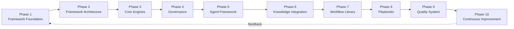
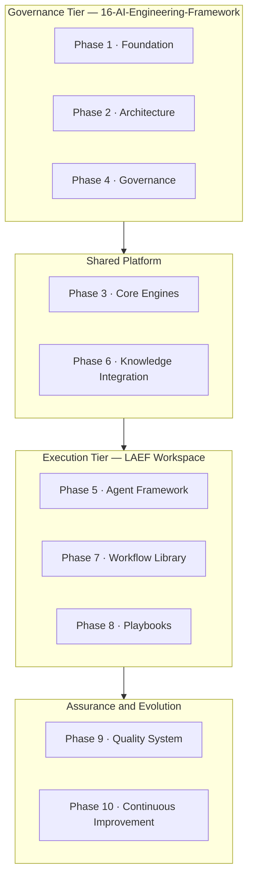
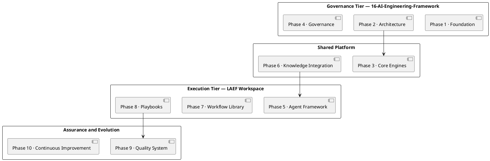

# LAEF Framework Roadmap

| Field | Value |
|-------|-------|
| Document ID | LAEF-007 |
| Document Title | LAEF Framework Roadmap |
| Book | LAEF — LOUTAS AI Engineering Framework |
| Knowledge Base Area | 16-AI-Engineering-Framework |
| Framework Layer | Core / Governance |
| Version | 1.0 |
| Status | Approved |
| Owner | Enterprise AI Governance Office |
| Approval Authority | Product Owner |
| Review Cycle | Annual, and on every major LAEF milestone |
| Last Updated | 2026-07-29 |

---

# Purpose

This document defines the **delivery roadmap** for the LOUTAS AI Engineering Framework (LAEF).

It sequences the framework's development into ten phases, states the objective and key deliverables of each phase, shows the dependencies between them, maps each phase to the LAEF-004 architecture and the two-tier structure, and aligns the phases with the framework releases defined in LAEF-006. It is the plan by which LAEF is built incrementally, one approved phase at a time.

This document is distinct from the LOUTAS Care product roadmap (13-Roadmap); it plans the *framework*, not the product.

---

# Scope

This document applies to the development of LAEF itself and to every role that plans, executes, reviews, or approves that development.

It provides the phase-level plan. The detailed plan for a phase is produced when that phase begins, under the work-governance workflow of LAEF-005, and is not pre-specified here.

---

# 1. Roadmap Principles

- **Incremental delivery.** LAEF is built phase by phase; the whole framework is never produced in one step.
- **Phase-gated.** No phase begins until the previous phase is completed, reviewed, and approved, in accordance with the LAEF-005 work-governance workflow.
- **Knowledge-first.** Each phase begins with an assessment of what already exists, to maximize reuse.
- **Baseline-anchored.** Completed phases are bundled into framework releases (LAEF-006), giving contributors a stable baseline at every step.
- **Living plan.** The roadmap evolves through approved revisions; its history is preserved (append-only).

---

# 2. The Ten Phases

| Phase | Name | Purpose | Status |
|-------|------|---------|--------|
| 1 | Framework Foundation | Vision, principles, scope, architecture, governance, versioning, roadmap | In Progress |
| 2 | Framework Architecture | Detailed architecture of the layers established in LAEF-004 | Planned |
| 3 | Core Engines | Specification of the eight core engines | Planned |
| 4 | Governance | Detailed governance mechanisms beyond the LAEF-005 overview | Planned |
| 5 | Agent Framework | Model-agnostic AI Agent roles and behavior (Agent Layer) | Planned |
| 6 | Knowledge Integration | Detailed Knowledge and Context layer integration | Planned |
| 7 | Workflow Library | The defined engineering workflows (Workflow Layer) | Planned |
| 8 | Playbooks | Reusable task-specific procedures (Playbook Layer) | Planned |
| 9 | Quality System | Detailed quality gates, validation, acceptance (Quality Layer) | Planned |
| 10 | Continuous Improvement | The learning system that evolves the framework (Learning Layer) | Planned |

On approval of this document, **Phase 1 is Completed** and Phase 2 becomes the next candidate for planning.

---

# 3. Phase Details

- **Phase 1 — Framework Foundation.** *Objective:* establish the framework's identity and governing documents. *Deliverables:* LAEF-001 through LAEF-007 and the 16-AI-Engineering-Framework area index. *(In Progress; completes on approval of this document.)*
- **Phase 2 — Framework Architecture.** *Objective:* specify the internal detail of each layer defined in LAEF-004. *Deliverables:* detailed architecture documents per layer.
- **Phase 3 — Core Engines.** *Objective:* specify the eight engines (Context, Knowledge, Task, Workflow, Decision, Agent, Quality, Learning). *Deliverables:* engine specifications with interfaces.
- **Phase 4 — Governance.** *Objective:* deepen governance beyond the LAEF-005 overview. *Deliverables:* detailed governance procedures and controls.
- **Phase 5 — Agent Framework.** *Objective:* define model-agnostic AI Agent roles and behavior. *Deliverables:* Agent Layer definitions in the LAEF Workspace.
- **Phase 6 — Knowledge Integration.** *Objective:* detail how the framework consumes the Knowledge Base. *Deliverables:* Knowledge and Context integration specifications.
- **Phase 7 — Workflow Library.** *Objective:* define the engineering workflows. *Deliverables:* the workflow library in the LAEF Workspace.
- **Phase 8 — Playbooks.** *Objective:* provide reusable procedures for recurring scenarios. *Deliverables:* the playbook library in the LAEF Workspace.
- **Phase 9 — Quality System.** *Objective:* operationalize quality gates and validation. *Deliverables:* the quality system and acceptance criteria.
- **Phase 10 — Continuous Improvement.** *Objective:* institutionalize learning and framework evolution. *Deliverables:* the learning system and improvement process.

---

# 4. Phase Sequence and Dependencies

Phases proceed in order, each gated on the approval of the previous, with a continuous-improvement feedback loop from Phase 10 back to the foundation.

**Mermaid**

**PlantUML**

```plantuml
@startuml
left to right direction
(Phase 1\nFramework Foundation) --> (Phase 2\nFramework Architecture)
(Phase 2\nFramework Architecture) --> (Phase 3\nCore Engines)
(Phase 3\nCore Engines) --> (Phase 4\nGovernance)
(Phase 4\nGovernance) --> (Phase 5\nAgent Framework)
(Phase 5\nAgent Framework) --> (Phase 6\nKnowledge Integration)
(Phase 6\nKnowledge Integration) --> (Phase 7\nWorkflow Library)
(Phase 7\nWorkflow Library) --> (Phase 8\nPlaybooks)
(Phase 8\nPlaybooks) --> (Phase 9\nQuality System)
(Phase 9\nQuality System) --> (Phase 10\nContinuous Improvement)
(Phase 10\nContinuous Improvement) ..> (Phase 1\nFramework Foundation)
@enduml
```

**Explanation.** The foundation comes first because every later phase depends on the identity, architecture, and governance it establishes. Architecture and engine detail follow, then the execution capabilities (agent, workflows, playbooks), then quality and continuous improvement. The dotted feedback edge shows that Phase 10 is not an endpoint: the learning it institutionalizes feeds back to refine the foundation, keeping the framework alive over its intended decade-long horizon.

---

# 5. Mapping Phases to Architecture and Tiers

Each phase delivers part of the LAEF-004 architecture and belongs to a tier of the two-tier structure.

| Phase | Primary LAEF-004 Layer(s) | Tier |
|-------|-------------------------|------|
| 1 Framework Foundation | Core, Governance | Governance (16-AI-Engineering-Framework) |
| 2 Framework Architecture | All layers (detail) | Governance (16-AI-Engineering-Framework) |
| 3 Core Engines | All layers (engines) | Shared Platform |
| 4 Governance | Governance | Governance (16-AI-Engineering-Framework) |
| 5 Agent Framework | Agent | Execution (LAEF Workspace) |
| 6 Knowledge Integration | Knowledge, Context | Shared Platform |
| 7 Workflow Library | Workflow | Execution (LAEF Workspace) |
| 8 Playbooks | Playbook | Execution (LAEF Workspace) |
| 9 Quality System | Quality | Assurance & Evolution |
| 10 Continuous Improvement | Learning | Assurance & Evolution |

**Mermaid**

**PlantUML**

**Explanation.** The governance tier (16-AI-Engineering-Framework) delivers the foundation, architecture, and governance phases. The execution tier (LAEF Workspace) delivers the agent, workflow, and playbook phases. The core engines and knowledge integration are shared platform capabilities that both tiers rely on, and quality and continuous improvement form the assurance-and-evolution work that wraps the whole. This mapping keeps the roadmap coherent with the architecture: every phase has a defined home.

---

# 6. Release Alignment

The roadmap aligns with the framework releases defined in LAEF-006:

- **LAEF v1.0** is the **Phase 1 Foundation baseline** — the seven LAEF-00X documents and the 16-AI-Engineering-Framework area index. It is cut when Phase 1 completes.
- Each subsequent completed phase is bundled into the next appropriate release: a phase that only adds backward-compatible content produces a **framework minor** release (v1.x); a phase that changes an architectural invariant or the framework structure produces a **framework major** release (v2.0), with migration notes.
- No phase is released until its documents are approved and its release criteria (LAEF-006, Section 4) are met.

Specific release-to-phase assignments beyond v1.0 are decided when each phase is planned, and recorded in that release's manifest.

---

# 7. Current Status

Work is classified per the LOUTAS Care standard categories:

- **In Progress:** Phase 1 — Framework Foundation. Six of seven documents (LAEF-001 through LAEF-006) and the 16-AI-Engineering-Framework area index are approved; this document (LAEF-007) completes the phase.
- **Planned:** Phases 2 through 10.
- **Backlog / Future Vision:** deeper elaboration within later phases, to be defined when those phases are planned.

On approval of this document, Phase 1 moves to **Completed**, and the **LAEF v1.0** release becomes ready to cut under LAEF-006.

---

# 8. Roadmap Governance

- The roadmap is a **living plan** and evolves through approved revisions under LAEF-005 and LAEF-006; changes are recorded in the revision history.
- Each phase is executed under the **work-governance workflow** of LAEF-005 (assessment, architecture review, ADR where applicable, approval gate, implementation, validation, completion report, review-and-approval gate).
- **Reordering, adding, or removing a phase** is a change to this document and follows the approval process; it does not silently alter the plan.
- The roadmap does not authorize any phase to begin; each phase begins only when explicitly planned and approved.

---

# 9. Boundaries

- This roadmap plans the framework (LAEF); it is distinct from the LOUTAS Care product roadmap (13-Roadmap).
- Detailed phase plans, deliverable specifications, and schedules are produced when each phase is planned, not here.
- Nothing in this roadmap overrides the LAEF-004 architecture or the LAEF-005 governance; a phase that would change an invariant requires the corresponding architecture revision and framework major release.

---

# Compliance

This document is authoritative once approved by the Product Owner.

The roadmap is executed under LAEF-005 and versioned under LAEF-006. Any exception is subject to the exception process of LAEF-005 (Section 7). This document complies with GOV-002 Document Template Standard and GOV-003 Document Numbering Standard.

---

# Dependencies

- LAEF-001 Framework Vision & Mission
- LAEF-002 Core Principles & Philosophy
- LAEF-003 Scope & Objectives
- LAEF-004 Framework Architecture Overview
- LAEF-005 Governance Overview
- LAEF-006 Versioning Strategy
- GOV-002 Document Template Standard
- GOV-003 Document Numbering Standard

---

# Related Documents

- README-LAEF — 16-AI-Engineering-Framework Area Index
- 13-Roadmap — LOUTAS Care Product Roadmap *(distinct; product, not framework)*
- LAEF Workspace — evolved from 99-AI-Team *(execution tier; delivers Phases 5, 7, 8)*
- Core Engine specifications *(Phase 3)*

---

# Revision History

| Version | Date | Description |
|---------|------|-------------|
| 1.0 (Draft) | 2026-07-29 | Initial draft issued for approval; ten-phase roadmap with sequence and tier-mapping diagrams in Mermaid and PlantUML |
| 1.0 (Approved) | 2026-07-29 | Approved by Product Owner; completes Phase 1 — Framework Foundation |
