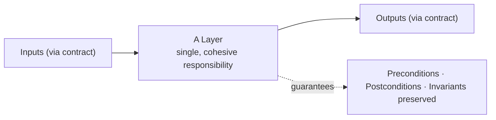
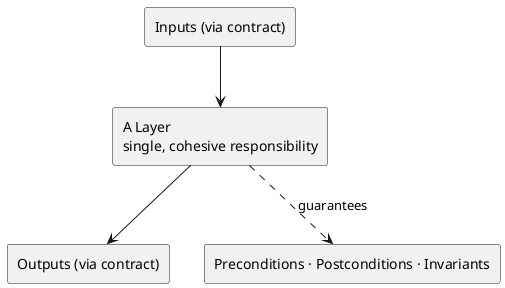
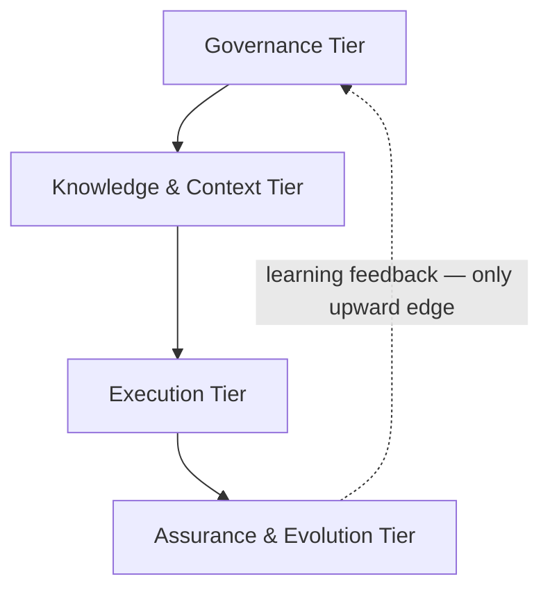
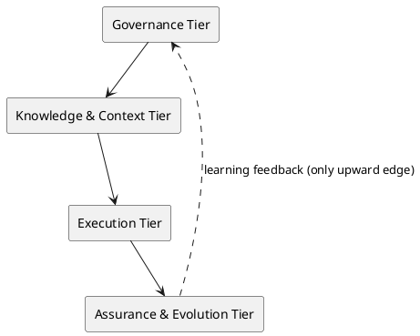
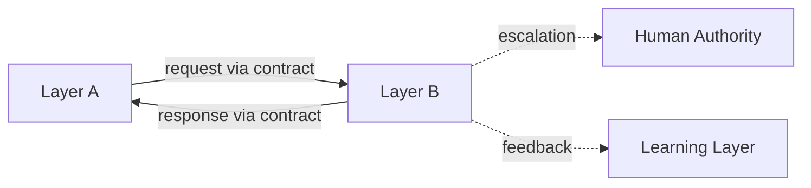
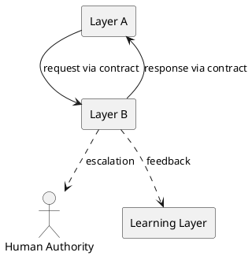
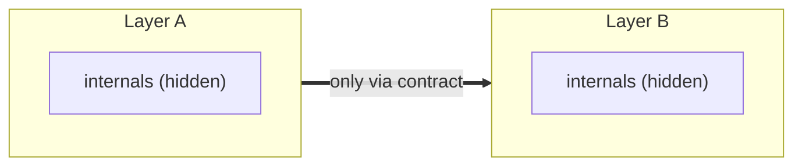
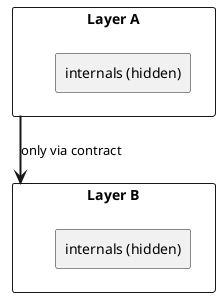
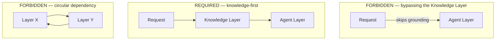
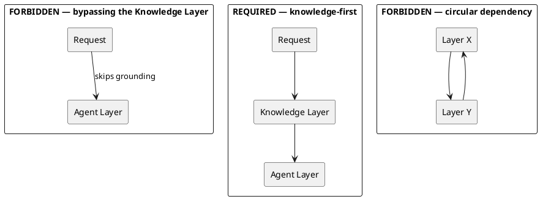

# LAEF Layer Architecture Foundations & Design Principles

| Field | Value |
|-------|-------|
| Document ID | LAEF-008 |
| Document Title | Layer Architecture Foundations & Design Principles |
| Book | LAEF — LOUTAS AI Engineering Framework |
| Knowledge Base Area | 16-AI-Engineering-Framework |
| Framework Layer | Core / Governance |
| Version | 1.0 |
| Status | Approved |
| Owner | Enterprise AI Governance Office |
| Approval Authority | Product Owner |
| Review Cycle | Annual, and on every major LAEF milestone |
| Last Updated | 2026-07-30 |

---

# Purpose

This document is the **architectural constitution** of the LOUTAS AI Engineering Framework (LAEF).

It defines the design principles, contracts, interface rules, dependency rules, communication patterns, composition rules, isolation guarantees, extension rules, decision governance, and anti-patterns that govern how every layer of the framework is architected. It is the authoritative reference that every Phase 2 layer-architecture document (LAEF-009 through LAEF-012) — and every future architecture document — must comply with.

Where LAEF-004 establishes *what* the layers are, this document establishes *the rules by which any layer's architecture is designed.*

---

# Scope

This document applies to every layer and tier of the framework, to every Phase 2 (and later) architecture document, and to every AI system that contributes to LOUTAS Care — referred to throughout as **"The AI Agent."**

It defines architectural rules, not layer internals. The internal architecture of specific layers is defined in LAEF-009 through LAEF-012. It is model-agnostic and subordinate to LAEF-001, LAEF-002, LAEF-003, and LAEF-004.

---

# 1. Position in the Framework

LAEF-008 sits between the architecture overview (LAEF-004) and the tier-architecture documents (LAEF-009 through LAEF-012):

- It **details** LAEF-004 by supplying the rules its layers must be designed against; it does not restate LAEF-004's invariants, layers, or tiers.
- It is **constitutional**: LAEF-009 through LAEF-012 comply with it, and any conflict is resolved in favor of this document unless LAEF-004 or a higher document governs.
- It governs not only Phase 2 but every future architecture document that adds or details a layer.

---

# 2. Layer Design Principles

Every layer's architecture shall satisfy the following principles:

- **Single responsibility.** A layer shall have one cohesive responsibility. Responsibilities shall not be split across layers or merged into a single layer.
- **Model-agnostic construction.** No layer shall depend on the identity of a specific AI system. Only the Agent Layer boundary adapts to a specific system.
- **Knowledge-authoritative.** No layer shall act against approved knowledge or architecture; the Knowledge Layer is authoritative.
- **Human-in-the-loop preserved at boundaries.** No layer shall acquire the authority to accept work; human approval points defined by governance shall remain intact.
- **Minimal surface.** A layer shall expose the smallest contract necessary and hide all internals.
- **Testable.** A layer's behavior shall be verifiable through its contract without reference to its internals.

---

# 3. Layer Contracts

Each layer shall expose exactly one **contract** describing everything another layer may rely on. Internals not named in the contract are not part of the guarantee and shall not be depended upon.

## Contract Template

| Field | Meaning |
|-------|---------|
| Contract Name | Unique name of the contract |
| Owning Layer | The layer that provides the contract |
| Responsibility | The single responsibility the contract fulfills |
| Inputs | What the layer accepts, and the source |
| Outputs | What the layer produces, and the destination |
| Preconditions | What must hold before the contract is invoked |
| Postconditions | What holds after the contract completes |
| Guarantees / Invariants | Invariants preserved (including the LAEF-004 invariants) |
| Failure Behavior | What happens on failure (return, escalate, contain) |
| Version | Contract version, governed by LAEF-006 |

Every Phase 2 layer document shall specify its layer's contract using this template.

---

# 4. Layer Contract Model (Diagram)

**Mermaid**

**PlantUML**

**Explanation.** A layer accepts inputs and produces outputs only through its contract, and it publishes the guarantees it upholds — its preconditions, postconditions, and the invariants it preserves. Nothing outside the contract is part of the agreement. This is the unit of composition for the whole framework: layers are connected by contracts, not by knowledge of each other's internals.

---

# 5. Interface Principles

The interface is the exposed surface through which a contract is accessed. Interfaces shall be:

- **Explicit.** Every interaction between layers occurs through a named interface; there are no implicit couplings.
- **Stable.** Interfaces change only through governed, versioned revision (LAEF-006); consumers rely on stability.
- **Minimal.** An interface exposes only what the contract requires — no incidental internals.
- **Versioned.** Interface changes carry a version so consumers can depend on a known shape.
- **Leak-free.** An interface shall not expose a layer's internal structures, state, or implementation details.

---

# 6. Dependency Rules

Dependencies between layers and tiers shall follow these rules:

- **Allowed direction.** Dependencies flow **governance → knowledge/context → execution → assurance**. The only permitted upward path is the **learning feedback** edge from the Assurance & Evolution tier back to governance.
- **Acyclic.** The dependency graph shall contain no cycles.
- **Contract-bound.** A dependency is a reliance on another layer's *contract*, never on its internals.
- **Dependency inversion.** Where a lower tier would otherwise need to depend on a higher one, the dependency shall be inverted through an abstraction owned by the lower tier.

---

# 7. Allowed Dependency Direction (Diagram)

**Mermaid**

**PlantUML**

**Explanation.** Dependencies run downward from governance through knowledge and execution to assurance, mirroring how work flows through the framework. The single exception is the learning-feedback edge, which carries captured lessons upward to improve governance. Every other upward or lateral dependency is prohibited, and the graph must remain acyclic — this is what keeps the architecture analyzable and free of tangled coupling.

---

# 8. Communication Patterns

Layers shall communicate only through the following patterns:

- **Contract-mediated request/response.** A layer requests another layer's service through its contract and receives a response through the same contract.
- **Human escalation.** Where governance requires a decision, a layer escalates to human authority rather than deciding on its own.
- **Feedback.** Outcomes flow to the Learning Layer through a defined feedback path.

The following are prohibited: side-channels that bypass contracts, shared mutable state across layer boundaries, and any communication that is not expressed through a contract.

---

# 9. Communication Patterns (Diagram)

**Mermaid**

**PlantUML**

**Explanation.** All legitimate communication is contract-mediated: a layer asks another for a service and receives a response through the same contract. Two dotted paths sit alongside the request/response: escalation to a human authority when a decision is required, and feedback to the Learning Layer so outcomes improve future work. There are no other channels — anything not shown here (a hidden call, a shared variable) is forbidden by Section 8.

---

# 10. Composition Rules

- **Layers compose into tiers.** Related layers with a shared architectural purpose form a tier, as defined in LAEF-004.
- **Tiers compose into the framework.** Tiers assemble in the allowed dependency order to form the whole.
- **Composition is by contract.** A composed unit exposes the contracts of its constituent layers; composition introduces no hidden coupling.
- **Assembly order.** Composition follows the dependency direction (Section 6); a unit is assembled only after the units it depends on.

---

# 11. Layer Isolation

Isolation is the property that a layer's internals are reachable only through its contract. Every layer shall guarantee:

- **No bypass.** No layer may reach around another layer's contract into its internals.
- **Hidden internals.** A layer's internal structures and state are not visible across its boundary.
- **Knowledge-first enforced structurally.** The architecture routes work through the Knowledge Layer before execution; isolation prevents skipping it.
- **Fault containment.** A failure inside a layer is contained and surfaced through the contract's failure behavior, not leaked as a side effect.

---

# 12. Layer Isolation & Boundaries (Diagram)

**Mermaid**

**PlantUML**

**Explanation.** Each layer's internals are sealed behind its boundary; the only legal crossing point is the contract. Layer A may use Layer B only through B's contract, never by reaching into B's internals — and vice versa. This isolation is what makes the framework maintainable: a layer can change internally without affecting others as long as its contract holds.

---

# 13. Extension Rules

The architecture is extended by adding or detailing layers through additional documents, without changing existing structure:

- **Attach to an existing layer.** A new document details or extends an existing layer; it does not introduce new structure outside the defined layers and tiers unless a governed architecture change occurs.
- **Append-only.** New documents and dependencies are appended; existing dependencies are not rewritten. This is consistent with LAEF-004 §12.
- **Governed introduction.** Adding a document follows the approval process; it does not, by itself, change the architecture.
- **Applies to LAEF-013 and beyond.** These rules govern all future architecture documents, not only Phase 2.

---

# 14. Architectural Decision Governance

LAEF-008 is the **constitutional architectural reference** for the framework. Changes to it are governed as follows:

- Any change to a **normative architectural rule** in this document **shall require an approved ADR**.
- ADRs remain **centralized in the existing repository `ADR/` directory**; this document does not host them.
- This document **references** the relevant ADRs but **never duplicates** their content.
- **Updates to LAEF-008 follow the versioning policy defined in LAEF-006** (major/minor/patch), with editorial maintenance below the versioning threshold.

A normative rule that is not backed by this document or an approved ADR has no architectural authority.

---

# 15. Architectural Anti-patterns

The following are prohibited. Any Phase 2 architecture that exhibits them fails conformance.

- **Bypassing the Knowledge Layer** — executing work without grounding it in authoritative knowledge.
- **Reaching around a contract** — depending on another layer's internals instead of its contract.
- **Circular dependencies** — any cycle in the dependency graph.
- **Embedded self-approval** — a layer that accepts its own work, violating human-in-the-loop.
- **Model-specific coupling** — binding any layer other than the Agent boundary to a specific AI system.
- **Side-channels / shared mutable state** — communication outside contracts.
- **God-layer** — a layer absorbing responsibilities that belong to others.
- **Duplicate or competing contracts** — more than one contract governing the same boundary.

---

# 16. Architectural Anti-pattern (Diagram)

**Mermaid**

**PlantUML**

**Explanation.** The top-left configuration is forbidden: a request that reaches the Agent Layer without first passing through the Knowledge Layer violates the knowledge-authoritative invariant — the required path directly beneath it grounds the request first. The bottom configuration is also forbidden: Layer X depending on Layer Y while Y depends back on X creates a cycle, which the dependency rules prohibit. These are shown together because they are the two most common ways a well-intentioned design silently breaks the framework.

---

# 17. Compliance

This document is authoritative once approved by the Product Owner.

Every Phase 2 layer-architecture document (LAEF-009 through LAEF-012) shall conform to this constitution and demonstrate it against the following **conformance checklist**:

- The layer has a single, cohesive responsibility.
- The layer exposes exactly one contract, specified with the contract template (Section 3).
- The layer depends only in allowed directions, and the dependency graph is acyclic (Section 6).
- The layer communicates only through contracts — no side-channels or shared mutable state (Section 8).
- The layer preserves the LAEF-004 invariants at its boundary.
- The layer is isolated: internals hidden, no bypass, faults contained (Section 11).
- Any extension follows the extension rules (Section 13).
- The layer exhibits none of the anti-patterns (Section 15).
- Any normative architectural rule change is backed by an approved ADR (Section 14).

Verification and enforcement of this checklist are governed by LAEF-005. This document defines architectural rules only.

---

# Dependencies

- LAEF-002 Core Principles & Philosophy
- LAEF-004 Framework Architecture Overview
- LAEF-005 Governance Overview
- LAEF-006 Versioning Strategy
- Repository `ADR/` directory
- GOV-002 Document Template Standard
- GOV-003 Document Numbering Standard

---

# Related Documents

- LAEF-009 Foundation Tier Architecture *(planned)*
- LAEF-010 Knowledge & Context Tier Architecture *(planned)*
- LAEF-011 Execution Tier Architecture *(planned)*
- LAEF-012 Assurance & Evolution Tier Architecture *(planned)*
- LAEF-007 Framework Roadmap
- LAEF Workspace — 99-AI-Team *(execution tier)*

---

# Appendix A — Glossary of Architectural Terms

| Term | Definition |
|------|------------|
| **Layer** | A cohesive architectural unit with a single responsibility and an explicit contract. |
| **Tier** | A group of related layers with a shared architectural purpose (Foundation/Governance, Knowledge & Context, Execution, Assurance & Evolution). |
| **Contract** | The formal, explicit specification of what a layer accepts, produces, and guarantees at its boundary. |
| **Interface** | The exposed surface through which a contract is accessed; stable, minimal, and versioned. |
| **Dependency** | A directed reliance of one layer or tier on another's contract; must follow the allowed direction and be acyclic. |
| **Composition** | The assembly of layers into tiers and tiers into the framework, by contract. |
| **Isolation** | The property that a layer's internals are hidden and reachable only through its contract. |
| **Boundary** | The contract-defined edge between two layers where all legal interaction occurs. |

---

# Revision History

| Version | Date | Description |
|---------|------|-------------|
| 1.0 (Draft) | 2026-07-30 | Initial draft issued for approval; architectural constitution for Phase 2 with five dual-notation diagrams, ADR governance, and glossary |
| 1.0 (Approved) | 2026-07-30 | Approved by Product Owner without content changes |
