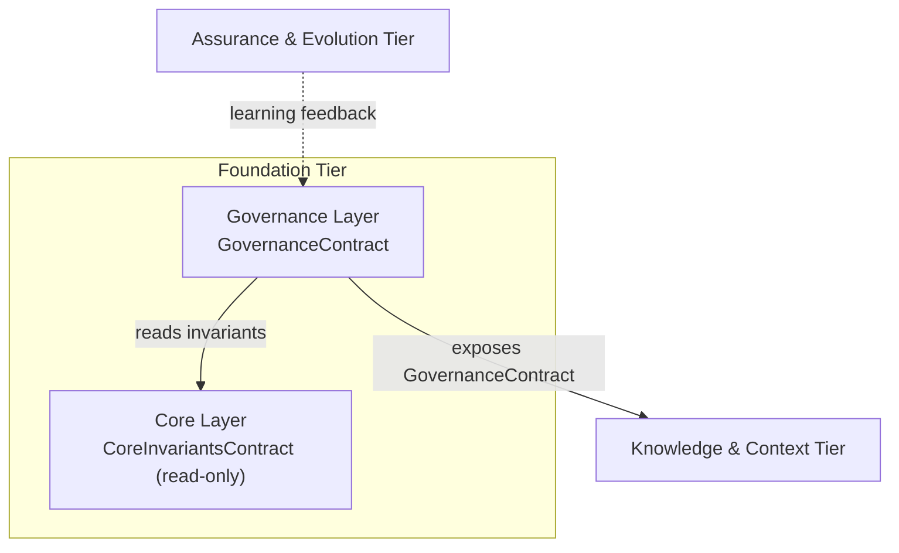
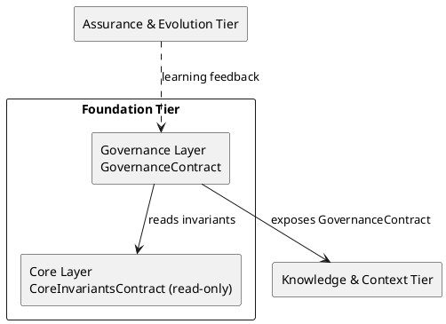
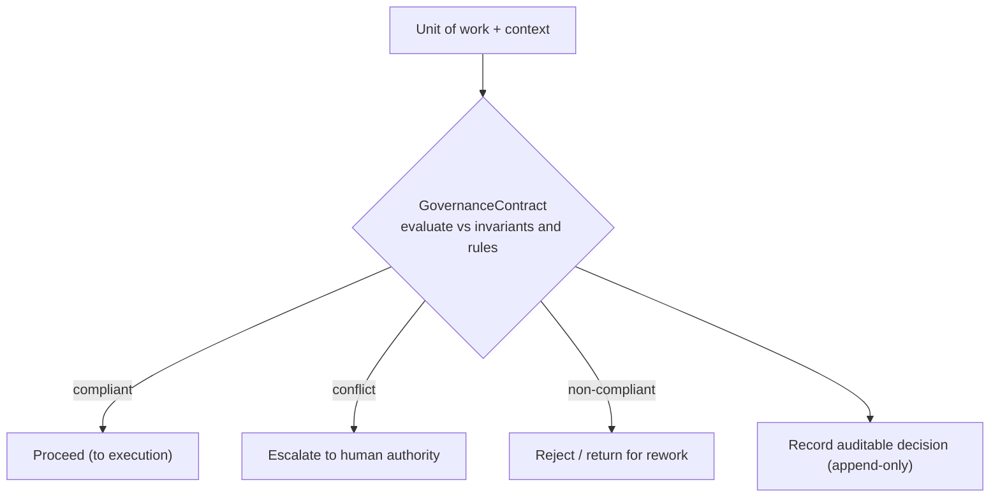
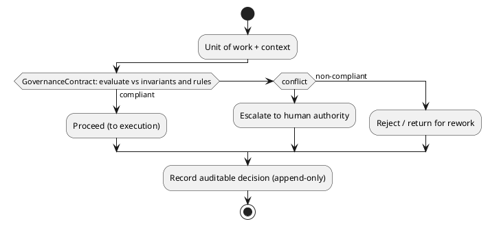

# LAEF Foundation Tier Architecture

| Field | Value |
|-------|-------|
| Document ID | LAEF-009 |
| Document Title | Foundation Tier Architecture (Core & Governance Layers) |
| Book | LAEF — LOUTAS AI Engineering Framework |
| Knowledge Base Area | 16-AI-Engineering-Framework |
| Framework Layer | Core / Governance |
| Version | 1.0 |
| Status | Approved |
| Owner | Enterprise AI Governance Office |
| Approval Authority | Product Owner |
| Review Cycle | Annual, and on every major LAEF milestone |
| Last Updated | 2026-07-30 |

---

# Purpose

This document defines the detailed architecture of the **Foundation Tier** of the LOUTAS AI Engineering Framework (LAEF) — the **Core Layer** and the **Governance Layer**.

It specifies each layer's responsibility, internal architectural structure, contract, dependencies, interfaces, and isolation, in conformance with the architectural constitution (LAEF-008) and the architecture overview (LAEF-004).

---

# Scope

This document applies to the Core and Governance layers and to every AI system that contributes to LOUTAS Care — referred to throughout as **"The AI Agent."**

It defines architecture only. It does **not** restate the Core content (LAEF-001, LAEF-002, LAEF-003), does **not** define governance procedures or enforcement (LAEF-005), and does **not** define engine internals (Phase 3). It conforms to LAEF-008 and is model-agnostic.

---

# 1. Position in the Framework

This document details the Foundation Tier that LAEF-004 defines at overview level, under the rules of LAEF-008:

- It **details** the Core and Governance layers; it does not restate LAEF-004's invariants or LAEF-008's rules.
- It **conforms** to LAEF-008 — every contract uses the LAEF-008 contract template, and the tier satisfies the LAEF-008 conformance checklist (Section 8).
- It **defers** governance procedures and enforcement to LAEF-005, and framework identity content to LAEF-001/002/003.

---

# 2. Tier Overview

The Foundation Tier is the top of the architecture. It holds the framework's authoritative identity and the governance that applies it.

- The **Core Layer** is the authoritative source of the framework's identity and invariants.
- The **Governance Layer** applies rules, roles, gates, and exception handling to work in flight.

Within the tier, the Governance Layer depends on the Core Layer (it governs against the invariants). The tier as a whole exposes its contracts downward to the Knowledge & Context Tier. No upward dependency exists except the learning-feedback edge defined in LAEF-008.

---

# 3. Core Layer Architecture

## 3.1 Responsibility

The Core Layer has a single responsibility: **provide authoritative, read-only access to the framework's identity and invariants** — vision, mission, principles, scope, and the architectural invariants — so that every other layer operates from one consistent source.

## 3.2 Internal Structure

Architecturally, the Core Layer is an **authoritative read-only store** of the framework's invariants, sourced from the approved governing documents (LAEF-001 through LAEF-004). It does not compute or decide; it serves. Its content is changed only through governed document revision, never at runtime.

## 3.3 Core Layer Contract

| Field | Value |
|-------|-------|
| Contract Name | CoreInvariantsContract |
| Owning Layer | Core Layer |
| Responsibility | Provide authoritative, read-only identity and invariants |
| Inputs | Queries for a named invariant or principle |
| Outputs | The current authoritative invariant/principle value (read-only) |
| Preconditions | The governing documents (LAEF-001…004) are Approved/Active |
| Postconditions | The consumer holds the current authoritative value |
| Guarantees / Invariants | Values are consistent, versioned, never self-contradictory; strictly read-only |
| Failure Behavior | If a value is unavailable or ambiguous, signal and escalate — never fabricate |
| Version | Governed by LAEF-006 |

## 3.4 Dependencies & Interfaces

The Core Layer depends on nothing at runtime; it is the root of the dependency graph. It exposes a single minimal, stable, read-only interface. No layer may write to it.

## 3.5 Isolation

The Core Layer's internals (how invariants are stored) are hidden; consumers see only the contract. It cannot be bypassed — an invariant is obtained only through the CoreInvariantsContract.

---

# 4. Governance Layer Architecture

## 4.1 Responsibility

The Governance Layer has a single responsibility: **apply the framework's rules, roles, gates, and exception handling to work in flight**, producing auditable decisions.

## 4.2 Internal Structure

Architecturally, the Governance Layer is composed of governance decision components — a rule set, a role registry, gate points, and an exception path — that evaluate work against the Core invariants and the applicable rules. The **content** of these rules and the **procedures** for enforcing them are defined in LAEF-005; this document defines only their architectural placement and contract.

## 4.3 Governance Layer Contract

| Field | Value |
|-------|-------|
| Contract Name | GovernanceContract |
| Owning Layer | Governance Layer |
| Responsibility | Apply rules, roles, gates, and exceptions to a unit of work |
| Inputs | A unit of work with its context; the Core invariants |
| Outputs | A governance decision (proceed / escalate / reject) and recorded approval or exception artifacts |
| Preconditions | Work is presented with sufficient context; Core invariants available |
| Postconditions | An auditable decision exists; non-compliant work is returned or escalated |
| Guarantees / Invariants | No self-approval; human-in-the-loop preserved; decisions append-only and auditable; invariants upheld |
| Failure Behavior | On conflict, escalate to human authority (Product Owner / Architecture Authority) |
| Version | Governed by LAEF-006 |

## 4.4 Dependencies & Interfaces

The Governance Layer depends on the Core Layer (it reads invariants through CoreInvariantsContract). It exposes the GovernanceContract downward. It holds no dependency on execution or assurance layers.

## 4.5 Isolation

The Governance Layer's internal decision components are hidden; other layers see only the GovernanceContract. Work cannot bypass governance to reach execution — the architecture routes it through this contract.

---

# 5. Foundation Tier Structure (Diagram)

**Mermaid**

**PlantUML**

**Explanation.** Within the Foundation Tier, the Governance Layer reads the framework's invariants from the Core Layer through the read-only CoreInvariantsContract, and applies its rules and gates to work. The tier exposes the GovernanceContract downward to the Knowledge & Context Tier — the single point through which work enters governance. The only upward connection is the learning-feedback edge from the Assurance & Evolution Tier, consistent with LAEF-008's dependency rules.

---

# 6. Governance Decision Flow (Diagram)

**Mermaid**

**PlantUML**

**Explanation.** A unit of work with its context enters the GovernanceContract, which evaluates it against the Core invariants and the applicable rules. Compliant work proceeds toward execution; a conflict is escalated to human authority rather than resolved silently; non-compliant work is returned for rework. Every outcome is recorded as an append-only, auditable decision. The rules and procedures behind this evaluation are defined in LAEF-005; this diagram shows only the architectural flow through the contract.

---

# 7. Tier Composition & Internal Dependencies

- The Core Layer is the root; it depends on nothing at runtime.
- The Governance Layer depends only on the Core Layer, through CoreInvariantsContract.
- The tier exposes the GovernanceContract to the Knowledge & Context Tier.
- The internal dependency graph (Governance → Core) is acyclic, and no layer in this tier depends on a lower tier, satisfying LAEF-008's dependency rules.

---

# 8. Conformance to LAEF-008

| Conformance item | Core Layer | Governance Layer |
|------------------|-----------|------------------|
| Single, cohesive responsibility | Yes | Yes |
| Exactly one contract (template) | CoreInvariantsContract | GovernanceContract |
| Allowed dependency direction, acyclic | Root (no deps) | Depends only on Core |
| Communicates only via contracts | Yes | Yes |
| Preserves LAEF-004 invariants at boundary | Yes (serves them) | Yes (upholds them) |
| Isolated (internals hidden, no bypass) | Yes | Yes |
| Extension per LAEF-008 §13 | Yes | Yes |
| No anti-patterns (LAEF-008 §15) | Yes | Yes (no self-approval) |
| Rule changes backed by ADR | N/A (content) | Yes |

This tier satisfies the LAEF-008 conformance checklist. Verification and enforcement remain governed by LAEF-005.

---

# 9. Boundaries & Deferrals

- Governance **procedures and enforcement** are defined in LAEF-005, not here.
- Framework **identity content** (the actual vision, principles, scope) is defined in LAEF-001/002/003, not restated here.
- **Engine internals** that realize these layers are deferred to Phase 3.
- The **rules and roles content** applied by the Governance Layer is governance content (LAEF-005); this document defines only their architectural placement and contract.

---

# Compliance

This document is authoritative once approved by the Product Owner.

It conforms to LAEF-008 and does not contradict LAEF-004. Any change to a normative architectural rule requires an approved ADR (LAEF-008 §14). Updates follow LAEF-006. This document complies with GOV-002 Document Template Standard and GOV-003 Document Numbering Standard.

---

# Dependencies

- LAEF-002 Core Principles & Philosophy
- LAEF-004 Framework Architecture Overview
- LAEF-005 Governance Overview
- LAEF-008 Layer Architecture Foundations & Design Principles
- GOV-002 Document Template Standard
- GOV-003 Document Numbering Standard

---

# Related Documents

- LAEF-010 Knowledge & Context Tier Architecture *(planned)*
- LAEF-011 Execution Tier Architecture *(planned)*
- LAEF-012 Assurance & Evolution Tier Architecture *(planned)*
- LAEF-001 / LAEF-003 — framework identity content *(referenced, not restated)*
- Core Engine specifications *(Phase 3)*

---

# Revision History

| Version | Date | Description |
|---------|------|-------------|
| 1.0 (Draft) | 2026-07-30 | Initial draft issued for approval; Core and Governance layer architecture with contracts and dual-notation diagrams, conformant to LAEF-008 |
| 1.0 (Approved) | 2026-07-30 | Approved by Product Owner without content changes |
