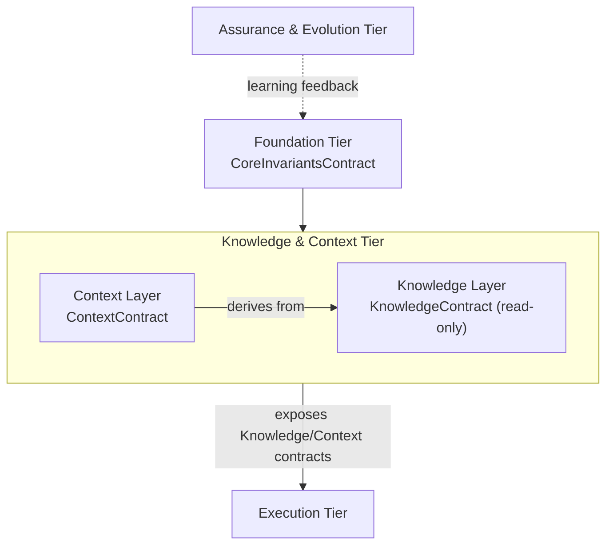
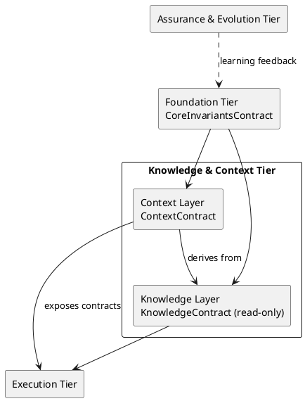
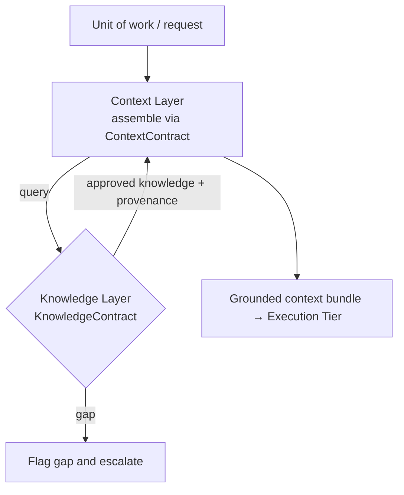
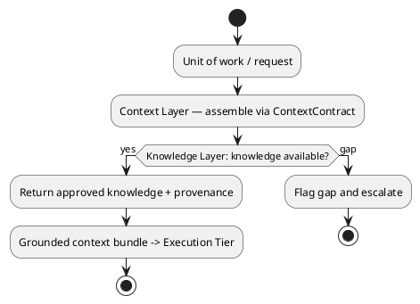

# LAEF Knowledge & Context Tier Architecture

| Field | Value |
|-------|-------|
| Document ID | LAEF-010 |
| Document Title | Knowledge & Context Tier Architecture (Knowledge & Context Layers) |
| Book | LAEF — LOUTAS AI Engineering Framework |
| Knowledge Base Area | 16-AI-Engineering-Framework |
| Framework Layer | Core / Governance |
| Version | 1.0 |
| Status | Approved |
| Owner | Enterprise AI Governance Office |
| Approval Authority | Product Owner |
| Review Cycle | Annual, and on every major LAEF milestone |
| Last Updated | 2026-07-30 |

---

# Purpose

This document defines the detailed architecture of the **Knowledge & Context Tier** of the LOUTAS AI Engineering Framework (LAEF) — the **Knowledge Layer** and the **Context Layer**.

It specifies each layer's responsibility, internal architectural structure, contract, dependencies, interfaces, and isolation, in conformance with the architectural constitution (LAEF-008) and the architecture overview (LAEF-004).

---

# Scope

This document applies to the Knowledge and Context layers and to every AI system that contributes to LOUTAS Care — referred to throughout as **"The AI Agent."**

It defines architecture only. It does **not** define the operational integration with the Knowledge Base (that is Phase 6 — Knowledge Integration), does **not** define engine internals (Phase 3), and does **not** restate LAEF-004 or LAEF-008. It conforms to LAEF-008 and is model-agnostic.

The split with Phase 6 is deliberate: **this document defines the structure, contracts, and interfaces of the Knowledge and Context layers; Phase 6 defines how those layers are wired to the actual Knowledge Base.**

---

# 1. Position in the Framework

This document details the Knowledge & Context Tier that LAEF-004 defines at overview level, under the rules of LAEF-008:

- It **details** the Knowledge and Context layers; it does not restate LAEF-004's invariants or LAEF-008's rules.
- It **conforms** to LAEF-008 — every contract uses the LAEF-008 contract template, and the tier satisfies the LAEF-008 conformance checklist (Section 8).
- It **depends on** the Foundation Tier (Core invariants; operating under governance) and **exposes** its contracts to the Execution Tier.
- It **defers** operational Knowledge Base integration to Phase 6 and engine internals to Phase 3.

---

# 2. Tier Overview

The Knowledge & Context Tier grounds work in authoritative truth before it is executed.

- The **Knowledge Layer** provides authoritative, read-first access to approved Knowledge Base content.
- The **Context Layer** assembles the situational context for a unit of work by narrowing that knowledge to what is relevant, combined with current project state.

Within the tier, the Context Layer depends on the Knowledge Layer (context is derived from authoritative knowledge). The tier depends on the Foundation Tier for the Core invariants and exposes the KnowledgeContract and ContextContract downward to the Execution Tier. No upward dependency exists except the learning-feedback edge defined in LAEF-008.

---

# 3. Knowledge Layer Architecture

## 3.1 Responsibility

The Knowledge Layer has a single responsibility: **provide authoritative, read-first access to approved Knowledge Base content** — architecture, ADRs, standards, governance, and prior decisions — so that work is grounded in truth rather than assumption.

## 3.2 Internal Structure

Architecturally, the Knowledge Layer is a **read-first access component over the authoritative Knowledge Base**. It retrieves approved content and returns it with provenance. It consumes, and never overrides, the Knowledge Base. The mechanism by which it connects to the actual repository is defined in Phase 6; here it is an abstract, contract-bound source.

## 3.3 Knowledge Layer Contract

| Field | Value |
|-------|-------|
| Contract Name | KnowledgeContract |
| Owning Layer | Knowledge Layer |
| Responsibility | Provide authoritative, read-first approved knowledge with provenance |
| Inputs | A query for relevant knowledge (topic / scope) |
| Outputs | The relevant approved knowledge, read-only, with provenance |
| Preconditions | The Knowledge Base is available; approved content exists |
| Postconditions | The consumer holds authoritative, provenance-tagged knowledge, or an explicit gap signal |
| Guarantees / Invariants | Knowledge is authoritative and never overridden; strictly read-only; gaps are flagged, never fabricated |
| Failure Behavior | If knowledge is missing or ambiguous, flag the gap and escalate — never fabricate |
| Version | Governed by LAEF-006 |

## 3.4 Dependencies & Interfaces

The Knowledge Layer depends on the Core Layer (CoreInvariantsContract) for the knowledge-authoritative invariant, and on the abstract Knowledge Base source (wired in Phase 6). It exposes a single minimal, read-only interface.

## 3.5 Isolation

The Knowledge Layer's internals (how retrieval works) are hidden; consumers see only the KnowledgeContract. It cannot be bypassed — approved knowledge is obtained only through the contract, preserving knowledge-first structurally.

---

# 4. Context Layer Architecture

## 4.1 Responsibility

The Context Layer has a single responsibility: **assemble the situational context for a unit of work** — the request, current project state, and applicable constraints — by narrowing authoritative knowledge to what is relevant.

## 4.2 Internal Structure

Architecturally, the Context Layer is a **context-assembly component** that draws on the Knowledge Layer (through KnowledgeContract) and current project state to produce a relevant, bounded context bundle for a specific unit of work. It derives context only from authoritative sources; it does not invent context.

## 4.3 Context Layer Contract

| Field | Value |
|-------|-------|
| Contract Name | ContextContract |
| Owning Layer | Context Layer |
| Responsibility | Assemble the relevant situational context for a unit of work |
| Inputs | A unit of work / request; access to KnowledgeContract; Core invariants |
| Outputs | An assembled, relevant context bundle with provenance |
| Preconditions | The request is specified; the Knowledge Layer is available |
| Postconditions | The consumer holds the relevant, authoritative context, or an explicit gap signal |
| Guarantees / Invariants | Context derives only from authoritative knowledge and current state; provenance preserved; no fabrication |
| Failure Behavior | If required context is unavailable, signal and escalate |
| Version | Governed by LAEF-006 |

## 4.4 Dependencies & Interfaces

The Context Layer depends on the Knowledge Layer (KnowledgeContract) and the Core Layer (CoreInvariantsContract). It exposes the ContextContract downward to the Execution Tier.

## 4.5 Isolation

The Context Layer's internals (how context is assembled) are hidden; consumers see only the ContextContract. Context cannot be assembled by reaching around the Knowledge Layer — it is derived through KnowledgeContract only.

---

# 5. Knowledge & Context Tier Structure (Diagram)

**Mermaid**

**PlantUML**

**Explanation.** The tier draws the Core invariants from the Foundation Tier. Inside it, the Context Layer derives its bundle from the Knowledge Layer through KnowledgeContract — context is never assembled independently of authoritative knowledge. The tier exposes both the KnowledgeContract and the ContextContract downward to the Execution Tier, which is how grounded work reaches execution. The only upward connection remains the learning-feedback edge, consistent with LAEF-008.

---

# 6. Knowledge-Grounding Flow (Diagram)

**Mermaid**

**PlantUML**

**Explanation.** A unit of work enters the Context Layer, which assembles its context by querying the Knowledge Layer through KnowledgeContract. When authoritative knowledge is available, it is returned with provenance and the Context Layer emits a grounded context bundle for the Execution Tier. When knowledge is missing or ambiguous, the gap is flagged and escalated rather than filled by assumption — enforcing the knowledge-authoritative invariant structurally. How the Knowledge Layer actually reaches the repository is defined in Phase 6.

---

# 7. Tier Composition & Internal Dependencies

- The Knowledge Layer depends on the Core Layer and the abstract Knowledge Base source (wired in Phase 6).
- The Context Layer depends on the Knowledge Layer and the Core Layer.
- The tier exposes KnowledgeContract and ContextContract to the Execution Tier.
- The internal dependency graph (Context → Knowledge) is acyclic, and no layer in this tier depends on a lower tier, satisfying LAEF-008's dependency rules.

---

# 8. Conformance to LAEF-008

| Conformance item | Knowledge Layer | Context Layer |
|------------------|-----------------|---------------|
| Single, cohesive responsibility | Yes | Yes |
| Exactly one contract (template) | KnowledgeContract | ContextContract |
| Allowed dependency direction, acyclic | Depends on Core + KB source | Depends on Knowledge + Core |
| Communicates only via contracts | Yes | Yes |
| Preserves LAEF-004 invariants at boundary | Yes (knowledge-authoritative) | Yes |
| Isolated (internals hidden, no bypass) | Yes | Yes (no reach-around) |
| Extension per LAEF-008 §13 | Yes | Yes |
| No anti-patterns (LAEF-008 §15) | Yes (no Knowledge bypass) | Yes |
| Rule changes backed by ADR | Yes | Yes |

This tier satisfies the LAEF-008 conformance checklist. Verification and enforcement remain governed by LAEF-005.

---

# 9. Boundaries & Deferrals

- **Operational Knowledge Base integration** — how the Knowledge Layer connects to the actual repository — is defined in **Phase 6 (Knowledge Integration)**, not here.
- **Engine internals** (Context Engine, Knowledge Engine) that realize these layers are deferred to Phase 3.
- This document defines the **structure, contracts, and interfaces** of the Knowledge and Context layers; it does not define their runtime wiring or the retrieval implementation.
- It does not restate LAEF-004 invariants or LAEF-008 rules.

---

# Compliance

This document is authoritative once approved by the Product Owner.

It conforms to LAEF-008 and does not contradict LAEF-004. Any change to a normative architectural rule requires an approved ADR (LAEF-008 §14). Updates follow LAEF-006. This document complies with GOV-002 Document Template Standard and GOV-003 Document Numbering Standard.

---

# Dependencies

- LAEF-002 Core Principles & Philosophy
- LAEF-004 Framework Architecture Overview
- LAEF-008 Layer Architecture Foundations & Design Principles
- LAEF-009 Foundation Tier Architecture
- GOV-002 Document Template Standard
- GOV-003 Document Numbering Standard

---

# Related Documents

- LAEF-011 Execution Tier Architecture *(planned)*
- LAEF-012 Assurance & Evolution Tier Architecture *(planned)*
- Phase 6 — Knowledge Integration *(planned; operational Knowledge Base wiring)*
- Core Engine specifications — Context Engine, Knowledge Engine *(Phase 3)*

---

# Revision History

| Version | Date | Description |
|---------|------|-------------|
| 1.0 (Draft) | 2026-07-30 | Initial draft issued for approval; Knowledge and Context layer architecture with contracts and dual-notation diagrams, conformant to LAEF-008; operational KB integration deferred to Phase 6 |
| 1.0 (Approved) | 2026-07-30 | Approved by Product Owner without content changes |
