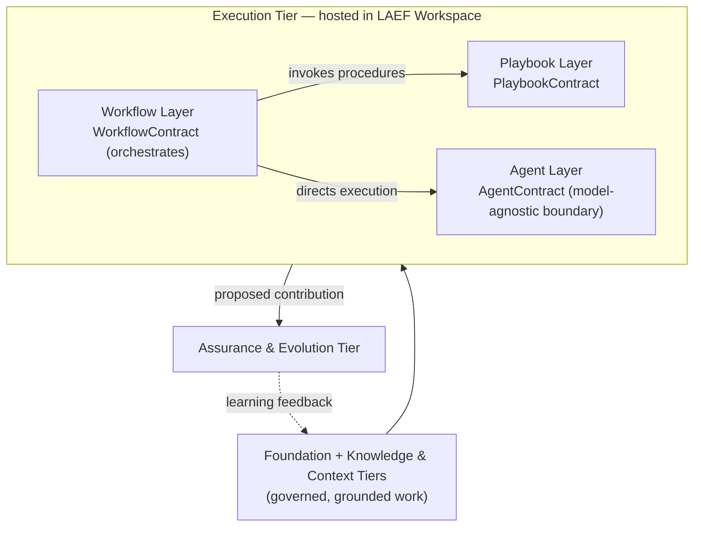
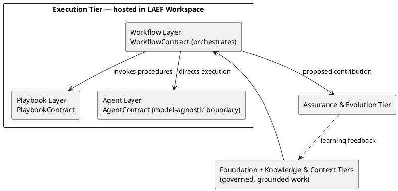
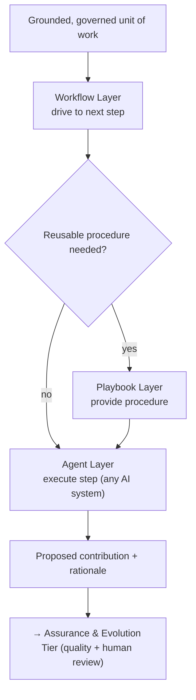
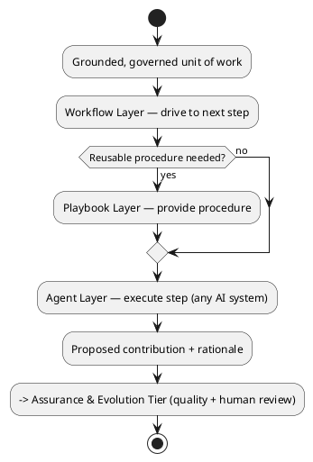

# LAEF Execution Tier Architecture

| Field | Value |
|-------|-------|
| Document ID | LAEF-011 |
| Document Title | Execution Tier Architecture (Agent, Workflow & Playbook Layers) |
| Book | LAEF — LOUTAS AI Engineering Framework |
| Knowledge Base Area | 16-AI-Engineering-Framework |
| Framework Layer | Core / Governance |
| Version | 1.0 |
| Status | Approved |
| Owner | Enterprise AI Governance Office |
| Approval Authority | Product Owner |
| Review Cycle | Annual, and on every major LAEF milestone |
| Last Updated | 2026-07-30 |

---

# Purpose

This document defines the detailed architecture of the **Execution Tier** of the LOUTAS AI Engineering Framework (LAEF) — the **Agent Layer**, the **Workflow Layer**, and the **Playbook Layer**.

It specifies each layer's responsibility, internal architectural structure, contract, dependencies, interfaces, and isolation, in conformance with the architectural constitution (LAEF-008) and the architecture overview (LAEF-004).

---

# Scope

This document applies to the Agent, Workflow, and Playbook layers and to every AI system that contributes to LOUTAS Care — referred to throughout as **"The AI Agent."**

It defines architecture only. It does **not** define the actual AI Agent roles (Phase 5), the actual workflows (Phase 7), or the actual playbooks (Phase 8); it does **not** define engine internals (Phase 3); and it does **not** restate LAEF-004 or LAEF-008. It conforms to LAEF-008 and is model-agnostic.

The Execution Tier is hosted operationally in the **LAEF Workspace** (evolved from 99-AI-Team).

---

# 1. Position in the Framework

This document details the Execution Tier that LAEF-004 defines at overview level, under the rules of LAEF-008:

- It **details** the Agent, Workflow, and Playbook layers; it does not restate LAEF-004's invariants or LAEF-008's rules.
- It **conforms** to LAEF-008 — every contract uses the LAEF-008 contract template, and the tier satisfies the LAEF-008 conformance checklist (Section 9).
- It **depends on** the Foundation Tier (governance clearance; Core invariants) and the Knowledge & Context Tier (grounded context), and **exposes** its output to the Assurance & Evolution Tier.
- It **defers** actual agents, workflows, and playbooks to Phases 5, 7, and 8, and engine internals to Phase 3.

---

# 2. Tier Overview

The Execution Tier is where grounded, governance-cleared work is performed.

- The **Agent Layer** is the model-agnostic boundary at which any AI system executes a unit of work, producing a *proposed* contribution.
- The **Workflow Layer** drives a unit of work through the defined engineering workflow.
- The **Playbook Layer** provides reusable, task-specific procedures for recurring scenarios.

Within the tier, the Workflow Layer orchestrates: it invokes the Playbook Layer for procedures and directs the Agent Layer to execute steps. The tier depends on the Foundation and Knowledge & Context tiers, and exposes its proposed contribution to the Assurance & Evolution Tier. No upward dependency exists except the learning-feedback edge defined in LAEF-008.

The Agent Layer is, by design, **the only layer permitted to couple to a specific AI system** (LAEF-008 §15); every other layer remains model-agnostic.

---

# 3. Agent Layer Architecture

## 3.1 Responsibility

The Agent Layer has a single responsibility: **adapt any AI system to the framework and execute a unit of work within governance, producing a proposed contribution** — never accepting it.

## 3.2 Internal Structure

Architecturally, the Agent Layer is the **model-agnostic execution boundary**: an adapter that presents the same framework behavior regardless of which AI system is connected. It receives grounded, governed work and produces a proposed contribution with rationale. It is the single point of contact with a specific AI system; the rest of the framework is unaware of which system is in use.

## 3.3 Agent Layer Contract

| Field | Value |
|-------|-------|
| Contract Name | AgentContract |
| Owning Layer | Agent Layer |
| Responsibility | Execute grounded, governed work; produce a proposed contribution |
| Inputs | A grounded context bundle (ContextContract); the workflow step / playbook to apply; governance constraints |
| Outputs | A proposed contribution with rationale, submitted for quality and human review |
| Preconditions | Work is grounded (Knowledge & Context) and governance-cleared to proceed |
| Postconditions | A proposed contribution exists and is submitted downstream; nothing is self-accepted |
| Guarantees / Invariants | Model-agnostic interface (any AI system pluggable); never self-approves; operates only on grounded, governed work; invariants preserved |
| Failure Behavior | On inability or uncertainty, surface and escalate — never fabricate |
| Version | Governed by LAEF-006 |

## 3.4 Dependencies & Interfaces

The Agent Layer depends on the Knowledge & Context Tier (ContextContract) for grounded work and on the Foundation Tier (Core invariants; governance clearance). It exposes the AgentContract, which the Workflow Layer drives. It is the only layer whose implementation may bind to a specific AI system, and it hides that binding behind the contract.

## 3.5 Isolation

The Agent Layer's internals — including which AI system is connected — are hidden; consumers see only the AgentContract. No layer may reach around it to a specific AI system; model-specific coupling is contained entirely within this boundary.

---

# 4. Workflow Layer Architecture

## 4.1 Responsibility

The Workflow Layer has a single responsibility: **drive a unit of work through the defined engineering workflow**, honoring every step and gate.

## 4.2 Internal Structure

Architecturally, the Workflow Layer is an **orchestration component** that advances a unit of work through the steps of an approved workflow, invoking the Playbook Layer for reusable procedures and directing the Agent Layer at execution steps. The actual workflow definitions are defined in Phase 7; here the layer is the engine that runs them.

## 4.3 Workflow Layer Contract

| Field | Value |
|-------|-------|
| Contract Name | WorkflowContract |
| Owning Layer | Workflow Layer |
| Responsibility | Advance a unit of work through the defined workflow steps and gates |
| Inputs | A unit of work with grounded context; the applicable workflow definition |
| Outputs | The work advanced to the next defined step, or a completion signal |
| Preconditions | A workflow definition exists; work is grounded and governance-cleared |
| Postconditions | The work is at a well-defined workflow state |
| Guarantees / Invariants | Steps follow the approved workflow; no step or gate is skipped |
| Failure Behavior | On an undefined transition, halt and escalate |
| Version | Governed by LAEF-006 |

## 4.4 Dependencies & Interfaces

The Workflow Layer depends on the Playbook Layer (PlaybookContract) and the Agent Layer (AgentContract), and on the upstream tiers for grounded, governed work. It exposes the WorkflowContract.

## 4.5 Isolation

The Workflow Layer's internals (how orchestration is implemented) are hidden; consumers see only the WorkflowContract. It advances work only through defined steps; there is no path around the workflow.

---

# 5. Playbook Layer Architecture

## 5.1 Responsibility

The Playbook Layer has a single responsibility: **provide reusable, task-specific procedures for recurring engineering scenarios**, so execution is consistent across contributors and over time.

## 5.2 Internal Structure

Architecturally, the Playbook Layer is a **procedure provider**: given a recognized scenario, it returns the approved reusable procedure to apply. The actual playbooks are defined in Phase 8; here the layer is the component that serves them.

## 5.3 Playbook Layer Contract

| Field | Value |
|-------|-------|
| Contract Name | PlaybookContract |
| Owning Layer | Playbook Layer |
| Responsibility | Provide the approved reusable procedure for a recognized scenario |
| Inputs | A recognized scenario with context |
| Outputs | The applicable reusable procedure |
| Preconditions | A matching playbook exists |
| Postconditions | The consumer holds the applicable procedure |
| Guarantees / Invariants | Procedures are consistent and reused; no divergence from the approved playbook |
| Failure Behavior | If no playbook matches, defer to the workflow default or escalate |
| Version | Governed by LAEF-006 |

## 5.4 Dependencies & Interfaces

The Playbook Layer depends only on the Core Layer (for invariants) and the abstract playbook source (defined in Phase 8). It exposes the PlaybookContract, consumed by the Workflow Layer.

## 5.5 Isolation

The Playbook Layer's internals (how procedures are stored and matched) are hidden; consumers see only the PlaybookContract.

---

# 6. Execution Tier Structure (Diagram)

**Mermaid**

**PlantUML**

**Explanation.** Governed, grounded work enters the Execution Tier, where the Workflow Layer orchestrates it — invoking the Playbook Layer for reusable procedures and directing the Agent Layer to execute steps. The Agent Layer is the single model-agnostic boundary: any AI system plugs in there and nowhere else. The tier's output is a *proposed* contribution passed to the Assurance & Evolution Tier for quality and human review; nothing is self-accepted. The only upward connection is the learning-feedback edge.

---

# 7. Execution Flow (Diagram)

**Mermaid**

**PlantUML**

**Explanation.** The Workflow Layer advances the work step by step. Where a step matches a recurring scenario, it invokes the Playbook Layer for the approved procedure; otherwise it proceeds directly. At each execution step the Agent Layer performs the work through whichever AI system is connected, and emits a proposed contribution with rationale. That proposal is handed to the Assurance & Evolution Tier — it is never accepted within the Execution Tier, preserving the human-in-the-loop invariant.

---

# 8. Tier Composition & Internal Dependencies

- The Agent Layer depends on the upstream tiers (grounded context, governance clearance, Core invariants).
- The Playbook Layer depends on the Core Layer and the abstract playbook source (Phase 8).
- The Workflow Layer depends on the Playbook Layer and the Agent Layer, and orchestrates them.
- The tier exposes its proposed contribution to the Assurance & Evolution Tier.
- The internal dependency graph (Workflow → Playbook, Workflow → Agent) is acyclic, and no layer depends on a lower tier, satisfying LAEF-008's dependency rules.

---

# 9. Conformance to LAEF-008

| Conformance item | Agent Layer | Workflow Layer | Playbook Layer |
|------------------|-------------|----------------|----------------|
| Single, cohesive responsibility | Yes | Yes | Yes |
| Exactly one contract (template) | AgentContract | WorkflowContract | PlaybookContract |
| Allowed dependency direction, acyclic | Depends on upstream | Depends on Playbook + Agent | Depends on Core + source |
| Communicates only via contracts | Yes | Yes | Yes |
| Preserves LAEF-004 invariants at boundary | Yes (no self-approval) | Yes (no skipped gates) | Yes |
| Isolated (internals hidden, no bypass) | Yes (model binding contained) | Yes | Yes |
| Extension per LAEF-008 §13 | Yes | Yes | Yes |
| No anti-patterns (LAEF-008 §15) | Yes (model coupling only here) | Yes | Yes |
| Rule changes backed by ADR | Yes | Yes | Yes |

This tier satisfies the LAEF-008 conformance checklist. Verification and enforcement remain governed by LAEF-005.

---

# 10. Boundaries & Deferrals

- The **actual AI Agent roles and behavior** are defined in **Phase 5 (Agent Framework)**, not here.
- The **actual workflows** are defined in **Phase 7 (Workflow Library)**, not here.
- The **actual playbooks** are defined in **Phase 8 (Playbooks)**, not here.
- **Engine internals** (Agent Engine, Workflow Engine, Task Engine) are deferred to Phase 3.
- This document defines the **structure, contracts, and interfaces** of the execution layers, and how the LAEF Workspace hosts them — not their populated content.

---

# Compliance

This document is authoritative once approved by the Product Owner.

It conforms to LAEF-008 and does not contradict LAEF-004. Any change to a normative architectural rule requires an approved ADR (LAEF-008 §14). Updates follow LAEF-006. This document complies with GOV-002 Document Template Standard and GOV-003 Document Numbering Standard.

---

# Dependencies

- LAEF-002 Core Principles & Philosophy
- LAEF-004 Framework Architecture Overview
- LAEF-008 Layer Architecture Foundations & Design Principles
- LAEF-009 Foundation Tier Architecture
- LAEF-010 Knowledge & Context Tier Architecture
- GOV-002 Document Template Standard
- GOV-003 Document Numbering Standard

---

# Related Documents

- LAEF-012 Assurance & Evolution Tier Architecture *(planned)*
- Phase 5 — Agent Framework · Phase 7 — Workflow Library · Phase 8 — Playbooks *(planned; populated content)*
- LAEF Workspace — 99-AI-Team *(execution tier host)*
- Core Engine specifications — Agent Engine, Workflow Engine, Task Engine *(Phase 3)*

---

# Revision History

| Version | Date | Description |
|---------|------|-------------|
| 1.0 (Draft) | 2026-07-30 | Initial draft issued for approval; Agent, Workflow, and Playbook layer architecture with contracts and dual-notation diagrams, conformant to LAEF-008; populated content deferred to Phases 5/7/8 |
| 1.0 (Approved) | 2026-07-30 | Approved by Product Owner without content changes |
