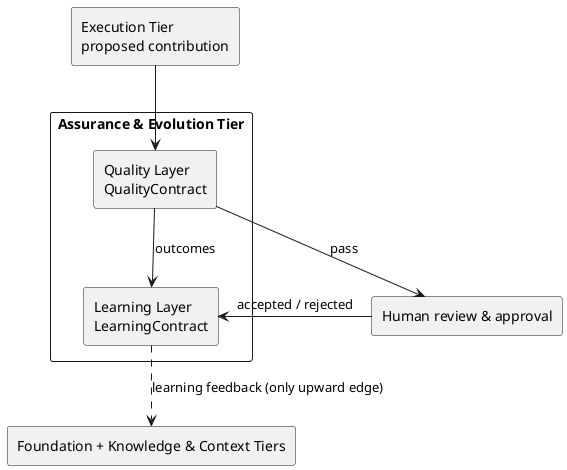
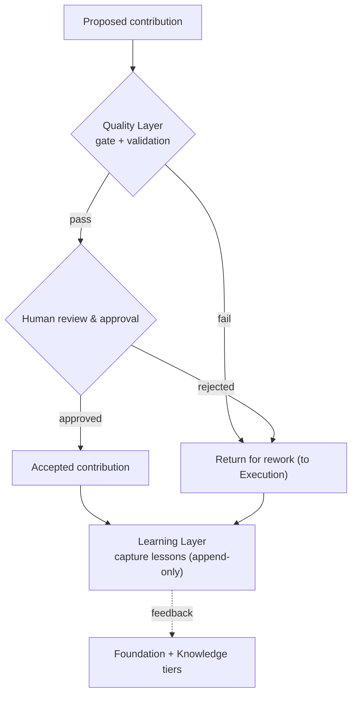
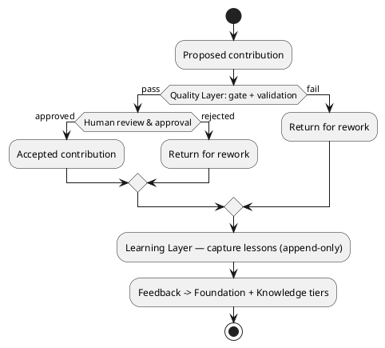

# LAEF Assurance & Evolution Tier Architecture

| Field | Value |
|-------|-------|
| Document ID | LAEF-012 |
| Document Title | Assurance & Evolution Tier Architecture (Quality & Learning Layers) |
| Book | LAEF — LOUTAS AI Engineering Framework |
| Knowledge Base Area | 16-AI-Engineering-Framework |
| Framework Layer | Core / Governance |
| Version | 1.0 |
| Status | Approved |
| Owner | Enterprise AI Governance Office |
| Approval Authority | Product Owner |
| Review Cycle | Annual, and on every major LAEF milestone |
| Last Updated | 2026-07-30 |

---

# Purpose

This document defines the detailed architecture of the **Assurance & Evolution Tier** of the LOUTAS AI Engineering Framework (LAEF) — the **Quality Layer** and the **Learning Layer**.

It specifies each layer's responsibility, internal architectural structure, contract, dependencies, interfaces, and isolation, in conformance with the architectural constitution (LAEF-008) and the architecture overview (LAEF-004). It is the final document of Phase 2 — Framework Architecture.

---

# Scope

This document applies to the Quality and Learning layers and to every AI system that contributes to LOUTAS Care — referred to throughout as **"The AI Agent."**

It defines architecture only. It does **not** define the operational quality system (Phase 9), does **not** define the operational learning system (Phase 10), does **not** define engine internals (Phase 3), and does **not** restate LAEF-004 or LAEF-008. It conforms to LAEF-008 and is model-agnostic.

---

# 1. Position in the Framework

This document details the Assurance & Evolution Tier that LAEF-004 defines at overview level, under the rules of LAEF-008:

- It **details** the Quality and Learning layers; it does not restate LAEF-004's invariants or LAEF-008's rules.
- It **conforms** to LAEF-008 — every contract uses the LAEF-008 contract template, and the tier satisfies the LAEF-008 conformance checklist (Section 8).
- It **depends on** the Execution Tier (proposed contributions) and the Foundation Tier (Core invariants), and it **carries the single upward feedback edge** back to the Foundation and Knowledge & Context tiers.
- It **defers** the operational quality and learning systems to Phases 9 and 10, and engine internals to Phase 3.

---

# 2. Tier Overview

The Assurance & Evolution Tier ensures quality before acceptance and turns outcomes into improvement.

- The **Quality Layer** applies quality gates and validation to a proposed contribution, before human review.
- The **Learning Layer** captures engineering lessons from outcomes and feeds improvement back into the framework.

Within the tier, the Learning Layer consumes the outcomes produced through the Quality Layer and the subsequent human decision. The tier depends on the Execution Tier for proposed contributions and on the Foundation Tier for invariants. The Learning Layer carries the **only upward dependency in the framework** — the learning-feedback edge to the Foundation and Knowledge & Context tiers — as permitted by LAEF-008.

The Quality Layer never accepts work; acceptance is a human decision (human-in-the-loop invariant).

---

# 3. Quality Layer Architecture

## 3.1 Responsibility

The Quality Layer has a single responsibility: **apply quality gates and validation to a proposed contribution**, producing a pass/fail result with findings, before the work reaches human review.

## 3.2 Internal Structure

Architecturally, the Quality Layer is a **gate-and-validation component** that evaluates a proposed contribution against acceptance criteria and returns a result with findings. It does not accept work; it advances passing work to human review and returns failing work for rework. The operational gate content and criteria are defined in Phase 9; here the layer is the component that applies them.

## 3.3 Quality Layer Contract

| Field | Value |
|-------|-------|
| Contract Name | QualityContract |
| Owning Layer | Quality Layer |
| Responsibility | Apply quality gates and validation to a proposed contribution |
| Inputs | A proposed contribution (AgentContract output); the applicable acceptance criteria |
| Outputs | A quality result (pass / fail) with findings; on pass, forwarded to human review; on fail, returned for rework |
| Preconditions | A proposed contribution exists; acceptance criteria are defined |
| Postconditions | A recorded quality result exists; failing work returned, passing work forwarded |
| Guarantees / Invariants | The quality bar is applied consistently; the layer never accepts work; findings are recorded (auditable) |
| Failure Behavior | On inability to evaluate, escalate |
| Version | Governed by LAEF-006 |

## 3.4 Dependencies & Interfaces

The Quality Layer depends on the Execution Tier (the proposed contribution via AgentContract) and the Core Layer (invariants behind acceptance criteria). It exposes the QualityContract.

## 3.5 Isolation

The Quality Layer's internals (how gates are evaluated) are hidden; consumers see only the QualityContract. Work cannot skip the quality gate to reach acceptance — the architecture routes it through this contract.

---

# 4. Learning Layer Architecture

## 4.1 Responsibility

The Learning Layer has a single responsibility: **capture engineering lessons from outcomes and feed improvement back into the framework**, carrying the framework's single upward feedback edge.

## 4.2 Internal Structure

Architecturally, the Learning Layer is a **capture-and-feedback component**: it records lessons from outcomes (accepted contributions, failures, escalations, exceptions) in an append-only manner and emits improvement signals upward to governance and knowledge. The operational learning system is defined in Phase 10; here the layer is the component that carries the loop.

## 4.3 Learning Layer Contract

| Field | Value |
|-------|-------|
| Contract Name | LearningContract |
| Owning Layer | Learning Layer |
| Responsibility | Capture lessons from outcomes and emit improvement feedback upward |
| Inputs | Outcomes: accepted contributions, failures, escalations, exceptions |
| Outputs | Captured lessons (append-only) and improvement signals to the Foundation and Knowledge & Context tiers |
| Preconditions | An outcome exists |
| Postconditions | Lessons are captured; feedback is emitted upward |
| Guarantees / Invariants | Lessons captured consistently and append-only; feedback is the framework's only upward dependency |
| Failure Behavior | If capture fails, signal — an outcome is never lost silently |
| Version | Governed by LAEF-006 |

## 4.4 Dependencies & Interfaces

The Learning Layer depends on the Quality Layer (results) and the human-decision outcome. It exposes the LearningContract, whose feedback path is the single upward edge to the Foundation and Knowledge & Context tiers, as permitted by LAEF-008.

## 4.5 Isolation

The Learning Layer's internals (how lessons are captured) are hidden; consumers see only the LearningContract. Its feedback is the sole sanctioned upward path; no other upward coupling exists.

---

# 5. Assurance & Evolution Tier Structure (Diagram)

**Mermaid**

```mermaid
graph TD
    EXE["Execution Tier<br/>proposed contribution"] --> Q
    subgraph AE["Assurance & Evolution Tier"]
        Q["Quality Layer<br/>QualityContract"]
        L["Learning Layer<br/>LearningContract"]
        Q -->|outcomes| L
    end
    Q -->|pass| HR["Human review & approval"]
    HR -->|accepted / rejected| L
    L -.->|learning feedback (only upward edge)| UP["Foundation + Knowledge & Context Tiers"]
```

**PlantUML**



**Explanation.** A proposed contribution from the Execution Tier enters the Quality Layer, which applies gates and validation. Passing work is forwarded to human review and approval; the human decision, together with the quality outcome, flows to the Learning Layer. The Learning Layer captures lessons and emits improvement feedback upward to the Foundation and Knowledge & Context tiers — the framework's single sanctioned upward edge. The Quality Layer never accepts work itself; acceptance is always a human decision.

---

# 6. Quality & Learning Flow (Diagram)

**Mermaid**



**PlantUML**



**Explanation.** A proposed contribution is validated at the Quality gate; failing work returns to the Execution Tier for rework. Passing work goes to human review — approval yields an accepted contribution, rejection returns it for rework. Every outcome, accepted or reworked, flows to the Learning Layer, which captures the lesson append-only and feeds improvement back to the upstream tiers. This is how the framework turns each unit of work into durable improvement while keeping acceptance human.

---

# 7. Tier Composition & Internal Dependencies

- The Quality Layer depends on the Execution Tier (proposed contribution) and the Core Layer (invariants).
- The Learning Layer depends on the Quality Layer (results) and the human-decision outcome.
- The tier's Learning Layer emits the single upward feedback edge to the Foundation and Knowledge & Context tiers.
- The internal dependency graph (Learning → Quality) is acyclic; the upward feedback edge is the sanctioned exception defined in LAEF-008, not a cycle.

---

# 8. Conformance to LAEF-008

| Conformance item | Quality Layer | Learning Layer |
|------------------|---------------|----------------|
| Single, cohesive responsibility | Yes | Yes |
| Exactly one contract (template) | QualityContract | LearningContract |
| Allowed dependency direction, acyclic | Depends on Execution + Core | Depends on Quality + outcome |
| Communicates only via contracts | Yes | Yes |
| Preserves LAEF-004 invariants at boundary | Yes (never accepts work) | Yes (append-only) |
| Isolated (internals hidden, no bypass) | Yes (no gate skip) | Yes |
| Extension per LAEF-008 §13 | Yes | Yes |
| No anti-patterns (LAEF-008 §15) | Yes | Yes (feedback is the sole upward edge) |
| Rule changes backed by ADR | Yes | Yes |

This tier satisfies the LAEF-008 conformance checklist. Verification and enforcement remain governed by LAEF-005.

---

# 9. Boundaries & Deferrals

- The **operational quality system** (gate content, acceptance criteria, validation methods) is defined in **Phase 9 (Quality System)**, not here.
- The **operational learning system** (how lessons are captured, curated, and applied) is defined in **Phase 10 (Continuous Improvement)**, not here.
- **Engine internals** (Quality Engine, Learning Engine) are deferred to Phase 3.
- This document defines the **structure, contracts, and interfaces** of the assurance layers — not their populated content.

---

# Compliance

This document is authoritative once approved by the Product Owner.

It conforms to LAEF-008 and does not contradict LAEF-004. Any change to a normative architectural rule requires an approved ADR (LAEF-008 §14). Updates follow LAEF-006. This document complies with GOV-002 Document Template Standard and GOV-003 Document Numbering Standard.

With the approval of this document, **Phase 2 — Framework Architecture is complete**, and every layer defined in LAEF-004 has detailed architecture coverage.

---

# Dependencies

- LAEF-002 Core Principles & Philosophy
- LAEF-004 Framework Architecture Overview
- LAEF-005 Governance Overview
- LAEF-008 Layer Architecture Foundations & Design Principles
- LAEF-009 Foundation Tier Architecture
- LAEF-011 Execution Tier Architecture
- GOV-002 Document Template Standard
- GOV-003 Document Numbering Standard

---

# Related Documents

- LAEF-010 Knowledge & Context Tier Architecture
- Phase 9 — Quality System · Phase 10 — Continuous Improvement *(planned; populated content)*
- Core Engine specifications — Quality Engine, Learning Engine *(Phase 3)*
- LAEF-007 Framework Roadmap

---

# Revision History

| Version | Date | Description |
|---------|------|-------------|
| 1.0 (Draft) | 2026-07-30 | Initial draft issued for approval; Quality and Learning layer architecture with contracts and dual-notation diagrams, conformant to LAEF-008; completes Phase 2 layer coverage; operational systems deferred to Phases 9/10 |
| 1.0 (Approved) | 2026-07-30 | Approved by Product Owner; completes Phase 2 — Framework Architecture |
