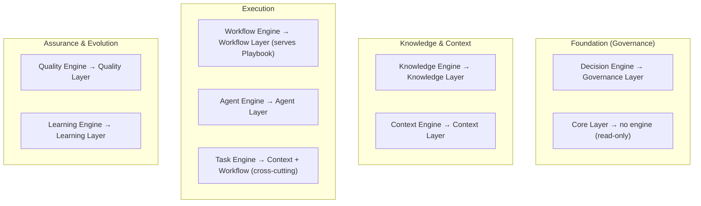
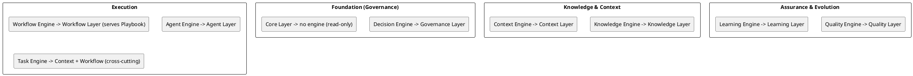
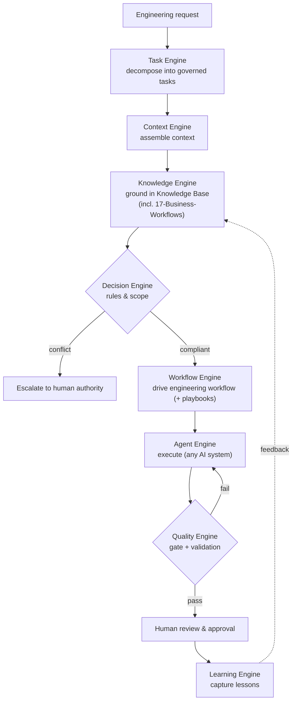
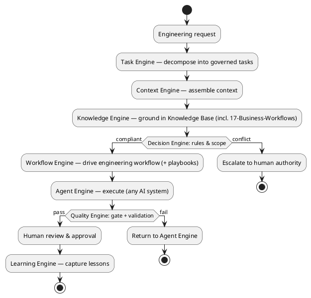

# LAEF Engine-Set Design Specification

| Field | Value |
|-------|-------|
| Document ID | LAEF-013 |
| Document Title | Engine-Set Design Specification (Core Engines Overview) |
| Book | LAEF — LOUTAS AI Engineering Framework |
| Knowledge Base Area | 16-AI-Engineering-Framework |
| Framework Layer | Core / Governance |
| Version | 1.0 |
| Status | Approved |
| Owner | Enterprise AI Governance Office |
| Approval Authority | Product Owner |
| Review Cycle | Annual, and on every major LAEF milestone |
| Last Updated | 2026-07-30 |

---

# Purpose

This document is the **architectural overview of the LAEF core engines** — the components that operationally realize the layers defined in Phase 2. It is the first document of Phase 3 (Core Engines).

It defines the complete engine set, each engine's responsibility, how the engines interact, their dependencies, the architectural constraints they operate under, and the mapping of each engine to the layer architecture in LAEF-009 through LAEF-012. It **intentionally excludes implementation details**; the detailed specification of each engine is produced in one document per engine (LAEF-014 through LAEF-021).

---

# Scope

This document applies to all LAEF core engines and to every AI system that contributes to LOUTAS Care — referred to throughout as **"The AI Agent."**

It defines the engine architecture at overview level only. It does **not** define per-engine internals (LAEF-014 through LAEF-021), does **not** define operational content of any layer (Phases 4–10), and does **not** restate LAEF-004 or LAEF-008. It conforms to LAEF-008 and is model-agnostic.

---

# 1. Position in the Framework

This document details, at the engine level, how the layers of LAEF-004 are realized, under the rules of LAEF-008:

- It **details** how the eight engines realize the nine layers; it does not restate LAEF-004's invariants or LAEF-008's rules.
- Each engine **conforms** to LAEF-008 and uses the relevant **layer contract** (from LAEF-009 through LAEF-012) as its interface — no new interface is invented.
- It **defers** each engine's internal design to its own document (LAEF-014 through LAEF-021) and all operational content to Phases 4–10.

---

# 2. Engine-Set Overview

LAEF is realized by **eight core engines**:

- **Context Engine** — assembles task context.
- **Knowledge Engine** — retrieves and grounds authoritative knowledge.
- **Task Engine** — decomposes a request into governed tasks (cross-cutting).
- **Workflow Engine** — drives the engineering workflow (and serves playbook invocation).
- **Decision Engine** — applies governance rules and routes escalations.
- **Agent Engine** — adapts any AI system to LAEF roles (the model-specific boundary).
- **Quality Engine** — runs quality gates and validation.
- **Learning Engine** — captures lessons and carries the upward feedback edge.

Two layers have no dedicated engine, by design (see Section 4): the **Core Layer** is read-only and served directly through its contract, and the **Playbook Layer** is served by the Workflow Engine.

---

# 3. Engine Responsibilities

| Engine | Responsibility | Realizes Layer | Interface Contract |
|--------|----------------|----------------|--------------------|
| Context Engine | Assemble the relevant situational context for a unit of work | Context | ContextContract |
| Knowledge Engine | Retrieve and ground authoritative knowledge with provenance | Knowledge | KnowledgeContract |
| Task Engine | Decompose a request into governed tasks | Context + Workflow (cross-cutting) | Context / Workflow contracts |
| Workflow Engine | Drive the engineering workflow; serve playbook invocation | Workflow (serves Playbook) | WorkflowContract (uses PlaybookContract) |
| Decision Engine | Apply governance rules; route escalations | Governance | GovernanceContract |
| Agent Engine | Adapt any AI system; execute; produce a proposed contribution | Agent | AgentContract |
| Quality Engine | Apply quality gates and validation | Quality | QualityContract |
| Learning Engine | Capture lessons; emit upward improvement feedback | Learning | LearningContract |

---

# 4. Engine-to-Layer Mapping & Reconciliation

The eight engines realize the nine layers as follows:

- Seven layers have a dedicated engine (Context, Knowledge, Workflow, Governance, Agent, Quality, Learning).
- The **Core Layer** has **no engine**: it is a read-only authoritative store served directly through CoreInvariantsContract; an engine would add no value.
- The **Playbook Layer** has **no dedicated engine**: it is served by the **Workflow Engine**, which already orchestrates playbook invocation (LAEF-011).
- The **Task Engine** is **cross-cutting**: it spans the Context and Workflow layers to decompose a request into governed tasks; it does not own a single layer.

This mapping preserves the approved LAEF-004 engine set; no new engine is introduced and no ADR is required.

**Mermaid**

**PlantUML**

**Explanation.** Seven layers map one-to-one to an engine. The Core Layer needs no engine because it only serves read-only invariants; the Playbook Layer is served by the Workflow Engine that already invokes playbooks; and the Task Engine is cross-cutting, spanning Context and Workflow to turn a request into governed tasks. This keeps the approved eight-engine set intact while covering every layer.

---

# 5. Engine Interactions

The engines interact by mirroring the flow of work through the layers. Each interaction is contract-mediated; there are no side-channels.

**Mermaid**

**PlantUML**

**Explanation.** A request is decomposed by the Task Engine, contextualized by the Context Engine, and grounded by the Knowledge Engine — which reads authoritative sources including the planned `17-Business-Workflows` repository (per ADR-011). The Decision Engine checks rules and scope, escalating conflicts. Compliant work is driven by the Workflow Engine (invoking playbooks as needed) and executed by the Agent Engine. The Quality Engine gates the result; passing work goes to human approval; and the Learning Engine captures lessons, feeding improvement back to knowledge. The Workflow Engine drives *engineering* workflows only; business workflows are read as knowledge by the Knowledge Engine, never driven by the Workflow Engine.

---

# 6. Engine Dependencies

Engine dependencies follow the same rules as layer dependencies (LAEF-008 §6):

- Dependencies flow in the allowed direction (governance → knowledge/context → execution → assurance); the only upward edge is the Learning Engine's feedback.
- The engine dependency graph is **acyclic**.
- Each engine depends on other engines only through their **layer contracts**, never their internals.
- The **Agent Engine** is the only engine permitted to couple to a specific AI system; all other engines are model-agnostic.

---

# 7. Architectural Constraints

Every engine shall satisfy the following, in conformance with LAEF-008:

- **Contract-bound.** Each engine uses its layer's contract as its interface and exposes nothing beyond it.
- **Single responsibility & isolation.** Each engine realizes one layer's responsibility (or, for the Task Engine, one cross-cutting responsibility) and hides its internals.
- **Knowledge-first.** No engine executes work before the Knowledge Engine has grounded it.
- **Human-in-the-loop.** No engine accepts work; acceptance is a human decision.
- **Model-agnostic except the Agent Engine.** Model-specific coupling is contained entirely within the Agent Engine.
- **Workflow Engine is engineering-only.** Per ADR-011, its authoritative source is the LAEF Workflow Library (Phase 7); it does not own, derive, or read business workflows.
- **Knowledge Engine authoritative sources.** The Knowledge Engine reads approved knowledge — including the product repositories and the planned `17-Business-Workflows` (per ADR-011) — strictly read-only.
- **No anti-patterns.** No engine bypasses the Knowledge Engine, reaches around a contract, forms a cycle, or embeds self-approval.

---

# 8. Mapping to LAEF-009 through LAEF-012

| Engine | Layer contract (interface) | Defined in |
|--------|----------------------------|------------|
| Decision Engine | GovernanceContract | LAEF-009 |
| (Core Layer — no engine) | CoreInvariantsContract | LAEF-009 |
| Knowledge Engine | KnowledgeContract | LAEF-010 |
| Context Engine | ContextContract | LAEF-010 |
| Task Engine | Context + Workflow contracts | LAEF-010 / LAEF-011 |
| Workflow Engine | WorkflowContract (uses PlaybookContract) | LAEF-011 |
| Agent Engine | AgentContract | LAEF-011 |
| Quality Engine | QualityContract | LAEF-012 |
| Learning Engine | LearningContract | LAEF-012 |

Each engine's detailed specification reuses its layer contract exactly as defined in Phase 2.

---

# 9. Phase 3 Document Sequence

The engine specifications are produced one document per engine:

| Document | Engine |
|----------|--------|
| LAEF-014 | Context Engine |
| LAEF-015 | Knowledge Engine |
| LAEF-016 | Task Engine |
| LAEF-017 | Decision Engine |
| LAEF-018 | Workflow Engine |
| LAEF-019 | Agent Engine |
| LAEF-020 | Quality Engine |
| LAEF-021 | Learning Engine |

Recommended writing order follows the interaction flow above. Phase 3 targets the **LAEF v1.2** release (minor, additive).

---

# 10. Boundaries & Deferrals

- **Per-engine internal design** is deferred to LAEF-014 through LAEF-021.
- **Operational content** of any layer (governance procedures, workflows, playbooks, quality system, learning system) is deferred to Phases 4–10.
- **Business-workflow content** and the establishment of `17-Business-Workflows` are product work outside LAEF (per ADR-011).
- This document defines the **engine set, responsibilities, interactions, dependencies, constraints, and mapping** — not implementation.

---

# Compliance

This document is authoritative once approved by the Product Owner.

It conforms to LAEF-008 and does not contradict LAEF-004 or any Phase 2 document. It reflects ADR-011. Any change to a normative architectural rule requires an approved ADR (LAEF-008 §14). Updates follow LAEF-006. This document complies with GOV-002 Document Template Standard and GOV-003 Document Numbering Standard.

---

# Dependencies

- LAEF-004 Framework Architecture Overview
- LAEF-008 Layer Architecture Foundations & Design Principles
- LAEF-009 Foundation Tier Architecture
- LAEF-010 Knowledge & Context Tier Architecture
- LAEF-011 Execution Tier Architecture
- LAEF-012 Assurance & Evolution Tier Architecture
- ADR-011 Business Workflow Source of Truth
- GOV-002 Document Template Standard
- GOV-003 Document Numbering Standard

---

# Related Documents

- LAEF-014 through LAEF-021 — individual engine specifications *(planned)*
- LAEF-007 Framework Roadmap
- 17-Business-Workflows — Business Workflow Repository *(planned per ADR-011)*
- LAEF Workspace — 99-AI-Team *(execution tier host; Phase 7 Workflow Library)*

---

# Revision History

| Version | Date | Description |
|---------|------|-------------|
| 1.0 (Draft) | 2026-07-30 | Initial draft issued for approval; engine-set overview with responsibilities, interactions, dependencies, constraints, LAEF-009–012 mapping, and dual-notation diagrams; reflects ADR-011; implementation excluded |
| 1.0 (Approved) | 2026-07-30 | Approved by Product Owner without content changes |
