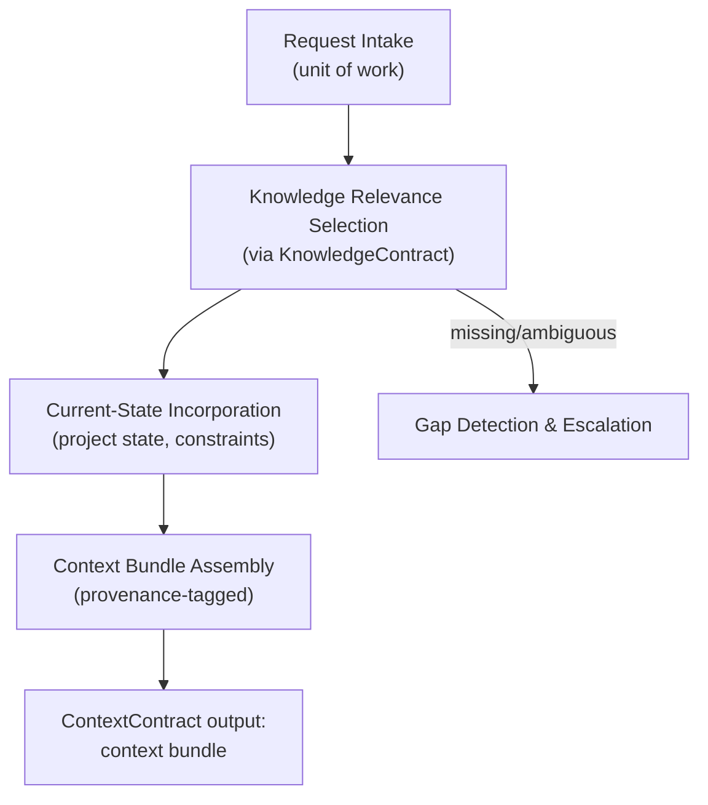
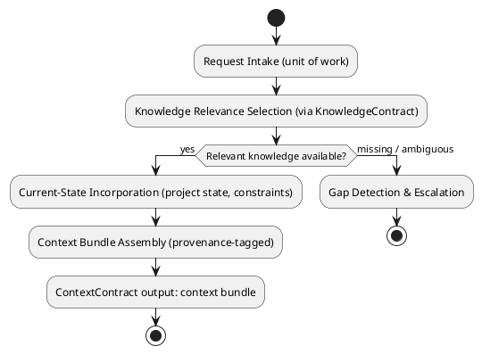
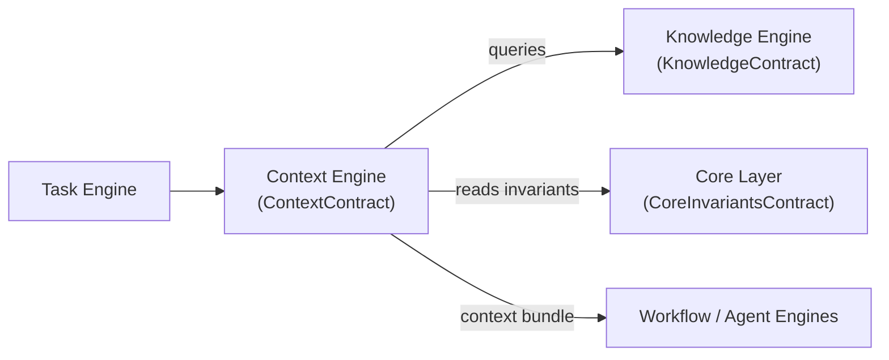
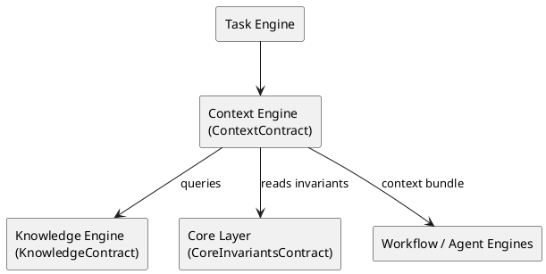

# LAEF Context Engine Specification

| Field | Value |
|-------|-------|
| Document ID | LAEF-014 |
| Document Title | Context Engine Specification |
| Book | LAEF — LOUTAS AI Engineering Framework |
| Knowledge Base Area | 16-AI-Engineering-Framework |
| Framework Layer | Core / Governance |
| Version | 1.0 |
| Status | Approved |
| Owner | Enterprise AI Governance Office |
| Approval Authority | Product Owner |
| Review Cycle | Annual, and on every major LAEF milestone |
| Last Updated | 2026-07-30 |

---

# Purpose

This document defines the architecture of the **Context Engine** — the engine that realizes the Context Layer of the LOUTAS AI Engineering Framework (LAEF).

It specifies the engine's responsibility, the contract it implements, its internal architectural structure, its interactions and dependencies, and the constraints it operates under, in conformance with the architectural constitution (LAEF-008) and the engine-set overview (LAEF-013).

---

# Scope

This document applies to the Context Engine and to every AI system that contributes to LOUTAS Care — referred to throughout as **"The AI Agent."**

It defines the engine's architecture only. It does **not** define implementation or code, does **not** redefine the Context Layer (LAEF-010) or the ContextContract, and does **not** restate LAEF-008 or LAEF-013. It is model-agnostic.

---

# 1. Position in the Framework

- The Context Engine **realizes the Context Layer** defined in LAEF-010, and implements the **ContextContract** exactly as defined there.
- It **conforms** to LAEF-008 (contract-bound, single responsibility, isolation, allowed dependencies, no anti-patterns) and to the engine-set overview LAEF-013.
- It **defers** implementation and code to the build phase; this document is architecture only.

---

# 2. Responsibility

The Context Engine has a single responsibility: **assemble the relevant situational context for a unit of work** — the request, current project state, and applicable constraints — by narrowing authoritative knowledge to what is relevant, and produce a bounded, provenance-tagged context bundle.

---

# 3. Contract Implemented

The Context Engine implements the **ContextContract** (defined in LAEF-010). It honors that contract without alteration:

- **Inputs:** a unit of work / request; access to the KnowledgeContract (via the Knowledge Engine); Core invariants.
- **Outputs:** an assembled, relevant context bundle with provenance.
- **Guarantees:** context derives only from authoritative knowledge and current state; provenance preserved; no fabrication.
- **Failure behavior:** if required context is unavailable, signal and escalate.

The engine adds no capability beyond the contract; the contract is the sole interface other engines rely on.

---

# 4. Internal Architecture

Architecturally, the Context Engine is composed of the following components (described at the architectural level, not as implementation):

- **Request Intake** — receives a unit of work (typically from the Task Engine) and identifies the context it requires.
- **Knowledge Relevance Selection** — queries the Knowledge Engine through the KnowledgeContract and selects the approved knowledge relevant to the request. It never accesses knowledge except through that contract.
- **Current-State Incorporation** — incorporates current project state and applicable constraints into the context.
- **Context Bundle Assembly** — assembles the selected knowledge and state into a bounded, provenance-tagged context bundle that satisfies the ContextContract.
- **Gap Detection & Escalation** — if required context is unavailable or ambiguous, it signals the gap and escalates rather than fabricating.

These components are internal and hidden behind the ContextContract; other engines see only the contract.

---

# 5. Internal Structure (Diagram)

**Mermaid**

**PlantUML**

**Explanation.** The engine takes in a unit of work, selects the relevant approved knowledge through the KnowledgeContract, incorporates current project state and constraints, and assembles a bounded, provenance-tagged context bundle that satisfies the ContextContract. If the knowledge required to build that context is missing or ambiguous, the engine signals the gap and escalates rather than inventing context. All of this is internal; consumers see only the contract output.

---

# 6. Interactions & Dependencies

- **Depends on** the **Knowledge Engine** (through the KnowledgeContract) for approved knowledge, and on the **Core Layer** (CoreInvariantsContract) for invariants.
- **Consumed by** the **Task Engine** and, downstream, the workflow and execution engines, which rely on the context bundle it produces.
- All interactions are contract-mediated; the Context Engine holds no dependency on execution or assurance engines, and introduces no cycle.

**Mermaid**

**PlantUML**

**Explanation.** The Context Engine receives work from the Task Engine, queries the Knowledge Engine through the KnowledgeContract, and reads invariants from the Core Layer. It produces a context bundle consumed by the downstream workflow and execution engines. Every arrow is a contract; the engine never reaches into another engine's internals, and the graph is acyclic.

---

# 7. Architectural Constraints

In conformance with LAEF-008 and LAEF-013, the Context Engine shall:

- Use the **ContextContract** as its sole interface; expose nothing beyond it.
- Hold a **single responsibility** (context assembly) and keep its internals isolated.
- Be **model-agnostic** — it depends on no specific AI system.
- Enforce **knowledge-first** — it obtains knowledge only through the Knowledge Engine's contract; it never bypasses it.
- **Never fabricate** context; on a gap it signals and escalates.
- Exhibit **no anti-patterns** — no Knowledge bypass, no reach-around, no cycle, no self-approval.

---

# 8. Conformance to LAEF-008 and LAEF-013

| Item | Context Engine |
|------|----------------|
| Realizes the correct layer | Context Layer (LAEF-010) |
| Implements the layer contract unchanged | ContextContract |
| Single, cohesive responsibility | Yes |
| Allowed dependency direction, acyclic | Depends on Knowledge Engine + Core |
| Contract-only communication | Yes |
| Isolation (internals hidden) | Yes |
| Model-agnostic | Yes |
| No anti-patterns | Yes (no Knowledge bypass) |

Verification and enforcement remain governed by LAEF-005.

---

# 9. Boundaries & Deferrals

- **Implementation and code** are out of scope; this document defines architecture only.
- The **Context Layer definition** and the **ContextContract** are owned by LAEF-010 and are referenced, not redefined.
- **Knowledge retrieval** is the Knowledge Engine's responsibility (LAEF-015); the Context Engine only consumes it through the contract.
- Operational content and engine build details are deferred to their respective phases.

---

# Compliance

This document is authoritative once approved by the Product Owner.

It conforms to LAEF-008, LAEF-013, and LAEF-010, and does not contradict LAEF-004. Any change to a normative architectural rule requires an approved ADR (LAEF-008 §14). Updates follow LAEF-006. This document complies with GOV-002 Document Template Standard and GOV-003 Document Numbering Standard.

---

# Dependencies

- LAEF-004 Framework Architecture Overview
- LAEF-008 Layer Architecture Foundations & Design Principles
- LAEF-010 Knowledge & Context Tier Architecture
- LAEF-013 Engine-Set Design Specification
- GOV-002 Document Template Standard
- GOV-003 Document Numbering Standard

---

# Related Documents

- LAEF-015 Knowledge Engine Specification *(planned; provides the KnowledgeContract this engine consumes)*
- LAEF-016 Task Engine Specification *(planned; provides work to this engine)*
- LAEF-009 Foundation Tier Architecture *(CoreInvariantsContract)*

---

# Revision History

| Version | Date | Description |
|---------|------|-------------|
| 1.0 (Draft) | 2026-07-30 | Initial draft issued for approval; Context Engine architecture realizing the Context Layer, implementing ContextContract, with dual-notation diagrams; conformant to LAEF-008 and LAEF-013; implementation excluded |
| 1.0 (Approved) | 2026-07-30 | Approved by Product Owner without content changes |
