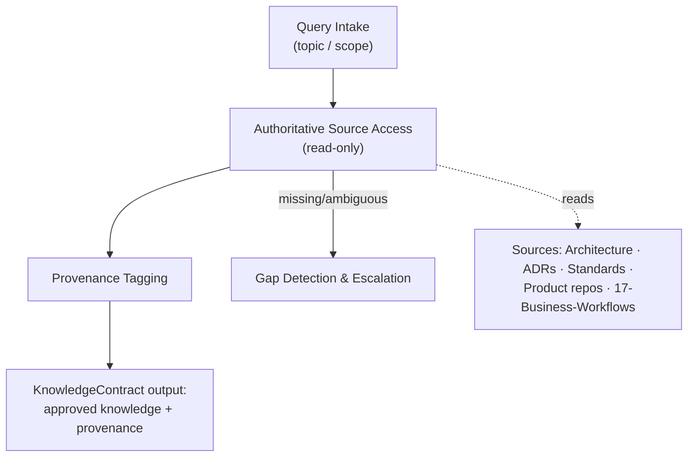
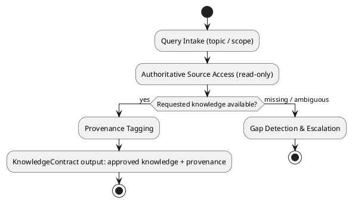
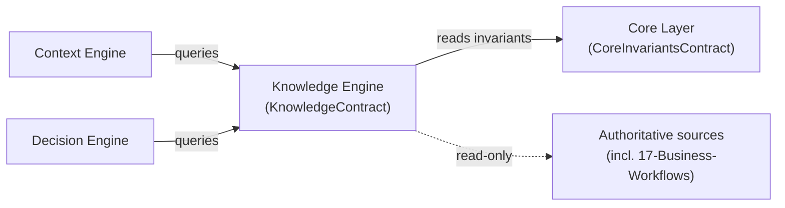
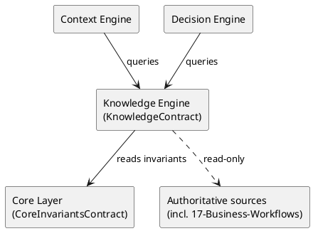

# LAEF Knowledge Engine Specification

| Field | Value |
|-------|-------|
| Document ID | LAEF-015 |
| Document Title | Knowledge Engine Specification |
| Book | LAEF — LOUTAS AI Engineering Framework |
| Knowledge Base Area | 16-AI-Engineering-Framework |
| Framework Layer | Core / Governance |
| Version | 1.0 |
| Status | Approved |
| Owner | Enterprise AI Governance Office |
| Approval Authority | Product Owner |
| Review Cycle | Annual, and on every major LAEF milestone |
| Last Updated | 2026-07-30 |

---

# Purpose

This document defines the architecture of the **Knowledge Engine** — the engine that realizes the Knowledge Layer of the LOUTAS AI Engineering Framework (LAEF).

It specifies the engine's responsibility, the contract it implements, its authoritative sources, its internal architectural structure, its interactions and dependencies, and the constraints it operates under, in conformance with the architectural constitution (LAEF-008) and the engine-set overview (LAEF-013).

---

# Scope

This document applies to the Knowledge Engine and to every AI system that contributes to LOUTAS Care — referred to throughout as **"The AI Agent."**

It defines the engine's architecture only. It does **not** define implementation or code, does **not** define the operational Knowledge Base integration (Phase 6 — Knowledge Integration), does **not** redefine the Knowledge Layer (LAEF-010) or the KnowledgeContract, and does **not** restate LAEF-008 or LAEF-013. It is model-agnostic.

---

# 1. Position in the Framework

- The Knowledge Engine **realizes the Knowledge Layer** defined in LAEF-010, and implements the **KnowledgeContract** exactly as defined there.
- It **conforms** to LAEF-008 and to the engine-set overview LAEF-013.
- It **defers** the operational wiring to the actual repositories to Phase 6, and implementation/code to the build phase; this document is architecture only.

---

# 2. Responsibility

The Knowledge Engine has a single responsibility: **retrieve and ground authoritative, approved knowledge with provenance**, read-first, so that every unit of work is grounded in truth rather than assumption. It is the structural enforcement point of the knowledge-authoritative invariant.

---

# 3. Contract Implemented

The Knowledge Engine implements the **KnowledgeContract** (defined in LAEF-010), honored without alteration:

- **Inputs:** a query for relevant knowledge (topic / scope).
- **Outputs:** the relevant approved knowledge, read-only, with provenance — or an explicit gap signal.
- **Guarantees:** knowledge is authoritative and never overridden; strictly read-only; gaps are flagged, never fabricated.
- **Failure behavior:** if knowledge is missing or ambiguous, flag the gap and escalate.

---

# 4. Authoritative Sources

The Knowledge Engine reads, strictly read-only, from the approved sources of truth:

- Architecture Repository, ADRs, Standards, Governance, and prior decisions.
- The product repositories (Business Domains, Clinical, Functional Requirements) as approved knowledge.
- The planned **`17-Business-Workflows`** repository — the business-workflow source of truth, per **ADR-011**.

The Knowledge Engine consumes these sources; it never writes to or overrides them. It provides business-workflow knowledge to engineering **without** the Workflow Engine ever driving business workflows (ADR-011). The mechanism by which the engine connects to these repositories is defined in Phase 6 (Knowledge Integration); here they are abstract, contract-bound sources.

---

# 5. Internal Architecture

Architecturally, the Knowledge Engine is composed of the following components (at the architectural level, not as implementation):

- **Query Intake** — receives a knowledge query (typically from the Context or Decision engines).
- **Authoritative Source Access** — retrieves approved content from the authoritative sources (Section 4), read-only.
- **Provenance Tagging** — attaches provenance to every returned item so consumers know its authoritative origin.
- **Read-Only Enforcement** — guarantees the engine never writes to or mutates any source.
- **Gap Detection & Escalation** — if the requested knowledge is missing or ambiguous, it flags the gap and escalates rather than fabricating.

These components are internal and hidden behind the KnowledgeContract.

---

# 6. Internal Structure (Diagram)

**Mermaid**

**PlantUML**

**Explanation.** The engine receives a query, retrieves approved content read-only from the authoritative sources (including `17-Business-Workflows`), tags it with provenance, and returns it through the KnowledgeContract. If the requested knowledge is missing or ambiguous, it flags the gap and escalates rather than inventing an answer. Read-only enforcement guarantees it never mutates a source; the wiring to the real repositories is defined in Phase 6.

---

# 7. Interactions & Dependencies

- **Consumed by** the **Context Engine** (for relevance selection) and the **Decision Engine** (for rule/scope evaluation), and by any engine requiring grounded knowledge — all through the KnowledgeContract.
- **Depends on** the **Core Layer** (CoreInvariantsContract) for the knowledge-authoritative invariant, and on the abstract authoritative sources (wired in Phase 6).
- All interactions are contract-mediated; the engine holds no downstream dependency and introduces no cycle.

**Mermaid**

**PlantUML**

**Explanation.** The Context and Decision engines query the Knowledge Engine through the KnowledgeContract. The engine reads the knowledge-authoritative invariant from the Core Layer and retrieves approved content read-only from the authoritative sources, including the planned `17-Business-Workflows`. It has no downstream dependency, so the graph stays acyclic, and every interaction is a contract.

---

# 8. Architectural Constraints

In conformance with LAEF-008 and LAEF-013, the Knowledge Engine shall:

- Use the **KnowledgeContract** as its sole interface; expose nothing beyond it.
- Hold a **single responsibility** (authoritative knowledge retrieval) and keep its internals isolated.
- Be **read-only** — it never writes to or overrides any source.
- Be **model-agnostic** — it depends on no specific AI system.
- Preserve **provenance** and **never fabricate** — on a gap it flags and escalates.
- Read business-workflow knowledge from `17-Business-Workflows` **only** (per ADR-011); it does not drive business workflows.
- Exhibit **no anti-patterns** — no reach-around, no cycle, no self-approval.

---

# 9. Conformance to LAEF-008 and LAEF-013

| Item | Knowledge Engine |
|------|------------------|
| Realizes the correct layer | Knowledge Layer (LAEF-010) |
| Implements the layer contract unchanged | KnowledgeContract |
| Single, cohesive responsibility | Yes |
| Allowed dependency direction, acyclic | Depends on Core + sources |
| Contract-only communication | Yes |
| Isolation (internals hidden) | Yes |
| Model-agnostic | Yes |
| No anti-patterns | Yes (read-only, no override) |

Verification and enforcement remain governed by LAEF-005.

---

# 10. Boundaries & Deferrals

- **Operational Knowledge Base integration** — how the engine connects to the actual repositories — is defined in **Phase 6 (Knowledge Integration)**, not here.
- **Implementation and code** are out of scope; this document defines architecture only.
- The **Knowledge Layer definition** and the **KnowledgeContract** are owned by LAEF-010 and are referenced, not redefined.
- **Establishment of `17-Business-Workflows`** is product work outside LAEF (per ADR-011); this engine only reads it once available.

---

# Compliance

This document is authoritative once approved by the Product Owner.

It conforms to LAEF-008, LAEF-013, and LAEF-010, reflects ADR-011, and does not contradict LAEF-004. Any change to a normative architectural rule requires an approved ADR (LAEF-008 §14). Updates follow LAEF-006. This document complies with GOV-002 Document Template Standard and GOV-003 Document Numbering Standard.

---

# Dependencies

- LAEF-004 Framework Architecture Overview
- LAEF-008 Layer Architecture Foundations & Design Principles
- LAEF-010 Knowledge & Context Tier Architecture
- LAEF-013 Engine-Set Design Specification
- ADR-011 Business Workflow Source of Truth
- GOV-002 Document Template Standard
- GOV-003 Document Numbering Standard

---

# Related Documents

- LAEF-014 Context Engine Specification *(consumes the KnowledgeContract)*
- LAEF-017 Decision Engine Specification *(planned; consumes knowledge)*
- Phase 6 — Knowledge Integration *(planned; operational wiring)*
- 17-Business-Workflows — Business Workflow Repository *(planned per ADR-011)*

---

# Revision History

| Version | Date | Description |
|---------|------|-------------|
| 1.0 (Draft) | 2026-07-30 | Initial draft issued for approval; Knowledge Engine architecture realizing the Knowledge Layer, implementing KnowledgeContract, authoritative sources incl. 17-Business-Workflows (ADR-011), with dual-notation diagrams; conformant to LAEF-008 and LAEF-013; operational integration deferred to Phase 6; implementation excluded |
| 1.0 (Approved) | 2026-07-30 | Approved by Product Owner without content changes |
