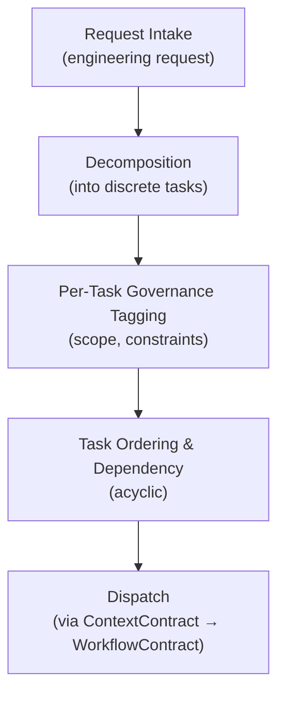
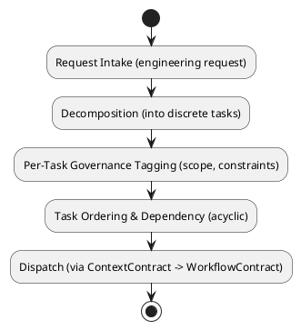
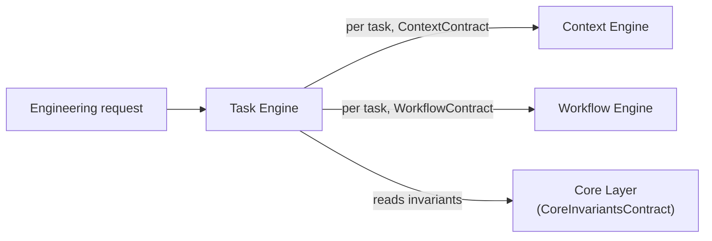
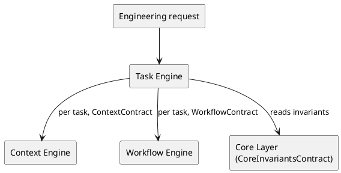

# LAEF Task Engine Specification

| Field | Value |
|-------|-------|
| Document ID | LAEF-016 |
| Document Title | Task Engine Specification |
| Book | LAEF — LOUTAS AI Engineering Framework |
| Knowledge Base Area | 16-AI-Engineering-Framework |
| Framework Layer | Core / Governance |
| Version | 1.0 |
| Status | Approved |
| Owner | Enterprise AI Governance Office |
| Approval Authority | Product Owner |
| Review Cycle | Annual, and on every major LAEF milestone |
| Last Updated | 2026-07-30 |

---

# Purpose

This document defines the architecture of the **Task Engine** — the cross-cutting engine that decomposes a request into governed tasks within the LOUTAS AI Engineering Framework (LAEF).

It specifies the engine's responsibility, its cross-cutting nature and interfaces, its internal architectural structure, its interactions and dependencies, and the constraints it operates under, in conformance with the architectural constitution (LAEF-008) and the engine-set overview (LAEF-013).

---

# Scope

This document applies to the Task Engine and to every AI system that contributes to LOUTAS Care — referred to throughout as **"The AI Agent."**

It defines the engine's architecture only. It does **not** define implementation or code, does **not** redefine the Context Layer (LAEF-010) or Workflow Layer (LAEF-011) or their contracts, and does **not** restate LAEF-008 or LAEF-013. It is model-agnostic.

---

# 1. Position in the Framework

- The Task Engine is **cross-cutting**: per LAEF-013, it spans the **Context** and **Workflow** layers rather than owning a single layer.
- It **conforms** to LAEF-008 and to the engine-set overview LAEF-013.
- It **defers** implementation and code to the build phase; this document is architecture only.

---

# 2. Responsibility

The Task Engine has a single responsibility: **decompose an engineering request into governed tasks** — discrete, scoped units of work, each carrying its governance constraints — so that the rest of the engine flow operates on well-formed, bounded tasks rather than an unstructured request.

---

# 3. Cross-Cutting Nature & Interfaces

The Task Engine does **not own a layer**, and therefore **does not introduce a new layer contract** (LAEF-013 §1). Instead, it interacts exclusively through existing contracts:

- It invokes the **Context Engine** through the **ContextContract** to have each task contextualized.
- It hands tasks to the **Workflow Engine** through the **WorkflowContract** to be driven through the engineering workflow.

The set of governed tasks it produces is an **internal orchestration artifact** consumed within the engine flow; it is not a new public interface. This is the sanctioned cross-cutting case identified in LAEF-013.

---

# 4. Internal Architecture

Architecturally, the Task Engine is composed of the following components (at the architectural level, not as implementation):

- **Request Intake** — receives an engineering request as the entry point of the engine flow.
- **Decomposition** — breaks the request into discrete, scoped tasks.
- **Per-Task Governance Tagging** — attaches the applicable scope and constraints to each task, so governance can be applied per task downstream.
- **Task Ordering & Dependency** — establishes ordering and dependencies among tasks, keeping the set acyclic.
- **Dispatch** — dispatches each task to the Context Engine (for grounding) and onward to the Workflow Engine (for execution), through their contracts.

These components are internal; other engines interact with the Task Engine only through the existing contracts it uses.

---

# 5. Internal Structure (Diagram)

**Mermaid**

**PlantUML**

**Explanation.** The Task Engine receives the engineering request, decomposes it into discrete tasks, tags each with its governance scope and constraints, orders them (keeping the set acyclic), and dispatches each — first to the Context Engine for grounding through the ContextContract, then onward to the Workflow Engine through the WorkflowContract. It never executes work itself; it only produces well-formed, governed tasks for the rest of the flow.

---

# 6. Interactions & Dependencies

- **Entry point** of the engine flow: it receives the engineering request.
- **Invokes** the **Context Engine** (ContextContract) to contextualize each task, and hands tasks to the **Workflow Engine** (WorkflowContract).
- **Depends on** the **Core Layer** (CoreInvariantsContract) for the invariants that bound decomposition.
- All interactions are contract-mediated; the engine introduces no cycle and holds no dependency on assurance engines.

**Mermaid**

**PlantUML**

**Explanation.** The Task Engine is the entry point: it takes the request and, per task, invokes the Context Engine through the ContextContract and the Workflow Engine through the WorkflowContract, reading the Core invariants that bound how it decomposes. It uses only existing contracts, keeps the task graph acyclic, and never reaches into another engine's internals.

---

# 7. Architectural Constraints

In conformance with LAEF-008 and LAEF-013, the Task Engine shall:

- Hold a **single responsibility** (request decomposition) and keep its internals isolated.
- Introduce **no new layer contract**; interact only through the existing **ContextContract** and **WorkflowContract** (cross-cutting case, LAEF-013).
- Be **model-agnostic** — it depends on no specific AI system.
- Preserve **knowledge-first** — it does not execute work; every task is grounded via the Context and Knowledge engines before execution.
- Keep the **task set acyclic** and never bypass a contract.
- Exhibit **no anti-patterns** — no Knowledge bypass, no reach-around, no cycle, no self-approval.

---

# 8. Conformance to LAEF-008 and LAEF-013

| Item | Task Engine |
|------|-------------|
| Realizes | Cross-cutting: Context + Workflow (LAEF-013) |
| Introduces a new layer contract | No — uses ContextContract + WorkflowContract |
| Single, cohesive responsibility | Yes (decomposition) |
| Allowed dependency direction, acyclic | Depends on Context, Workflow, Core |
| Contract-only communication | Yes |
| Isolation (internals hidden) | Yes |
| Model-agnostic | Yes |
| No anti-patterns | Yes |

The Task Engine is the sanctioned cross-cutting engine; it satisfies LAEF-008 by using existing contracts rather than owning a new layer. Verification and enforcement remain governed by LAEF-005.

---

# 9. Boundaries & Deferrals

- **Implementation and code** are out of scope; this document defines architecture only.
- The **Context and Workflow layer definitions** and their contracts are owned by LAEF-010 and LAEF-011 and are referenced, not redefined.
- **Contextualization** and **workflow execution** are the responsibilities of the Context Engine (LAEF-014) and Workflow Engine (LAEF-018); the Task Engine only produces and dispatches governed tasks.
- Operational content and engine build details are deferred to their respective phases.

---

# Compliance

This document is authoritative once approved by the Product Owner.

It conforms to LAEF-008, LAEF-013, LAEF-010, and LAEF-011, and does not contradict LAEF-004. Any change to a normative architectural rule requires an approved ADR (LAEF-008 §14). Updates follow LAEF-006. This document complies with GOV-002 Document Template Standard and GOV-003 Document Numbering Standard.

---

# Dependencies

- LAEF-004 Framework Architecture Overview
- LAEF-008 Layer Architecture Foundations & Design Principles
- LAEF-010 Knowledge & Context Tier Architecture
- LAEF-011 Execution Tier Architecture
- LAEF-013 Engine-Set Design Specification
- GOV-002 Document Template Standard
- GOV-003 Document Numbering Standard

---

# Related Documents

- LAEF-014 Context Engine Specification *(invoked via ContextContract)*
- LAEF-018 Workflow Engine Specification *(planned; invoked via WorkflowContract)*
- LAEF-009 Foundation Tier Architecture *(CoreInvariantsContract)*

---

# Revision History

| Version | Date | Description |
|---------|------|-------------|
| 1.0 (Draft) | 2026-07-30 | Initial draft issued for approval; cross-cutting Task Engine architecture (Context + Workflow), using existing contracts, with dual-notation diagrams; conformant to LAEF-008 and LAEF-013; implementation excluded |
| 1.0 (Approved) | 2026-07-30 | Approved by Product Owner without content changes |
