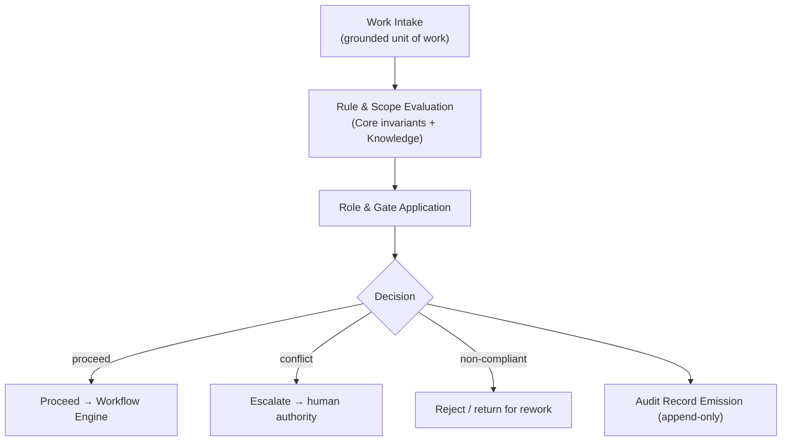
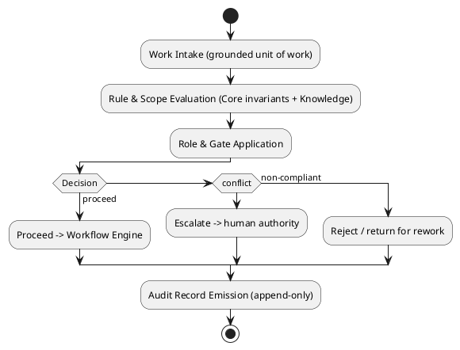
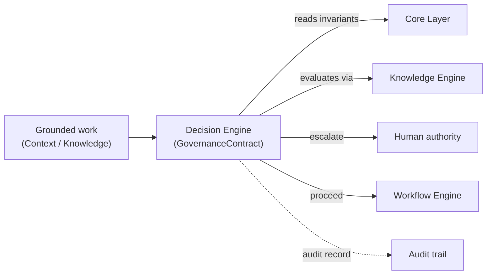
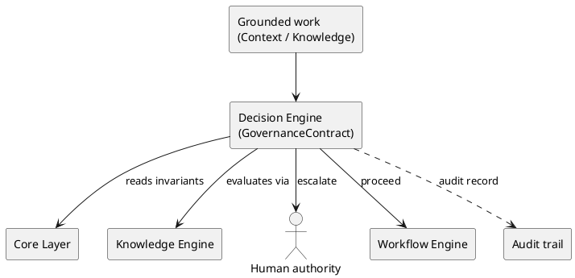

# LAEF Decision Engine Specification

| Field | Value |
|-------|-------|
| Document ID | LAEF-017 |
| Document Title | Decision Engine Specification |
| Book | LAEF — LOUTAS AI Engineering Framework |
| Knowledge Base Area | 16-AI-Engineering-Framework |
| Framework Layer | Core / Governance |
| Version | 1.0 |
| Status | Approved |
| Owner | Enterprise AI Governance Office |
| Approval Authority | Product Owner |
| Review Cycle | Annual, and on every major LAEF milestone |
| Last Updated | 2026-07-30 |

---

# Purpose

This document defines the architecture of the **Decision Engine** — the engine that realizes the Governance Layer of the LOUTAS AI Engineering Framework (LAEF).

It specifies the engine's responsibility, the contract it implements, its internal architectural structure, its interactions and dependencies, and the constraints it operates under, in conformance with the architectural constitution (LAEF-008) and the engine-set overview (LAEF-013).

---

# Scope

This document applies to the Decision Engine and to every AI system that contributes to LOUTAS Care — referred to throughout as **"The AI Agent."**

It defines the engine's architecture only. It does **not** define implementation or code, does **not** define the governance rules, roles, or procedures content (which is owned by LAEF-005), does **not** redefine the Governance Layer (LAEF-009) or the GovernanceContract, and does **not** restate LAEF-008 or LAEF-013. It is model-agnostic.

---

# 1. Position in the Framework

- The Decision Engine **realizes the Governance Layer** defined in LAEF-009, and implements the **GovernanceContract** exactly as defined there.
- It **conforms** to LAEF-008 and to the engine-set overview LAEF-013.
- It **applies** the governance rules, roles, and procedures whose *content* is defined in LAEF-005; it does not define them.
- It **defers** implementation and code to the build phase; this document is architecture only.

---

# 2. Responsibility

The Decision Engine has a single responsibility: **apply the framework's governance rules, roles, gates, and exception handling to a unit of work, and route escalations** — producing an auditable decision (proceed, escalate, or reject). It is the structural enforcement point of the governance-and-scope check.

---

# 3. Contract Implemented

The Decision Engine implements the **GovernanceContract** (defined in LAEF-009), honored without alteration:

- **Inputs:** a unit of work with its context; the Core invariants.
- **Outputs:** a governance decision (proceed / escalate / reject) and recorded approval or exception artifacts.
- **Guarantees:** no self-approval; human-in-the-loop preserved; decisions append-only and auditable; invariants upheld.
- **Failure behavior:** on conflict, escalate to human authority (Product Owner / Architecture Authority).

---

# 4. Internal Architecture

Architecturally, the Decision Engine is composed of the following components (at the architectural level, not as implementation):

- **Work Intake** — receives a grounded unit of work with its context.
- **Rule & Scope Evaluation** — evaluates the work against the Core invariants and the applicable rules (whose content is defined in LAEF-005), reading knowledge through the Knowledge Engine where needed.
- **Role & Gate Application** — applies the relevant roles and gate points to the decision.
- **Decision** — determines the outcome: proceed, escalate, or reject.
- **Exception Path** — routes a sanctioned exception through the documented, approved, traceable process.
- **Audit Record Emission** — records every decision append-only for the audit trail.

These components are internal and hidden behind the GovernanceContract.

---

# 5. Internal Structure (Diagram)

**Mermaid**

**PlantUML**

**Explanation.** The Decision Engine receives grounded work, evaluates it against the Core invariants and the applicable rules (reading knowledge as needed), and applies the relevant roles and gates. It then decides: compliant work proceeds to the Workflow Engine, a conflict is escalated to human authority, and non-compliant work is returned for rework. Every outcome is recorded append-only for the audit trail. The *content* of the rules and roles is defined in LAEF-005; this engine only applies them.

---

# 6. Interactions & Dependencies

- **Receives** grounded work from upstream (Context and Knowledge engines).
- **Depends on** the **Core Layer** (CoreInvariantsContract) for invariants and the **Knowledge Engine** (KnowledgeContract) for rule and scope evaluation.
- **Routes** escalations to **human authority**, forwards compliant work to the **Workflow Engine**, and emits audit records.
- All interactions are contract-mediated; the engine introduces no cycle.

**Mermaid**

**PlantUML**

**Explanation.** The Decision Engine takes in grounded work, reads the Core invariants, and evaluates rules and scope with help from the Knowledge Engine. Compliant work proceeds to the Workflow Engine; conflicts are escalated to human authority; and every decision is written to the audit trail append-only. It never accepts work on its own — proceeding to execution is not acceptance; acceptance remains a human decision downstream.

---

# 7. Architectural Constraints

In conformance with LAEF-008 and LAEF-013, the Decision Engine shall:

- Use the **GovernanceContract** as its sole interface; expose nothing beyond it.
- Hold a **single responsibility** (governance application) and keep its internals isolated.
- **Never self-approve** and never let the AI Agent approve its own work; preserve human-in-the-loop.
- Be **model-agnostic** — it depends on no specific AI system.
- Record every decision **append-only and auditable**.
- **Escalate on conflict** to human authority rather than resolving silently.
- Apply rules whose **content is defined in LAEF-005**; it does not define governance content.
- Exhibit **no anti-patterns** — no reach-around, no cycle, no embedded self-approval.

---

# 8. Conformance to LAEF-008 and LAEF-013

| Item | Decision Engine |
|------|-----------------|
| Realizes the correct layer | Governance Layer (LAEF-009) |
| Implements the layer contract unchanged | GovernanceContract |
| Single, cohesive responsibility | Yes |
| Allowed dependency direction, acyclic | Depends on Core + Knowledge |
| Contract-only communication | Yes |
| Isolation (internals hidden) | Yes |
| Model-agnostic | Yes |
| No anti-patterns | Yes (no self-approval) |

Verification and enforcement remain governed by LAEF-005.

---

# 9. Boundaries & Deferrals

- **Governance rules, roles, and procedures content** are defined in **LAEF-005**, not here; this engine applies them.
- **Implementation and code** are out of scope; this document defines architecture only.
- The **Governance Layer definition** and the **GovernanceContract** are owned by LAEF-009 and are referenced, not redefined.
- Operational content and engine build details are deferred to their respective phases.

---

# Compliance

This document is authoritative once approved by the Product Owner.

It conforms to LAEF-008, LAEF-013, and LAEF-009, and does not contradict LAEF-004 or LAEF-005. Any change to a normative architectural rule requires an approved ADR (LAEF-008 §14). Updates follow LAEF-006. This document complies with GOV-002 Document Template Standard and GOV-003 Document Numbering Standard.

---

# Dependencies

- LAEF-004 Framework Architecture Overview
- LAEF-005 Governance Overview
- LAEF-008 Layer Architecture Foundations & Design Principles
- LAEF-009 Foundation Tier Architecture
- LAEF-013 Engine-Set Design Specification
- GOV-002 Document Template Standard
- GOV-003 Document Numbering Standard

---

# Related Documents

- LAEF-015 Knowledge Engine Specification *(consulted during evaluation)*
- LAEF-018 Workflow Engine Specification *(planned; receives compliant work)*
- LAEF-005 Governance Overview *(defines the rules this engine applies)*

---

# Revision History

| Version | Date | Description |
|---------|------|-------------|
| 1.0 (Draft) | 2026-07-30 | Initial draft issued for approval; Decision Engine architecture realizing the Governance Layer, implementing GovernanceContract, with dual-notation diagrams; conformant to LAEF-008 and LAEF-013; governance content deferred to LAEF-005; implementation excluded |
| 1.0 (Approved) | 2026-07-30 | Approved by Product Owner without content changes |
