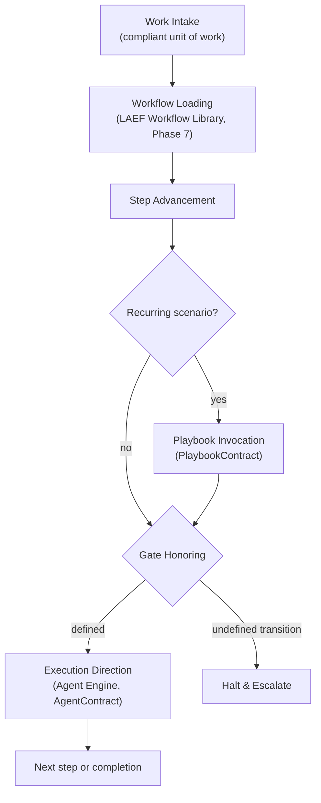
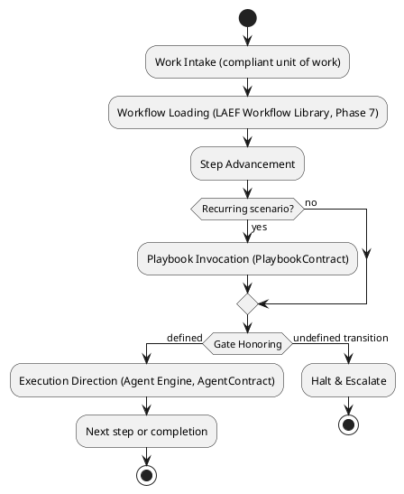
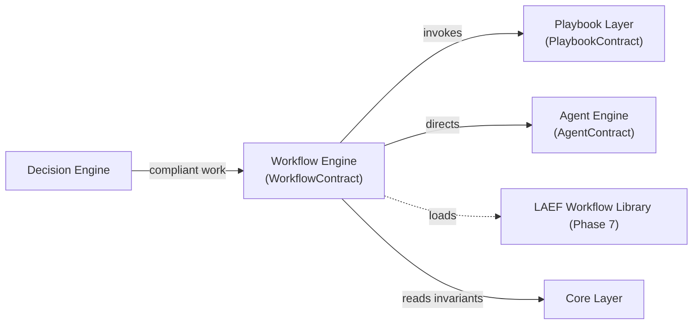
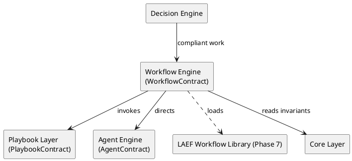

# LAEF Workflow Engine Specification

| Field | Value |
|-------|-------|
| Document ID | LAEF-018 |
| Document Title | Workflow Engine Specification |
| Book | LAEF — LOUTAS AI Engineering Framework |
| Knowledge Base Area | 16-AI-Engineering-Framework |
| Framework Layer | Core / Governance |
| Version | 1.0 |
| Status | Approved |
| Owner | Enterprise AI Governance Office |
| Approval Authority | Product Owner |
| Review Cycle | Annual, and on every major LAEF milestone |
| Last Updated | 2026-07-30 |

---

# Purpose

This document defines the architecture of the **Workflow Engine** — the engine that realizes the Workflow Layer and serves the Playbook Layer of the LOUTAS AI Engineering Framework (LAEF).

It specifies the engine's responsibility, the contracts it implements and uses, its internal architectural structure, its interactions and dependencies, and the constraints it operates under, in conformance with the architectural constitution (LAEF-008), the engine-set overview (LAEF-013), and ADR-011.

---

# Scope

This document applies to the Workflow Engine and to every AI system that contributes to LOUTAS Care — referred to throughout as **"The AI Agent."**

It defines the engine's architecture only. It does **not** define the actual workflow definitions (Phase 7 — Workflow Library), the actual playbooks (Phase 8 — Playbooks), implementation or code; it does **not** redefine the Workflow or Playbook layers (LAEF-011) or their contracts; and it does **not** restate LAEF-008 or LAEF-013. It is model-agnostic.

---

# 1. Position in the Framework

- The Workflow Engine **realizes the Workflow Layer** defined in LAEF-011 (implementing the **WorkflowContract**) and **serves the Playbook Layer** (using the **PlaybookContract**), per LAEF-013.
- It **conforms** to LAEF-008 and to the engine-set overview LAEF-013.
- It is **engineering-only** per **ADR-011**: its authoritative source is the LAEF Workflow Library (Phase 7); it does not own, derive, or read business workflows.
- It **defers** implementation and code to the build phase; this document is architecture only.

---

# 2. Responsibility

The Workflow Engine has a single responsibility: **drive a unit of work through the defined engineering workflow**, honoring every step and gate, and invoking reusable procedures from the Playbook Layer where a step matches a recurring scenario.

---

# 3. Contracts Implemented & Used

- **Implements** the **WorkflowContract** (LAEF-011) — advancing a unit of work through the defined workflow steps and gates.
- **Uses** the **PlaybookContract** (LAEF-011) — serving the Playbook Layer by invoking reusable procedures. Per LAEF-013, the Playbook Layer has no dedicated engine; the Workflow Engine serves it.

The engine adds no capability beyond these contracts.

---

# 4. Engineering-Only Constraint (ADR-011)

Per ADR-011, the Workflow Engine drives **engineering** workflows only:

- Its authoritative source of workflow definitions is the **LAEF Workflow Library (Phase 7)**.
- It **does not** own, derive, or read **business workflows**. Business-workflow knowledge is read by the **Knowledge Engine** from `17-Business-Workflows` (planned), never driven by this engine.

This preserves the LAEF-003 scope boundary between engineering and product workflows.

---

# 5. Internal Architecture

Architecturally, the Workflow Engine is composed of the following components (at the architectural level, not as implementation):

- **Work Intake** — receives a compliant unit of work from the Decision Engine.
- **Workflow Loading** — loads the applicable engineering workflow definition from the LAEF Workflow Library (Phase 7).
- **Step Advancement** — advances the work through the workflow's steps in order.
- **Playbook Invocation** — where a step matches a recurring scenario, invokes the Playbook Layer through the PlaybookContract.
- **Gate Honoring** — honors every gate; no step or gate is skipped.
- **Execution Direction** — at execution steps, directs the Agent Engine through the AgentContract.
- **Transition Guard** — on an undefined transition, halts and escalates.

These components are internal and hidden behind the WorkflowContract.

---

# 6. Internal Structure (Diagram)

**Mermaid**

**PlantUML**

**Explanation.** The Workflow Engine takes compliant work, loads the applicable *engineering* workflow from the LAEF Workflow Library, and advances it step by step. Where a step matches a recurring scenario it invokes a playbook; it honors every gate; and at execution steps it directs the Agent Engine through the AgentContract. An undefined transition halts and escalates rather than improvising. It never drives business workflows — those are read as knowledge elsewhere.

---

# 7. Interactions & Dependencies

- **Receives** compliant work from the **Decision Engine**.
- **Uses** the **Playbook Layer** (PlaybookContract) and **directs** the **Agent Engine** (AgentContract).
- **Reads** engineering workflow definitions from the **LAEF Workflow Library (Phase 7)** and invariants from the **Core Layer**.
- All interactions are contract-mediated; the engine introduces no cycle.

**Mermaid**

**PlantUML**

**Explanation.** Compliant work arrives from the Decision Engine. The Workflow Engine loads the engineering workflow from the LAEF Workflow Library, invokes playbooks through the PlaybookContract, and directs the Agent Engine through the AgentContract, reading the Core invariants throughout. Every arrow is a contract; the graph is acyclic; and business workflows appear nowhere in this engine's dependencies.

---

# 8. Architectural Constraints

In conformance with LAEF-008, LAEF-013, and ADR-011, the Workflow Engine shall:

- Use the **WorkflowContract** as its interface and the **PlaybookContract** to serve playbooks; expose nothing else.
- Hold a **single responsibility** (drive the engineering workflow) and keep its internals isolated.
- Be **engineering-only** (ADR-011); it does not own, derive, or read business workflows.
- Be **model-agnostic** — it directs the Agent Engine but binds to no specific AI system itself.
- **Skip no step or gate**; on an undefined transition, halt and escalate.
- Exhibit **no anti-patterns** — no reach-around, no cycle, no self-approval.

---

# 9. Conformance to LAEF-008 and LAEF-013

| Item | Workflow Engine |
|------|-----------------|
| Realizes the correct layer | Workflow Layer (LAEF-011); serves Playbook Layer |
| Implements the layer contract unchanged | WorkflowContract (uses PlaybookContract) |
| Single, cohesive responsibility | Yes |
| Allowed dependency direction, acyclic | Depends on Playbook, Agent, Core, Workflow Library |
| Contract-only communication | Yes |
| Isolation (internals hidden) | Yes |
| Model-agnostic | Yes |
| Engineering-only (ADR-011) | Yes |
| No anti-patterns | Yes |

Verification and enforcement remain governed by LAEF-005.

---

# 10. Boundaries & Deferrals

- The **actual workflow definitions** are defined in **Phase 7 (Workflow Library)**, not here.
- The **actual playbooks** are defined in **Phase 8 (Playbooks)**, not here.
- **Business workflows** are product content read by the Knowledge Engine (ADR-011); this engine never touches them.
- **Implementation and code** are out of scope; this document defines architecture only.
- The **Workflow and Playbook layer definitions** and their contracts are owned by LAEF-011 and are referenced, not redefined.

---

# Compliance

This document is authoritative once approved by the Product Owner.

It conforms to LAEF-008, LAEF-013, and LAEF-011, reflects ADR-011, and does not contradict LAEF-004. Any change to a normative architectural rule requires an approved ADR (LAEF-008 §14). Updates follow LAEF-006. This document complies with GOV-002 Document Template Standard and GOV-003 Document Numbering Standard.

---

# Dependencies

- LAEF-004 Framework Architecture Overview
- LAEF-008 Layer Architecture Foundations & Design Principles
- LAEF-011 Execution Tier Architecture
- LAEF-013 Engine-Set Design Specification
- ADR-011 Business Workflow Source of Truth
- GOV-002 Document Template Standard
- GOV-003 Document Numbering Standard

---

# Related Documents

- LAEF-016 Task Engine Specification *(dispatches work via WorkflowContract)*
- LAEF-019 Agent Engine Specification *(planned; directed via AgentContract)*
- Phase 7 — Workflow Library · Phase 8 — Playbooks *(planned; populated content)*
- 17-Business-Workflows — Business Workflow Repository *(product; read by the Knowledge Engine, not this engine)*

---

# Revision History

| Version | Date | Description |
|---------|------|-------------|
| 1.0 (Draft) | 2026-07-30 | Initial draft issued for approval; Workflow Engine architecture realizing the Workflow Layer and serving the Playbook Layer, engineering-only per ADR-011, with dual-notation diagrams; conformant to LAEF-008 and LAEF-013; populated content deferred to Phases 7/8; implementation excluded |
| 1.0 (Approved) | 2026-07-30 | Approved by Product Owner without content changes |
