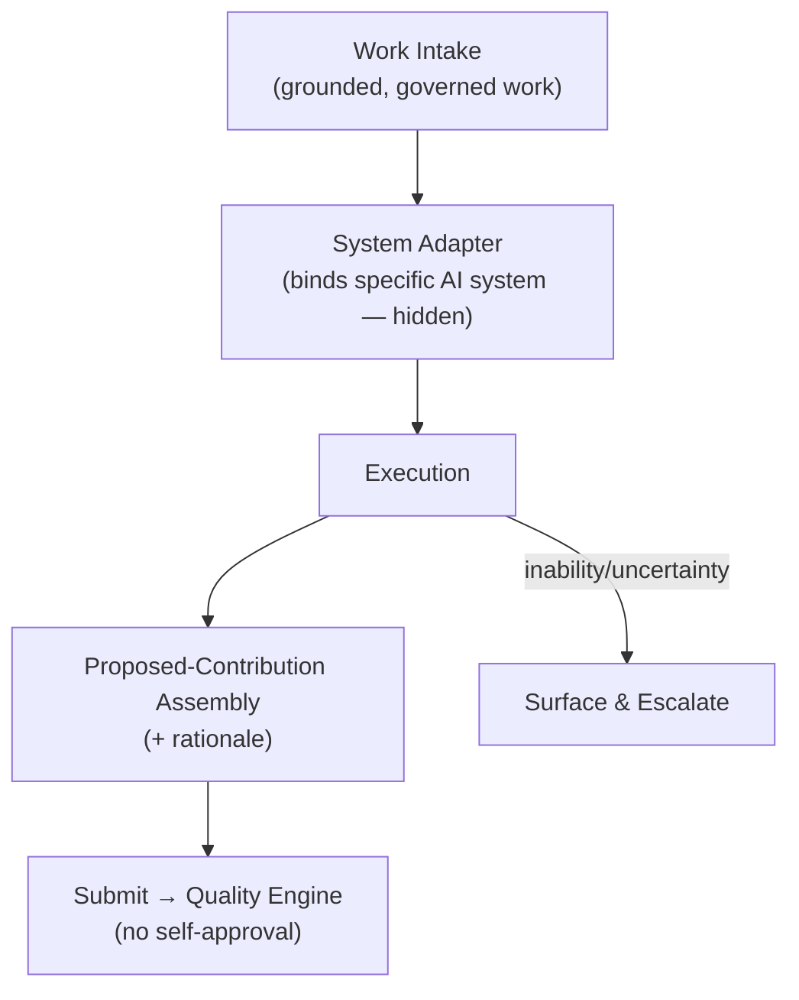
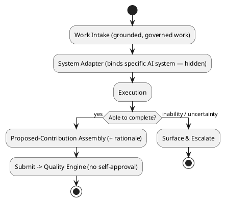
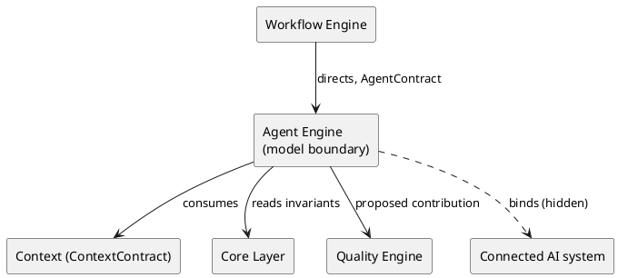

# LAEF Agent Engine Specification

| Field | Value |
|-------|-------|
| Document ID | LAEF-019 |
| Document Title | Agent Engine Specification |
| Book | LAEF — LOUTAS AI Engineering Framework |
| Knowledge Base Area | 16-AI-Engineering-Framework |
| Framework Layer | Core / Governance |
| Version | 1.0 |
| Status | Approved |
| Owner | Enterprise AI Governance Office |
| Approval Authority | Product Owner |
| Review Cycle | Annual, and on every major LAEF milestone |
| Last Updated | 2026-07-30 |

---

# Purpose

This document defines the architecture of the **Agent Engine** — the engine that realizes the Agent Layer of the LOUTAS AI Engineering Framework (LAEF), and the framework's single model-specific boundary.

It specifies the engine's responsibility, the contract it implements, its role as the model-agnostic boundary, its internal architectural structure, its interactions and dependencies, and the constraints it operates under, in conformance with the architectural constitution (LAEF-008) and the engine-set overview (LAEF-013).

---

# Scope

This document applies to the Agent Engine and to every AI system that contributes to LOUTAS Care — referred to throughout as **"The AI Agent."**

It defines the engine's architecture only. It does **not** define the actual AI Agent roles and behavior (Phase 5 — Agent Framework), implementation or code, or the integration details of any specific AI system; it does **not** redefine the Agent Layer (LAEF-011) or the AgentContract; and it does **not** restate LAEF-008 or LAEF-013.

---

# 1. Position in the Framework

- The Agent Engine **realizes the Agent Layer** defined in LAEF-011, and implements the **AgentContract** exactly as defined there.
- It is the **single model-specific boundary** of the framework (LAEF-008 §15): the only engine permitted to couple to a specific AI system.
- It **conforms** to LAEF-008 and to the engine-set overview LAEF-013.
- It **defers** actual agent roles/behavior to Phase 5 and implementation/code to the build phase; this document is architecture only.

---

# 2. Responsibility

The Agent Engine has a single responsibility: **adapt any AI system to the framework and execute a grounded, governed unit of work, producing a proposed contribution** — never accepting it. It is the point at which any AI system plugs into LAEF.

---

# 3. Contract Implemented

The Agent Engine implements the **AgentContract** (defined in LAEF-011), honored without alteration:

- **Inputs:** a grounded context bundle (ContextContract); the workflow step / playbook to apply; governance constraints.
- **Outputs:** a proposed contribution with rationale, submitted for quality and human review.
- **Guarantees:** model-agnostic interface (any AI system pluggable); never self-approves; operates only on grounded, governed work; invariants preserved.
- **Failure behavior:** on inability or uncertainty, surface and escalate — never fabricate.

---

# 4. The Model-Agnostic Boundary

The Agent Engine is the framework's only point of contact with a specific AI system. Architecturally it is an **adapter**: it presents the same AgentContract behavior regardless of which AI system is connected, and it **hides** the identity and specifics of that system behind the contract.

- Any current or future AI system may be connected here with no change elsewhere in the framework.
- Model-specific coupling is **contained entirely** within this engine; every other engine remains model-agnostic.
- Swapping the connected AI system is an operation local to this engine; the rest of LAEF is unaffected.

---

# 5. Internal Architecture

Architecturally, the Agent Engine is composed of the following components (at the architectural level, not as implementation):

- **Work Intake** — receives a grounded, governed unit of work as directed by the Workflow Engine.
- **System Adapter** — binds to the connected AI system and presents uniform framework behavior; this is the only model-specific component.
- **Execution** — performs the unit of work through the connected system.
- **Proposed-Contribution Assembly** — assembles the output and its rationale into a proposed contribution satisfying the AgentContract.
- **No-Self-Approval Enforcement** — submits the proposed contribution downstream for quality and human review; it never accepts its own work.
- **Uncertainty Handling** — on inability or uncertainty, surfaces and escalates rather than fabricating.

These components are internal and hidden behind the AgentContract.

---

# 6. Internal Structure (Diagram)

**Mermaid**



**PlantUML**



**Explanation.** The Agent Engine takes grounded, governed work, binds to the connected AI system through its System Adapter — the only model-specific component — and executes. It assembles the result and rationale into a proposed contribution and submits it to the Quality Engine; it never accepts its own work. On inability or uncertainty it surfaces and escalates rather than inventing an answer. Which AI system is connected is invisible outside this engine.

---

# 7. Interactions & Dependencies

- **Directed by** the **Workflow Engine** (through the AgentContract) at execution steps.
- **Consumes** the grounded context bundle via the **ContextContract** and reads invariants from the **Core Layer**.
- **Produces** a proposed contribution to the **Quality Engine**.
- All interactions are contract-mediated; the model binding is contained; the engine introduces no cycle.

**Mermaid**

```mermaid
graph LR
    WEng["Workflow Engine"] -->|directs, AgentContract| AEng["Agent Engine<br/>(model boundary)"]
    AEng -->|consumes| CTX["Context (ContextContract)"]
    AEng -->|reads invariants| CORE["Core Layer"]
    AEng -->|proposed contribution| QEng["Quality Engine"]
    AEng -.->|binds (hidden)| SYS["Connected AI system"]
```

**PlantUML**



**Explanation.** The Workflow Engine directs the Agent Engine through the AgentContract. The Agent Engine consumes grounded context, reads Core invariants, and produces a proposed contribution to the Quality Engine. Its binding to a specific AI system (the dotted edge) is internal and hidden; no other engine sees or depends on it. The graph is acyclic and every public interaction is a contract.

---

# 8. Architectural Constraints

In conformance with LAEF-008 and LAEF-013, the Agent Engine shall:

- Use the **AgentContract** as its sole interface; expose nothing beyond it — including hiding the connected AI system.
- Hold a **single responsibility** (adapt and execute) and keep its internals isolated.
- Be the **only** engine that couples to a specific AI system; contain all model-specific coupling within itself.
- **Never self-approve**; submit the proposed contribution for quality and human review.
- Operate **only on grounded, governed work**; on uncertainty, surface and escalate — never fabricate.
- Exhibit **no anti-patterns** — no Knowledge bypass, no reach-around, no cycle, no embedded self-approval.

---

# 9. Conformance to LAEF-008 and LAEF-013

| Item | Agent Engine |
|------|--------------|
| Realizes the correct layer | Agent Layer (LAEF-011) |
| Implements the layer contract unchanged | AgentContract |
| Single, cohesive responsibility | Yes |
| Allowed dependency direction, acyclic | Depends on Context, Core; produces to Quality |
| Contract-only communication | Yes |
| Isolation (internals hidden, incl. model binding) | Yes |
| Model coupling contained here only | Yes (sole boundary) |
| No anti-patterns (no self-approval) | Yes |

Verification and enforcement remain governed by LAEF-005.

---

# 10. Boundaries & Deferrals

- The **actual AI Agent roles and behavior** are defined in **Phase 5 (Agent Framework)**, not here.
- The **integration details of a specific AI system** are implementation, out of scope here.
- **Implementation and code** are out of scope; this document defines architecture only.
- The **Agent Layer definition** and the **AgentContract** are owned by LAEF-011 and are referenced, not redefined.

---

# Compliance

This document is authoritative once approved by the Product Owner.

It conforms to LAEF-008, LAEF-013, and LAEF-011, and does not contradict LAEF-004. Any change to a normative architectural rule requires an approved ADR (LAEF-008 §14). Updates follow LAEF-006. This document complies with GOV-002 Document Template Standard and GOV-003 Document Numbering Standard.

---

# Dependencies

- LAEF-004 Framework Architecture Overview
- LAEF-008 Layer Architecture Foundations & Design Principles
- LAEF-011 Execution Tier Architecture
- LAEF-013 Engine-Set Design Specification
- GOV-002 Document Template Standard
- GOV-003 Document Numbering Standard

---

# Related Documents

- LAEF-018 Workflow Engine Specification *(directs this engine via AgentContract)*
- LAEF-020 Quality Engine Specification *(planned; receives the proposed contribution)*
- Phase 5 — Agent Framework *(planned; actual agent roles and behavior)*

---

# Revision History

| Version | Date | Description |
|---------|------|-------------|
| 1.0 (Draft) | 2026-07-30 | Initial draft issued for approval; Agent Engine architecture realizing the Agent Layer and serving as the sole model-specific boundary, implementing AgentContract, with dual-notation diagrams; conformant to LAEF-008 and LAEF-013; agent roles deferred to Phase 5; implementation excluded |
| 1.0 (Approved) | 2026-07-30 | Approved by Product Owner without content changes |
