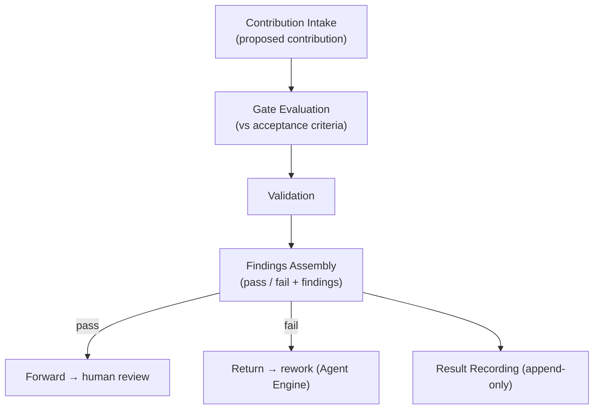
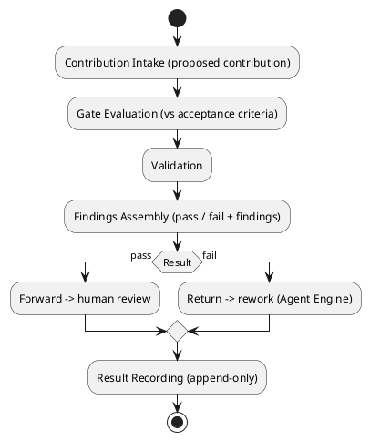
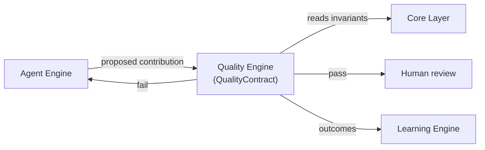
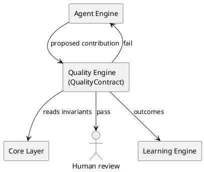

# LAEF Quality Engine Specification

| Field | Value |
|-------|-------|
| Document ID | LAEF-020 |
| Document Title | Quality Engine Specification |
| Book | LAEF — LOUTAS AI Engineering Framework |
| Knowledge Base Area | 16-AI-Engineering-Framework |
| Framework Layer | Core / Governance |
| Version | 1.0 |
| Status | Approved |
| Owner | Enterprise AI Governance Office |
| Approval Authority | Product Owner |
| Review Cycle | Annual, and on every major LAEF milestone |
| Last Updated | 2026-07-30 |

---

# Purpose

This document defines the architecture of the **Quality Engine** — the engine that realizes the Quality Layer of the LOUTAS AI Engineering Framework (LAEF).

It specifies the engine's responsibility, the contract it implements, its internal architectural structure, its interactions and dependencies, and the constraints it operates under, in conformance with the architectural constitution (LAEF-008) and the engine-set overview (LAEF-013).

---

# Scope

This document applies to the Quality Engine and to every AI system that contributes to LOUTAS Care — referred to throughout as **"The AI Agent."**

It defines the engine's architecture only. It does **not** define the operational quality system — gate content, acceptance criteria, or validation methods (Phase 9 — Quality System) — implementation or code; it does **not** redefine the Quality Layer (LAEF-012) or the QualityContract; and it does **not** restate LAEF-008 or LAEF-013. It is model-agnostic.

---

# 1. Position in the Framework

- The Quality Engine **realizes the Quality Layer** defined in LAEF-012, and implements the **QualityContract** exactly as defined there.
- It **conforms** to LAEF-008 and to the engine-set overview LAEF-013.
- It **applies** quality gates whose *content* (criteria, methods) is defined in Phase 9; it does not define them.
- It **defers** implementation and code to the build phase; this document is architecture only.

---

# 2. Responsibility

The Quality Engine has a single responsibility: **apply quality gates and validation to a proposed contribution**, producing a pass/fail result with findings, before the work reaches human review. It never accepts work; acceptance is a human decision.

---

# 3. Contract Implemented

The Quality Engine implements the **QualityContract** (defined in LAEF-012), honored without alteration:

- **Inputs:** a proposed contribution (AgentContract output); the applicable acceptance criteria.
- **Outputs:** a quality result (pass / fail) with findings; on pass, forwarded to human review; on fail, returned for rework.
- **Guarantees:** the quality bar is applied consistently; the engine never accepts work; findings are recorded (auditable).
- **Failure behavior:** on inability to evaluate, escalate.

---

# 4. Internal Architecture

Architecturally, the Quality Engine is composed of the following components (at the architectural level, not as implementation):

- **Contribution Intake** — receives a proposed contribution from the Agent Engine.
- **Gate Evaluation** — evaluates the contribution against the applicable acceptance criteria (whose content is defined in Phase 9).
- **Validation** — runs the applicable validation checks.
- **Findings Assembly** — assembles a pass/fail result with findings.
- **Routing** — forwards passing work to human review; returns failing work for rework.
- **Result Recording** — records every quality result append-only for the audit trail.

These components are internal and hidden behind the QualityContract.

---

# 5. Internal Structure (Diagram)

**Mermaid**

**PlantUML**

**Explanation.** The Quality Engine receives a proposed contribution, evaluates it against the applicable acceptance criteria, runs validation, and assembles a pass/fail result with findings. Passing work is forwarded to human review; failing work is returned to the Agent Engine for rework. Every result is recorded append-only. The engine never accepts work itself — acceptance is a human decision — and the criteria content it applies is defined in Phase 9.

---

# 6. Interactions & Dependencies

- **Receives** a proposed contribution from the **Agent Engine**.
- **Depends on** the **Core Layer** (CoreInvariantsContract) for the invariants behind acceptance criteria.
- **Forwards** passing work to **human review**, **returns** failing work to the Agent Engine, and passes outcomes to the **Learning Engine**.
- All interactions are contract-mediated; the engine introduces no cycle.

**Mermaid**

**PlantUML**

**Explanation.** The Quality Engine receives the proposed contribution from the Agent Engine, reads the Core invariants behind its criteria, and routes the result: passing work to human review, failing work back to the Agent Engine for rework. Outcomes flow to the Learning Engine. It never accepts work; every arrow is a contract; the graph is acyclic.

---

# 7. Architectural Constraints

In conformance with LAEF-008 and LAEF-013, the Quality Engine shall:

- Use the **QualityContract** as its sole interface; expose nothing beyond it.
- Hold a **single responsibility** (quality gating and validation) and keep its internals isolated.
- **Never accept work**; forward passing work to human review and return failing work for rework.
- Apply the **quality bar consistently** and record **auditable findings**.
- Be **model-agnostic** — it depends on no specific AI system.
- On **inability to evaluate**, escalate.
- Exhibit **no anti-patterns** — no reach-around, no cycle, no self-approval.

---

# 8. Conformance to LAEF-008 and LAEF-013

| Item | Quality Engine |
|------|----------------|
| Realizes the correct layer | Quality Layer (LAEF-012) |
| Implements the layer contract unchanged | QualityContract |
| Single, cohesive responsibility | Yes |
| Allowed dependency direction, acyclic | Depends on Agent output + Core |
| Contract-only communication | Yes |
| Isolation (internals hidden) | Yes |
| Model-agnostic | Yes |
| No anti-patterns (never accepts work) | Yes |

Verification and enforcement remain governed by LAEF-005.

---

# 9. Boundaries & Deferrals

- The **operational quality system** — gate content, acceptance criteria, validation methods — is defined in **Phase 9 (Quality System)**, not here.
- **Implementation and code** are out of scope; this document defines architecture only.
- The **Quality Layer definition** and the **QualityContract** are owned by LAEF-012 and are referenced, not redefined.
- Human review and acceptance are outside this engine; it only produces a quality result.

---

# Compliance

This document is authoritative once approved by the Product Owner.

It conforms to LAEF-008, LAEF-013, and LAEF-012, and does not contradict LAEF-004. Any change to a normative architectural rule requires an approved ADR (LAEF-008 §14). Updates follow LAEF-006. This document complies with GOV-002 Document Template Standard and GOV-003 Document Numbering Standard.

---

# Dependencies

- LAEF-004 Framework Architecture Overview
- LAEF-008 Layer Architecture Foundations & Design Principles
- LAEF-012 Assurance & Evolution Tier Architecture
- LAEF-013 Engine-Set Design Specification
- GOV-002 Document Template Standard
- GOV-003 Document Numbering Standard

---

# Related Documents

- LAEF-019 Agent Engine Specification *(produces the proposed contribution)*
- LAEF-021 Learning Engine Specification *(planned; receives outcomes)*
- Phase 9 — Quality System *(planned; gate content and criteria)*

---

# Revision History

| Version | Date | Description |
|---------|------|-------------|
| 1.0 (Draft) | 2026-07-30 | Initial draft issued for approval; Quality Engine architecture realizing the Quality Layer, implementing QualityContract, with dual-notation diagrams; conformant to LAEF-008 and LAEF-013; operational quality system deferred to Phase 9; implementation excluded |
| 1.0 (Approved) | 2026-07-30 | Approved by Product Owner without content changes |
