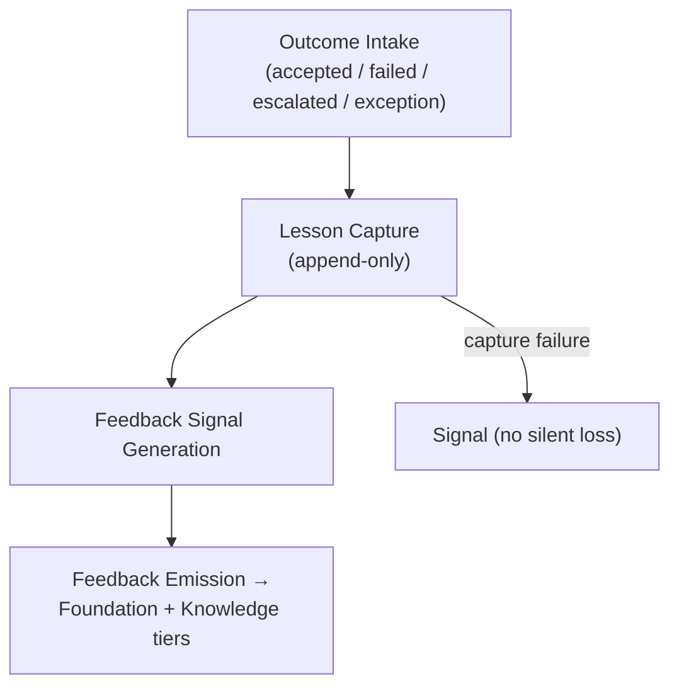
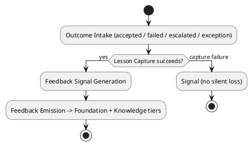
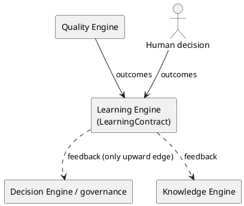

# LAEF Learning Engine Specification

| Field | Value |
|-------|-------|
| Document ID | LAEF-021 |
| Document Title | Learning Engine Specification |
| Book | LAEF — LOUTAS AI Engineering Framework |
| Knowledge Base Area | 16-AI-Engineering-Framework |
| Framework Layer | Core / Governance |
| Version | 1.0 |
| Status | Approved |
| Owner | Enterprise AI Governance Office |
| Approval Authority | Product Owner |
| Review Cycle | Annual, and on every major LAEF milestone |
| Last Updated | 2026-07-30 |

---

# Purpose

This document defines the architecture of the **Learning Engine** — the engine that realizes the Learning Layer of the LOUTAS AI Engineering Framework (LAEF) and carries the framework's single upward feedback edge. It is the final document of Phase 3 (Core Engines).

It specifies the engine's responsibility, the contract it implements, its internal architectural structure, its interactions and dependencies, and the constraints it operates under, in conformance with the architectural constitution (LAEF-008) and the engine-set overview (LAEF-013).

---

# Scope

This document applies to the Learning Engine and to every AI system that contributes to LOUTAS Care — referred to throughout as **"The AI Agent."**

It defines the engine's architecture only. It does **not** define the operational learning system — how lessons are captured, curated, and applied (Phase 10 — Continuous Improvement) — implementation or code; it does **not** redefine the Learning Layer (LAEF-012) or the LearningContract; and it does **not** restate LAEF-008 or LAEF-013. It is model-agnostic.

---

# 1. Position in the Framework

- The Learning Engine **realizes the Learning Layer** defined in LAEF-012, and implements the **LearningContract** exactly as defined there.
- It carries the **only upward dependency in the framework** — the learning-feedback edge to the Foundation and Knowledge & Context tiers (LAEF-008).
- It **conforms** to LAEF-008 and to the engine-set overview LAEF-013.
- It **defers** the operational learning system to Phase 10 and implementation/code to the build phase; this document is architecture only.

---

# 2. Responsibility

The Learning Engine has a single responsibility: **capture engineering lessons from outcomes and emit improvement feedback upward** into the framework, so that each unit of work becomes durable improvement.

---

# 3. Contract Implemented

The Learning Engine implements the **LearningContract** (defined in LAEF-012), honored without alteration:

- **Inputs:** outcomes — accepted contributions, failures, escalations, exceptions.
- **Outputs:** captured lessons (append-only) and improvement signals to the Foundation and Knowledge & Context tiers.
- **Guarantees:** lessons captured consistently and append-only; feedback is the framework's only upward dependency.
- **Failure behavior:** if capture fails, signal — an outcome is never lost silently.

---

# 4. The Single Upward Feedback Edge

The Learning Engine is the **only** component permitted to carry a dependency upward. Its feedback path to the Foundation (governance) and Knowledge & Context tiers is the sole sanctioned upward edge in the framework (LAEF-008 §6). No other engine emits feedback upward; this containment is what keeps the framework's dependency graph acyclic while still allowing the framework to improve over time.

---

# 5. Internal Architecture

Architecturally, the Learning Engine is composed of the following components (at the architectural level, not as implementation):

- **Outcome Intake** — receives outcomes (accepted contributions, failures, escalations, exceptions).
- **Lesson Capture** — records lessons append-only.
- **Feedback Signal Generation** — derives improvement signals from captured lessons.
- **Feedback Emission** — emits improvement feedback upward to the Foundation and Knowledge & Context tiers.
- **Loss Prevention** — if capture fails, it signals rather than dropping an outcome silently.

These components are internal and hidden behind the LearningContract.

---

# 6. Internal Structure (Diagram)

**Mermaid**



**PlantUML**



**Explanation.** The Learning Engine receives every outcome — accepted, failed, escalated, or exception — and captures the lesson append-only. From those lessons it generates improvement signals and emits them upward to the Foundation and Knowledge & Context tiers. If capture itself fails, it signals rather than dropping the outcome, so no lesson is ever lost silently.

---

# 7. Interactions & Dependencies

- **Receives** outcomes from the **Quality Engine** and the **human decision**.
- **Emits** improvement feedback upward to the **Decision Engine / governance** and the **Knowledge Engine** — the single upward edge.
- Holds **no downstream dependency**; the only edge it adds is the sanctioned upward feedback, which is not a cycle.

**Mermaid**

```mermaid
graph LR
    QEng["Quality Engine"] -->|outcomes| LEng["Learning Engine<br/>(LearningContract)"]
    HUM["Human decision"] -->|outcomes| LEng
    LEng -.->|feedback (only upward edge)| DEng["Decision Engine / governance"]
    LEng -.->|feedback| KEng["Knowledge Engine"]
```

**PlantUML**



**Explanation.** The Learning Engine takes outcomes from the Quality Engine and the human decision, captures lessons, and emits improvement feedback upward to governance (the Decision Engine) and to the Knowledge Engine. These upward feedback edges (dotted) are the only ones of their kind in the framework; every other dependency flows downward, so the graph remains acyclic.

---

# 8. Architectural Constraints

In conformance with LAEF-008 and LAEF-013, the Learning Engine shall:

- Use the **LearningContract** as its sole interface; expose nothing beyond it.
- Hold a **single responsibility** (capture lessons and feed back) and keep its internals isolated.
- Capture lessons **append-only**; never lose an outcome silently.
- Carry the **only upward feedback edge**; introduce no other upward coupling.
- Be **model-agnostic** — it depends on no specific AI system.
- Exhibit **no anti-patterns** — no reach-around, no cycle (the feedback edge is the sanctioned exception), no self-approval.

---

# 9. Conformance to LAEF-008 and LAEF-013

| Item | Learning Engine |
|------|-----------------|
| Realizes the correct layer | Learning Layer (LAEF-012) |
| Implements the layer contract unchanged | LearningContract |
| Single, cohesive responsibility | Yes |
| Allowed dependency direction, acyclic | Receives outcomes; sole upward feedback edge |
| Contract-only communication | Yes |
| Isolation (internals hidden) | Yes |
| Model-agnostic | Yes |
| No anti-patterns | Yes (feedback is the sanctioned upward edge) |

Verification and enforcement remain governed by LAEF-005.

---

# 10. Boundaries & Deferrals

- The **operational learning system** — how lessons are captured, curated, and applied — is defined in **Phase 10 (Continuous Improvement)**, not here.
- **Implementation and code** are out of scope; this document defines architecture only.
- The **Learning Layer definition** and the **LearningContract** are owned by LAEF-012 and are referenced, not redefined.
- Acting on the feedback (updating governance or knowledge) is the responsibility of the receiving tiers, not this engine.

---

# Compliance

This document is authoritative once approved by the Product Owner.

It conforms to LAEF-008, LAEF-013, and LAEF-012, and does not contradict LAEF-004. Any change to a normative architectural rule requires an approved ADR (LAEF-008 §14). Updates follow LAEF-006. This document complies with GOV-002 Document Template Standard and GOV-003 Document Numbering Standard.

With the approval of this document, **Phase 3 — Core Engines is complete**, and all eight engines have detailed architecture coverage.

---

# Dependencies

- LAEF-004 Framework Architecture Overview
- LAEF-008 Layer Architecture Foundations & Design Principles
- LAEF-012 Assurance & Evolution Tier Architecture
- LAEF-013 Engine-Set Design Specification
- GOV-002 Document Template Standard
- GOV-003 Document Numbering Standard

---

# Related Documents

- LAEF-020 Quality Engine Specification *(provides outcomes)*
- LAEF-017 Decision Engine Specification *(receives upward feedback)*
- LAEF-015 Knowledge Engine Specification *(receives upward feedback)*
- Phase 10 — Continuous Improvement *(planned; operational learning system)*

---

# Revision History

| Version | Date | Description |
|---------|------|-------------|
| 1.0 (Draft) | 2026-07-30 | Initial draft issued for approval; Learning Engine architecture realizing the Learning Layer and carrying the single upward feedback edge, implementing LearningContract, with dual-notation diagrams; conformant to LAEF-008 and LAEF-013; completes Phase 3 engine coverage; operational learning system deferred to Phase 10; implementation excluded |
| 1.0 (Approved) | 2026-07-30 | Approved by Product Owner; completes Phase 3 — Core Engines |
