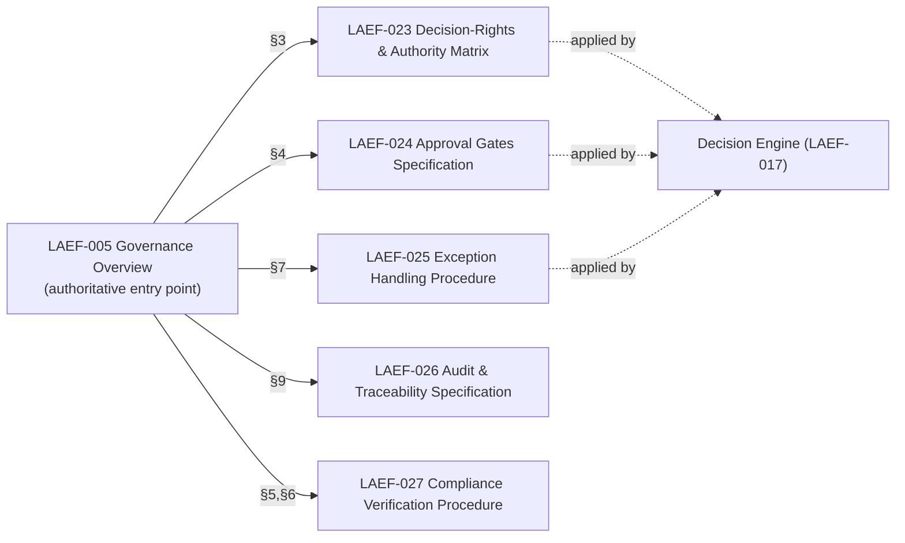
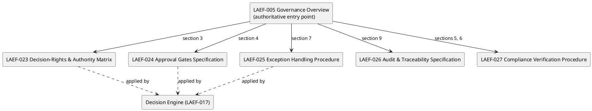

# LAEF Governance Detail Design Specification

| Field | Value |
|-------|-------|
| Document ID | LAEF-022 |
| Document Title | Governance Detail Design Specification (Phase 4 Scope Map) |
| Book | LAEF — LOUTAS AI Engineering Framework |
| Knowledge Base Area | 16-AI-Engineering-Framework |
| Framework Layer | Core / Governance |
| Version | 1.0 |
| Status | Approved |
| Owner | Enterprise AI Governance Office |
| Approval Authority | Product Owner |
| Review Cycle | Annual, and on every major LAEF milestone |
| Last Updated | 2026-07-31 |

---

# Purpose

This document is the **architectural blueprint for Phase 4 (Governance)**. It establishes the complete scope map for the detailed governance documents, binding each to a specific section of the Governance Overview (LAEF-005), defining each document's responsibility and boundary, and setting explicit rules that prevent duplication with LAEF-005.

Its objective is to fix the Phase 4 scope **before** any detailed governance document is drafted.

---

# Scope

This document applies to Phase 4 and to every AI system that contributes to LOUTAS Care — referred to throughout as **"The AI Agent."**

It defines the Phase 4 **scope map** only. It does **not** contain the detailed governance content itself (that is produced in LAEF-023 through LAEF-027), does **not** restate LAEF-005, does **not** define implementation, and does **not** restate LAEF-008 or LAEF-013. It conforms to LAEF-008 and is model-agnostic.

---

# 1. Position in the Framework

- This document opens Phase 4 as its overview, the same role LAEF-008 played for Phase 2 and LAEF-013 for Phase 3.
- It **details how LAEF-005 is expanded** by the Phase 4 documents; it does not restate LAEF-005's content or the GovernanceContract.
- It **conforms** to LAEF-008.
- The detailed governance documents it maps are **LAEF-023 through LAEF-027**.

---

# 2. Relationship Between LAEF-005 and Phase 4

The relationship is strictly hierarchical and non-duplicative:

- **LAEF-005 remains the authoritative overview and single entry point** for governance. It is not superseded, replaced, or restated by any Phase 4 document.
- **Each Phase 4 document expands exactly one primary LAEF-005 section**, adding the detailed procedures and controls that the overview summarizes.
- **The Decision Engine (LAEF-017) applies** this governance content; Phase 4 defines content, not engine architecture.
- A reader begins at LAEF-005 for the model, then follows to the relevant Phase 4 document for the operational detail.

---

# 3. Phase 4 Document Map

| Document | Title | Expands LAEF-005 § | What it adds (detail beyond the overview) |
|----------|-------|--------------------|-------------------------------------------|
| LAEF-023 | Decision-Rights & Authority Matrix | §3 Roles and Responsibilities | A detailed matrix of who decides and who approves each class of work |
| LAEF-024 | Approval Gates Specification | §4 Approval Workflows | Precise definition of each gate, its entry/exit criteria, and evidence required |
| LAEF-025 | Exception Handling Procedure | §7 Exception Handling | The step-by-step exception request, approval, and traceability process |
| LAEF-026 | Audit & Traceability Specification | §9 Auditability | Detailed audit-record structure, retention, and traceability requirements |
| LAEF-027 | Compliance Verification Procedure | §5 Compliance (+ §6 Operational Enforcement) | How conformance is verified and enforced operationally |

LAEF-005 sections **not** expanded in Phase 4 — §1 Governance Model, §2 Lifecycle, §8 Repository Governance, §10 Checklist, §11 Approval Record Template — remain sufficient at the overview level and are referenced, not re-detailed, unless a future need is identified.

---

# 4. Per-Document Scope, Responsibility & Boundary

**LAEF-023 — Decision-Rights & Authority Matrix**
- *Responsibility:* define, in detail, the decision and approval rights for each class of engineering work.
- *Boundary:* it defines *who*; it does not define gates (LAEF-024) or exceptions (LAEF-025).

**LAEF-024 — Approval Gates Specification**
- *Responsibility:* define each approval gate — its purpose, entry/exit criteria, and required evidence — as enforced by the Decision Engine.
- *Boundary:* it defines *gates*; it references roles from LAEF-023 rather than redefining them.

**LAEF-025 — Exception Handling Procedure**
- *Responsibility:* define the detailed process for requesting, approving, recording, and closing a sanctioned exception.
- *Boundary:* it defines the *exception process*; it references roles (LAEF-023) and gates (LAEF-024).

**LAEF-026 — Audit & Traceability Specification**
- *Responsibility:* define the detailed audit-record structure, retention, and traceability requirements for decisions, approvals, and exceptions.
- *Boundary:* it defines *what is recorded and how it is traced*; it does not define who decides or which gates apply.

**LAEF-027 — Compliance Verification Procedure**
- *Responsibility:* define how conformance to the framework is verified and operationally enforced.
- *Boundary:* it defines *verification*; it consumes the outputs of LAEF-023 through LAEF-026 rather than redefining them.

---

# 5. Anti-Duplication Rules

The following rules are normative and bind every Phase 4 document:

1. **LAEF-005 is authoritative and is not restated.** A Phase 4 document references its parent LAEF-005 section and adds only the detail; it never copies LAEF-005 content.
2. **One primary section per document.** Each Phase 4 document expands exactly one primary LAEF-005 section, named in its Position.
3. **Single owner per topic.** Any governance topic has exactly one owning Phase 4 document; overlapping topics are assigned to a single owner (single source of truth).
4. **Cross-reference, do not copy.** Shared concepts (roles, gates) are referenced across documents, never duplicated.
5. **No redefinition of architecture.** No Phase 4 document redefines the GovernanceContract (LAEF-009) or the Decision Engine (LAEF-017); Phase 4 defines content the engine applies.
6. **Overview stays an overview.** Phase 4 does not push detail back up into LAEF-005; LAEF-005 remains the concise entry point.

---

# 6. Scope Map (Diagram)

**Mermaid**

**PlantUML**

**Explanation.** LAEF-005 stays the authoritative overview and entry point. Each Phase 4 document expands exactly one of its sections with detailed procedures and controls — roles (§3), gates (§4), exceptions (§7), audit (§9), and compliance (§5–6). The Decision Engine applies this content at runtime. The arrows are "expands," not "replaces": no detail is copied back into LAEF-005, and no document duplicates another's topic.

---

# 7. Recommended Implementation Order

1. **LAEF-023 Decision-Rights & Authority Matrix** — roles are referenced by every other document, so they come first.
2. **LAEF-024 Approval Gates Specification** — gates use the roles from LAEF-023.
3. **LAEF-025 Exception Handling Procedure** — exceptions use gates and roles.
4. **LAEF-026 Audit & Traceability Specification** — audit records the decisions, approvals, and exceptions above.
5. **LAEF-027 Compliance Verification Procedure** — verification checks everything the prior documents establish.

Each is produced one document at a time under the established gate. Phase 4 targets the **LAEF v1.3** release (minor, additive).

---

# 8. Phase 4 Success Criteria

Phase 4 (Governance) is considered successfully completed when all of the following hold:

- All five detailed governance documents (LAEF-023 through LAEF-027) are drafted, reviewed, and Approved.
- Each document expands exactly one primary LAEF-005 section, with the anti-duplication rules (§5) satisfied and no duplicated content.
- The governance content the Decision Engine applies — roles, gates, exceptions, audit, and compliance verification — is fully specified across the five documents.
- All cross-references resolve, and shared concepts (roles, gates) are referenced consistently rather than duplicated.
- LAEF-005 remains the authoritative overview, unmodified except through governed change.
- No open exception or unresolved conflict blocks governance operation.

# 9. Exit Criteria

Phase 4 may be closed and LAEF v1.3 released only when all of the following are met:

- Every Phase 4 document is Approved and consistent with the v1.2 baseline, with no modification to any v1.2 document.
- Full repository validation passes: unique document IDs, valid cross-references, no obsolete references, and balanced diagrams.
- The LAEF v1.3 Release Manifest is prepared and approved by the Product Owner.
- The area index (README-LAEF), MASTER_INDEX, CHANGELOG, and PROJECT_STATUS are updated to reflect Phase 4.
- The Phase 4 Completion Report is produced.
- Backward compatibility is confirmed (additive within the v1.x line; no migration required).

# 10. Boundaries & Deferrals

- The **detailed governance content** is produced in LAEF-023 through LAEF-027, not here.
- **LAEF governance is distinct from the product `01-Governance`** area (DOC-001, GOV-002…005). Phase 4 governs AI-engineering work; the product area governs product documentation. LAEF continues to reuse GOV-002/003 for document format.
- **Engine architecture** (how governance is applied) is owned by LAEF-017; Phase 4 defines content, not engine internals.
- **Implementation and code** are out of scope.

---

# 11. Conformance to LAEF-008

| Item | This Document |
|------|---------------|
| Single, cohesive responsibility | Yes (Phase 4 scope map) |
| References, does not restate, LAEF-005 | Yes |
| Dependency direction, acyclic | Details LAEF-005; mapped by Decision Engine |
| Anti-duplication rules defined | Yes (§5) |
| Model-agnostic | Yes |
| No anti-patterns | Yes |

Verification and enforcement remain governed by LAEF-005.

---

# Compliance

This document is authoritative once approved by the Product Owner.

It conforms to LAEF-008 and does not contradict LAEF-004, LAEF-005, or any v1.2 document. Any change to a normative architectural rule requires an approved ADR (LAEF-008 §14). Updates follow LAEF-006. This document complies with GOV-002 Document Template Standard and GOV-003 Document Numbering Standard.

---

# Dependencies

- LAEF-004 Framework Architecture Overview
- LAEF-005 Governance Overview
- LAEF-008 Layer Architecture Foundations & Design Principles
- LAEF-013 Engine-Set Design Specification
- LAEF-017 Decision Engine Specification
- GOV-002 Document Template Standard
- GOV-003 Document Numbering Standard

---

# Related Documents

- LAEF-023 Decision-Rights & Authority Matrix *(planned)*
- LAEF-024 Approval Gates Specification *(planned)*
- LAEF-025 Exception Handling Procedure *(planned)*
- LAEF-026 Audit & Traceability Specification *(planned)*
- LAEF-027 Compliance Verification Procedure *(planned)*
- LAEF-007 Framework Roadmap

---

# Revision History

| Version | Date | Description |
|---------|------|-------------|
| 1.0 (Draft) | 2026-07-31 | Initial draft issued for approval; Phase 4 scope map binding LAEF-023–027 to LAEF-005 sections, with anti-duplication rules, scope-map diagram, and implementation order; conformant to LAEF-008 |
| 1.0 (Approved) | 2026-07-31 | Approved by Product Owner with documentation enhancements: added Phase 4 Success Criteria (§8) and Exit Criteria (§9), and added LAEF-013 to Dependencies; no change to architecture, scope, document map, or implementation order |
