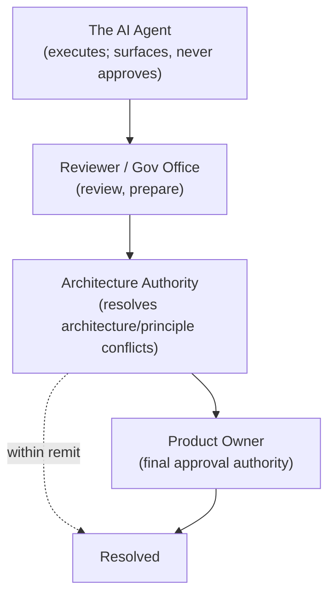
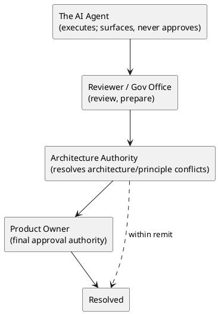

# LAEF Decision-Rights & Authority Matrix

| Field | Value |
|-------|-------|
| Document ID | LAEF-023 |
| Document Title | Decision-Rights & Authority Matrix |
| Book | LAEF — LOUTAS AI Engineering Framework |
| Knowledge Base Area | 16-AI-Engineering-Framework |
| Framework Layer | Core / Governance |
| Version | 1.0 |
| Status | Approved |
| Owner | Enterprise AI Governance Office |
| Approval Authority | Product Owner |
| Review Cycle | Annual, and on every major LAEF milestone |
| Last Updated | 2026-07-31 |

---

# Purpose

This document provides the detailed **decision-rights and authority matrix** for the LOUTAS AI Engineering Framework (LAEF): who decides, approves, executes, reviews, and records each class of engineering work.

It is a Phase 4 detailed governance document that **expands LAEF-005 §3 (Roles and Responsibilities)** under the scope map of LAEF-022.

---

# Scope

This document applies to governance decisions across LAEF and to every AI system that contributes to LOUTAS Care — referred to throughout as **"The AI Agent."**

It defines governance content only. It **references** the roles defined in LAEF-005 §3 and does **not** redefine them (anti-duplication rule). It does **not** define approval gates (LAEF-024) or the exception process (LAEF-025), and does **not** define implementation. It conforms to LAEF-008 and is model-agnostic.

---

# 1. Position in the Framework

- This is a Phase 4 detailed governance document under the scope map **LAEF-022**.
- It **expands LAEF-005 §3**; the role definitions remain owned by LAEF-005 and are referenced here.
- It **conforms** to LAEF-008 and the anti-duplication rules of LAEF-022 §5.
- Gates (LAEF-024) and exceptions (LAEF-025) are separate documents; this document defines only decision rights.

---

# 2. Roles (Referenced)

The six governance roles are defined in **LAEF-005 §3** and are referenced here without redefinition:

- **Product Owner** — final approval authority.
- **Architecture Authority** — resolves architecture and principle conflicts; safeguards invariants.
- **Enterprise AI Governance Office** — prepares and maintains governance documents; operates the process.
- **Reviewer** — performs review at gates.
- **Repository Maintainer** — publishes approved documents; maintains cross-references and indexes.
- **The AI Agent** — executes within governance; never self-approves.

Per LAEF-005 §3, one individual may hold several roles in a small team, provided approvals remain explicit, documented, and auditable, and the AI Agent never approves its own work.

---

# 3. Decision Classes

The matrix covers these classes of governed work:

1. LAEF document approval
2. Architecture Decision Record (ADR) approval
3. Scope change approval
4. Framework release approval
5. Exception approval
6. Architecture / principle conflict resolution
7. Gate review
8. Publication & repository update

---

# 4. Decision-Rights Matrix

## How to Read the Matrix

Each cell shows a role's authority for that decision class:

- **A** = Accountable / Final Approval Authority
- **R** = Recommends / Prepares
- **V** = Reviews
- **X** = Executes / Drafts
- **P** = Publishes / Records
- **C** = Consulted
- **I** = Informed

Each decision class has **exactly one Accountable (A)**. The AI Agent never holds **A**.

| Decision Class | Product Owner | Architecture Authority | Gov Office | Reviewer | Repository Maintainer | The AI Agent |
|----------------|:---:|:---:|:---:|:---:|:---:|:---:|
| LAEF document approval | **A** | C | R | V | I | X |
| ADR approval | **A** | R | C | V | I | X |
| Scope change approval | **A** | C | R | V | I | X |
| Framework release approval | **A** | C | R | V | P | X |
| Exception approval | **A** | C | R | V | I | X |
| Architecture / principle conflict resolution | **A** (final) | R (resolves, escalates if needed) | C | C | I | X |
| Gate review | I | C | C | **A** (of the review) | I | X |
| Publication & repository update | I | I | C | I | **A / X** | I |

Notes: for architecture/principle conflicts, the Architecture Authority resolves within its remit and escalates to the Product Owner where the decision exceeds that remit (LAEF-002). "Gate review" accountability is for the review outcome, not the underlying work approval, which remains with the Product Owner.

## Authority Principles Summary

> - **Human authority is always final.**
> - **The AI Agent never self-approves.**
> - **Every governed decision has a single accountable owner and an auditable record.**

---

# 5. Decision-Rights Principles

- **Final authority is always human and distinct from the AI Agent.** No decision is final on the AI Agent's authority.
- **One accountable approver per decision.** Each decision class has a single **A**; consultation and review do not dilute accountability.
- **Role combination is permitted, self-approval is not.** In small teams a person may hold multiple roles (LAEF-005 §3), but the human approver must be distinct from the AI Agent that produced the work.
- **Every approval is traceable.** Approvals are explicit, documented, and auditable (recorded per LAEF-026).
- **Escalation is a right and a duty.** The AI Agent surfaces conflicts and escalates rather than deciding.

---

# 6. Escalation & Authority (Diagram)

**Mermaid**

**PlantUML**

**Explanation.** Work and conflicts flow upward: the AI Agent surfaces and escalates but never approves; the Reviewer and Governance Office review and prepare; the Architecture Authority resolves architecture and principle conflicts within its remit and escalates beyond it; and the Product Owner holds final approval authority. Every resolution terminates at a human authority distinct from the AI Agent.

---

# 7. Boundaries & Deferrals

- **Role definitions** are owned by LAEF-005 §3 and referenced, not redefined.
- **Approval gates** (where these rights are exercised) are defined in **LAEF-024**.
- **The exception process** is defined in **LAEF-025**; this document only assigns who approves an exception.
- **Recording of approvals** is defined in **LAEF-026**.
- **LAEF governance is distinct** from the product `01-Governance` area; this matrix governs AI-engineering decisions.
- **Implementation and tooling** are out of scope.

---

# 8. Conformance to LAEF-008 and LAEF-022

| Item | This Document |
|------|---------------|
| Expands exactly one LAEF-005 section | Yes — §3 Roles and Responsibilities |
| References, does not restate, LAEF-005 | Yes (roles referenced) |
| Single owner per topic (decision rights) | Yes |
| Cross-references gates/exceptions rather than duplicating | Yes (LAEF-024 / LAEF-025) |
| No redefinition of the GovernanceContract or Decision Engine | Yes |
| Model-agnostic; no anti-patterns | Yes |

Verification and enforcement remain governed by LAEF-005.

---

# 9. Worked Example — Approving a New LAEF Document

This example shows the matrix applied to a real workflow: producing and approving a new LAEF governance document.

1. **Draft (X).** The AI Agent drafts the document within governance, surfacing options and any conflicts; it never approves its own work.
2. **Prepare (R).** The Enterprise AI Governance Office curates the draft into governance form and confirms it is ready for review.
3. **Review (V).** The Reviewer performs the gate review and confirms compliance (the Reviewer is Accountable for the review outcome).
4. **Consult (C).** The Architecture Authority is consulted on architectural fit and invariant safety; if a conflict exceeds its remit, it escalates.
5. **Approve (A).** The Product Owner gives final approval — the single Accountable authority for the document. No approval is final on the AI Agent's authority.
6. **Publish (P).** The Repository Maintainer publishes the approved document and updates cross-references and indexes.
7. **Record.** The approval is recorded as an auditable entry (per LAEF-026).

Reading across the "LAEF document approval" row of the matrix reproduces exactly this flow: Product Owner **A**, Architecture Authority **C**, Governance Office **R**, Reviewer **V**, Repository Maintainer **I/P at publication**, AI Agent **X**. The same pattern, with the relevant row, applies to approving any class of governed work — for example a new product module, where the AI Agent drafts the architecture, the Reviewer and Architecture Authority review, and the Product Owner approves.

---

# Compliance

This document is authoritative once approved by the Product Owner.

It conforms to LAEF-008 and LAEF-022, expands LAEF-005 §3, and does not contradict LAEF-004 or any v1.2 document. Any change to a normative architectural rule requires an approved ADR (LAEF-008 §14). Updates follow LAEF-006. This document complies with GOV-002 Document Template Standard and GOV-003 Document Numbering Standard.

---

# Dependencies

- LAEF-005 Governance Overview
- LAEF-008 Layer Architecture Foundations & Design Principles
- LAEF-013 Engine-Set Design Specification
- LAEF-017 Decision Engine Specification
- LAEF-022 Governance Detail Design Specification
- GOV-002 Document Template Standard
- GOV-004 Approval and Review Policy

---

# Related Documents

- LAEF-024 Approval Gates Specification *(planned; where these rights are exercised)*
- LAEF-025 Exception Handling Procedure *(planned)*
- LAEF-026 Audit & Traceability Specification *(planned; records approvals)*
- LAEF-005 Governance Overview §3 *(role definitions)*

---

# Revision History

| Version | Date | Description |
|---------|------|-------------|
| 1.0 (Draft) | 2026-07-31 | Initial draft issued for approval; detailed decision-rights matrix expanding LAEF-005 §3, referencing roles without redefinition, with escalation diagram; conformant to LAEF-008 and LAEF-022 |
| 1.0 (Approved) | 2026-07-31 | Approved by Product Owner with documentation enhancements: added How to Read the Matrix, Authority Principles Summary, and a worked example; no change to model, roles, decision rights, or boundaries |
