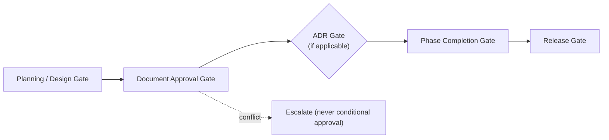
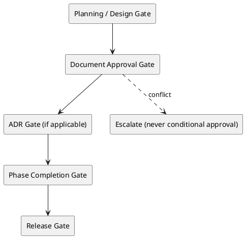
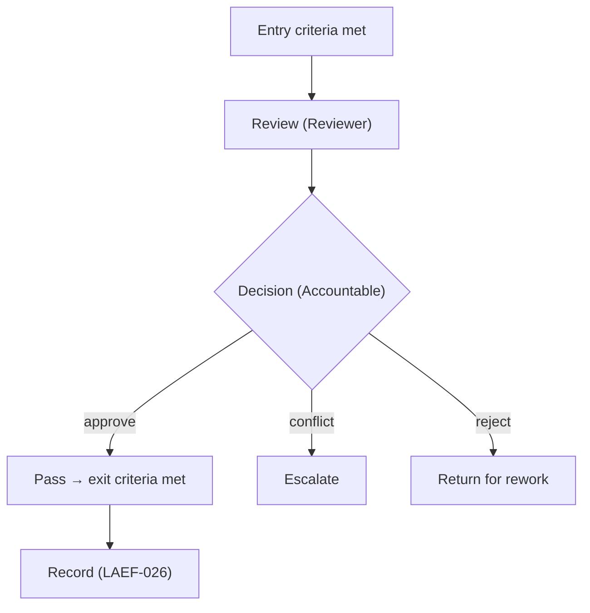
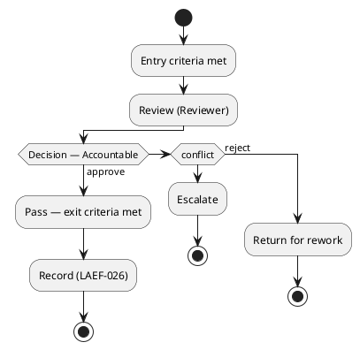

# LAEF Approval Gates Specification

| Field | Value |
|-------|-------|
| Document ID | LAEF-024 |
| Document Title | Approval Gates Specification |
| Book | LAEF — LOUTAS AI Engineering Framework |
| Knowledge Base Area | 16-AI-Engineering-Framework |
| Framework Layer | Core / Governance |
| Version | 1.0 |
| Status | Approved |
| Owner | Enterprise AI Governance Office |
| Approval Authority | Product Owner |
| Review Cycle | Annual, and on every major LAEF milestone |
| Last Updated | 2026-07-31 |

---

# Purpose

This document specifies the **approval gates** of the LOUTAS AI Engineering Framework (LAEF): the named checkpoints at which work is reviewed and approved, each with its purpose, entry criteria, required evidence, exit criteria, accountable authority, and record.

It is a Phase 4 detailed governance document that **expands LAEF-005 §4 (Approval Workflows)** under the scope map of LAEF-022.

---

# Scope

This document applies to the LAEF approval process and to every AI system that contributes to LOUTAS Care — referred to throughout as **"The AI Agent."**

It defines governance content only. It **references** the roles defined in LAEF-023, the exception process in LAEF-025, and the audit requirements in LAEF-026, and does **not** redefine them. It does **not** restate LAEF-005 or define implementation. It conforms to LAEF-008 and is model-agnostic.

---

# 1. Position in the Framework

- This is a Phase 4 detailed governance document under the scope map **LAEF-022**.
- It **expands LAEF-005 §4**; the approval-workflow rules remain owned by LAEF-005 and are referenced here.
- It **conforms** to LAEF-008 and the anti-duplication rules of LAEF-022 §5.
- Roles are referenced from **LAEF-023**; the exception process is **LAEF-025**; recording is **LAEF-026**.

---

# 2. Gate Model

Approval is **per-artifact and per-gate** (LAEF-005 §4). Every gate shares the same anatomy:

- **Purpose** — what the gate protects.
- **Entry criteria** — what must be true to enter the gate.
- **Required evidence** — what is presented for the decision.
- **Exit criteria** — what must hold to pass.
- **Accountable** — the single role accountable for the decision (per LAEF-023).
- **Record** — the auditable approval record produced (per LAEF-026).

At every gate: approval is explicit (silence is not approval), the AI Agent never approves its own work, and conflicts are escalated rather than approved conditionally (LAEF-005 §4).

---

# 3. Gate Catalog

## How to Read a Gate

Every gate below is described with the same fields, so any gate can be read consistently:

- **Gate Purpose** — what the gate protects.
- **Entry Criteria** — what must be true to enter the gate.
- **Activities** — what is done at the gate (review, verification).
- **Exit Criteria** — what must hold to pass.
- **Decision Outcome** — pass (exit criteria met) or fail (failure outcome).
- **Responsible Authority** — the single role accountable for the decision (per LAEF-023).

## 3.1 Planning / Design Gate
| Field | Value |
|-------|-------|
| Purpose | Approve a plan or design specification before any document is drafted |
| Entry criteria | Existing-system assessment complete; plan/design spec prepared |
| Activities | Review the plan against the assessment and approved architecture |
| Required evidence | The design specification (scope, objectives, boundaries, conformance) |
| Exit criteria | Product Owner approves the plan; scope is fixed |
| Failure outcome | Plan returned for revision; drafting does not begin |
| Accountable | Product Owner (per LAEF-023) |
| Record | Approval record (LAEF-026) |

## 3.2 Document Approval Gate
| Field | Value |
|-------|-------|
| Purpose | Make a drafted document authoritative |
| Entry criteria | Draft complete; conformance checklist satisfied; reviewer confirms compliance |
| Activities | Reviewer checks conformance and confirms compliance |
| Required evidence | The document and its conformance/review result |
| Exit criteria | Product Owner approves; document status set to Approved |
| Failure outcome | Document returned for rework; status remains Draft |
| Accountable | Product Owner |
| Record | Approval record (LAEF-026) |

## 3.3 ADR Gate (when applicable)
| Field | Value |
|-------|-------|
| Purpose | Approve an architectural decision before dependent work proceeds |
| Entry criteria | A normative architectural rule change or cross-cutting decision is proposed |
| Activities | Review the decision, alternatives, and consequences |
| Required evidence | The drafted ADR (context, decision, consequences, alternatives) |
| Exit criteria | ADR approved and recorded in the ADR/ directory |
| Failure outcome | ADR revised or rejected; dependent work does not proceed |
| Accountable | Product Owner (Architecture Authority recommends) |
| Record | ADR entry + approval record (LAEF-026) |

## 3.4 Phase Completion Gate
| Field | Value |
|-------|-------|
| Purpose | Close a phase before the next begins |
| Entry criteria | All phase documents approved; validation passed; completion report prepared |
| Activities | Verify approvals, validation results, and phase success criteria |
| Required evidence | Completion report; validation results; phase success criteria met |
| Exit criteria | Product Owner approves phase closure |
| Failure outcome | Phase remains open; outstanding items returned for completion |
| Accountable | Product Owner |
| Record | Approval record (LAEF-026) |

## 3.5 Release Gate
| Field | Value |
|-------|-------|
| Purpose | Cut a framework release |
| Entry criteria | Release manifest prepared; release criteria met; exit criteria satisfied |
| Activities | Verify release and exit criteria; confirm the manifest |
| Required evidence | The release manifest and validation results |
| Exit criteria | Product Owner approves the release; Repository Maintainer publishes |
| Failure outcome | Release held; manifest returned for correction |
| Accountable | Product Owner (Repository Maintainer publishes) |
| Record | Release manifest (Released) + approval record (LAEF-026) |

Exception approval is handled by the separate exception process (LAEF-025); this catalog does not duplicate it.

## Gate Summary Matrix

| Gate | Trigger | Responsible Authority | Entry Criteria | Exit Outcome | Next Step |
|------|---------|-----------------------|----------------|--------------|-----------|
| Planning / Design | A plan/design spec is ready | Product Owner | Assessment done; spec prepared | Plan approved; scope fixed | Draft the document(s) |
| Document Approval | A document draft is complete | Product Owner | Conformance satisfied; reviewed | Document Approved | Next document or phase gate |
| ADR (if required) | A normative architectural change is proposed | Product Owner (AA recommends) | ADR drafted | ADR approved & recorded | Dependent work proceeds |
| Phase Completion | All phase documents approved | Product Owner | Validation passed; report ready | Phase closed | Release gate |
| Release | Release manifest prepared | Product Owner (Maintainer publishes) | Release & exit criteria met | Release published | Next phase |

---

# 4. Gate Sequence (Diagram)

**Mermaid**

**PlantUML**

**Explanation.** Work flows through the gates in order: a plan is approved before drafting (Planning/Design Gate), each document is made authoritative (Document Approval Gate), architectural decisions pass an ADR Gate where applicable, a phase closes only after the Phase Completion Gate, and a release is cut at the Release Gate. At any gate a conflict is escalated rather than approved conditionally.

## Gate Anatomy (Diagram)

**Mermaid**

**PlantUML**

**Explanation.** Every gate has the same anatomy: once entry criteria are met, the Reviewer reviews and the single Accountable role decides. Approval passes the gate and produces an auditable record; a conflict is escalated; a rejection returns the work for rework. This uniform shape is what makes the gates predictable and auditable.

---

# 5. Gate Rules

- **One Accountable per gate.** Each gate has exactly one accountable role (per LAEF-023).
- **Explicit and recorded.** Approval is explicit and produces an auditable record (LAEF-026); silence is not approval.
- **No self-approval.** The AI Agent presents work and never approves it.
- **Escalate conflicts.** Work conflicting with approved knowledge, architecture, or scope is escalated, not conditionally approved.
- **No gate is skipped.** A phase does not advance until the prior gate has passed (LAEF-005 §4).

---

## Gate Design Principles

> - **No gate may be bypassed** without an approved exception (LAEF-025).
> - **Every gate has one accountable authority.**
> - **Every gate decision is auditable** (LAEF-026).
> - **Passing a gate does not replace final Product Owner approval** where required.

# 6. Boundaries & Deferrals

- **Approval-workflow rules** are owned by LAEF-005 §4 and referenced, not restated.
- **Roles** (who is Accountable) are defined in **LAEF-023**.
- **The exception process** is defined in **LAEF-025**; this document does not duplicate it.
- **Recording of approvals** is defined in **LAEF-026**.
- **LAEF governance is distinct** from the product `01-Governance` area.
- **Implementation and tooling** are out of scope.

---

# 7. Conformance to LAEF-008 and LAEF-022

| Item | This Document |
|------|---------------|
| Expands exactly one LAEF-005 section | Yes — §4 Approval Workflows |
| References, does not restate, LAEF-005 | Yes |
| Single owner per topic (gates) | Yes |
| Cross-references roles/exceptions/audit rather than duplicating | Yes (LAEF-023 / 025 / 026) |
| No redefinition of the GovernanceContract or Decision Engine | Yes |
| Model-agnostic; no anti-patterns | Yes |

Verification and enforcement remain governed by LAEF-005.

---

# 8. Worked Example — Gate Flow: Developing a New Pharmacy Module

This example shows a contribution moving through the gates in a real engineering workflow.

1. **Planning & Design Gate.** A Pharmacy-module design specification is prepared (scope, boundaries, conformance). The Reviewer reviews it; the Product Owner approves the plan and fixes scope. *Failure:* the plan is returned for revision and drafting does not begin.
2. **Document Approval Gate.** Each Pharmacy architecture document is drafted by the AI Agent, checked for conformance by the Reviewer, and approved by the Product Owner. *Failure:* a document is returned for rework and stays Draft.
3. **ADR Gate (if required).** The Pharmacy module introduces a normative architectural decision — for example a new domain boundary. An ADR is drafted, recommended by the Architecture Authority, and approved by the Product Owner, then recorded in the ADR/ directory. Only then does dependent work proceed. *Failure:* the ADR is revised or rejected and dependent work waits.
4. **Phase Completion Gate.** Once all Pharmacy documents are approved and validation passes, the completion report is prepared and the Product Owner closes the phase. *Failure:* the phase remains open with outstanding items returned.
5. **Release Gate.** The release manifest is prepared and criteria met; the Product Owner approves the release and the Repository Maintainer publishes it. *Failure:* the release is held and the manifest corrected.

Throughout, the AI Agent drafts and surfaces but never approves, conflicts are escalated rather than conditionally approved, and every gate decision is recorded (LAEF-026). The gates work together as a chain: no later gate is reached until the earlier one has passed.

---

# Compliance

This document is authoritative once approved by the Product Owner.

It conforms to LAEF-008 and LAEF-022, expands LAEF-005 §4, and does not contradict LAEF-004 or any v1.2 document. Any change to a normative architectural rule requires an approved ADR (LAEF-008 §14). Updates follow LAEF-006. This document complies with GOV-002 Document Template Standard and GOV-003 Document Numbering Standard.

---

# Dependencies

- LAEF-005 Governance Overview
- LAEF-008 Layer Architecture Foundations & Design Principles
- LAEF-022 Governance Detail Design Specification
- LAEF-023 Decision-Rights & Authority Matrix
- GOV-002 Document Template Standard
- GOV-004 Approval and Review Policy

---

# Related Documents

- LAEF-023 Decision-Rights & Authority Matrix *(who is Accountable at each gate)*
- LAEF-025 Exception Handling Procedure *(planned)*
- LAEF-026 Audit & Traceability Specification *(planned; records approvals)*
- LAEF-005 Governance Overview §4 *(approval-workflow rules)*

---

# Revision History

| Version | Date | Description |
|---------|------|-------------|
| 1.0 (Draft) | 2026-07-31 | Initial draft issued for approval; approval gates (Planning, Document, ADR, Phase Completion, Release) expanding LAEF-005 §4, with gate-sequence and gate-anatomy diagrams; conformant to LAEF-008 and LAEF-022 |
| 1.0 (Approved) | 2026-07-31 | Approved by Product Owner with documentation enhancements: How to Read a Gate, per-gate Activities and Failure outcome, Gate Summary Matrix, Gate Design Principles, and a worked example; no change to gate model, responsibilities, or scope |
