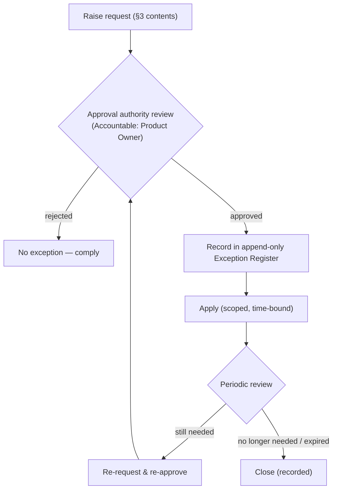
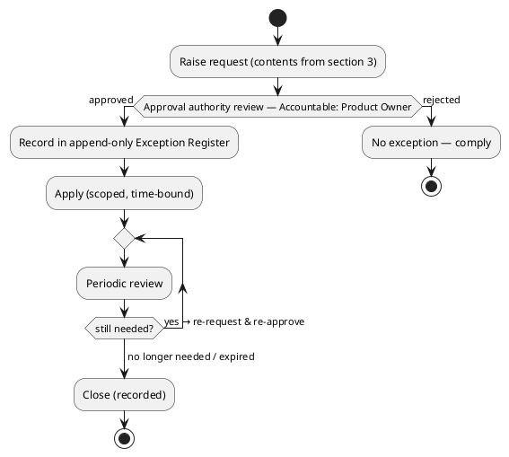

# LAEF Exception Handling Procedure

| Field | Value |
|-------|-------|
| Document ID | LAEF-025 |
| Document Title | Exception Handling Procedure |
| Book | LAEF — LOUTAS AI Engineering Framework |
| Knowledge Base Area | 16-AI-Engineering-Framework |
| Framework Layer | Core / Governance |
| Version | 1.0 |
| Status | Approved |
| Owner | Enterprise AI Governance Office |
| Approval Authority | Product Owner |
| Review Cycle | Annual, and on every major LAEF milestone |
| Last Updated | 2026-07-31 |

---

# Purpose

This document specifies the detailed **exception handling procedure** for the LOUTAS AI Engineering Framework (LAEF): how a governed exception is requested, approved, recorded, applied, reviewed, and closed.

It is a Phase 4 detailed governance document that **expands LAEF-005 §7 (Exception Handling)** under the scope map of LAEF-022.

---

# Scope

This document applies to exceptions to LAEF governance and to every AI system that contributes to LOUTAS Care — referred to throughout as **"The AI Agent."**

It defines governance content only. It **references** the roles in LAEF-023, the gates in LAEF-024, and the audit requirements in LAEF-026, and does **not** redefine them. It does **not** restate LAEF-005 §7 or define implementation. It conforms to LAEF-008 and is model-agnostic.

---

# 1. Position in the Framework

- This is a Phase 4 detailed governance document under the scope map **LAEF-022**.
- It **expands LAEF-005 §7**; the exception principles and the high-level flow remain owned by LAEF-005 and are referenced here.
- It **conforms** to LAEF-008 and the anti-duplication rules of LAEF-022 §5.

---

# 2. Exception Principles (Referenced)

From LAEF-005 §7 (referenced, not restated): LAEF permits exceptions **only through a governed, traceable process**; no undocumented or unapproved exception is valid; every exception is **scoped and time-bound** and subject to periodic review.

> **Exception Principles Summary**
> - **No exception is valid unless documented and approved.**
> - **Every exception is scoped and time-bound** — never open-ended.
> - **Every exception is recorded in the append-only Exception Register and is auditable.**
> - **The AI Agent may request an exception but never approves one.**

---

## How to Read an Exception

Every exception moves through the same lifecycle stages:

- **Exception Request** — documented with the mandatory fields (§3).
- **Review** — the approval authority reviews the request.
- **Approval / Rejection** — approved (proceed to recording) or rejected (comply).
- **Recording** — an approved exception is entered in the append-only register.
- **Application** — applied strictly within its scope and time bound.
- **Periodic Review** — reviewed on a defined cadence while active.
- **Closure** — closed at expiry; renewal requires a fresh approval.

# 3. Exception Request — Required Contents

## Mandatory Fields (required before review)

An exception may not enter review until all of the following are present:

- **Rule excepted** — the specific governance rule, standard, or gate the exception applies to.
- **Justification** — why the exception is needed and why compliance is not currently possible.
- **Scope** — exactly what the exception covers (and what it does not).
- **Time bound** — the expiry date or condition; exceptions are never open-ended.
- **Risk & mitigation** — the risk introduced and how it is contained.
- **Requester** — who is requesting (the AI Agent may request; it never approves).

## Optional Supporting Information

The following may be attached to strengthen a request but are not required to enter review:

- **Supporting references** — links to related decisions, ADRs, or prior exceptions.
- **Precedent** — earlier comparable exceptions and their outcomes.
- **Additional context** — any further notes that aid the reviewer.

A request missing any mandatory field is returned to the requester before it enters review.

---

# 4. Exception Procedure

1. **Raise.** The requester documents the exception with the required contents (§3). The AI Agent may raise an exception but never approves it.
2. **Review.** The approval authority reviews the request. Per LAEF-023, the Product Owner is Accountable; the Architecture Authority is consulted where the exception touches architecture or invariants.
3. **Decide.** The authority approves or rejects. A rejected request means the work must comply with governance — there is no conditional exception.
4. **Record.** An approved exception is recorded in the append-only **Exception Register** (§5), per LAEF-026.
5. **Apply.** The exception is applied strictly within its scope and time bound.
6. **Review periodically.** The exception is reviewed on a defined cadence while active.
7. **Close.** At expiry the exception is closed; continuation requires a fresh request and re-approval. Closure is recorded.

This procedure details the high-level flow in LAEF-005 §7; it does not replace it.

---

## Exception Summary Table

| Stage | Responsible Authority | Required Output | Next Step |
|-------|-----------------------|-----------------|-----------|
| Raise | Requester (the AI Agent may raise) | Documented request with mandatory fields | Review |
| Review | Product Owner (Architecture Authority consulted) | Review outcome | Decide |
| Decide | Product Owner (Accountable) | Approval or rejection | Record (if approved) / Comply (if rejected) |
| Record | Enterprise AI Governance Office | Append-only register entry | Apply |
| Apply | Requester | Exception applied within scope & time bound | Periodic review |
| Periodic Review | Product Owner | Review record | Renew or Close |
| Close | Product Owner | Closure record | — |

# 5. Exception Register

The Exception Register is **append-only** (entries are never edited or deleted; status changes are new appended records). Each entry records:

| Field | Meaning |
|-------|---------|
| Exception ID | Unique identifier |
| Rule excepted | The rule, standard, or gate |
| Justification | Why it was granted |
| Scope | What it covers |
| Granted date | When approved |
| Expiry | When it ends (date or condition) |
| Approver | The accountable authority (per LAEF-023) |
| Status | Active / Under review / Closed / Expired |
| Review dates | Periodic review record |
| Closure | Closure/expiry record |

---

# 6. Exception Lifecycle (Diagram)

**Mermaid**

**PlantUML**

**Explanation.** A request with the required contents is reviewed by the accountable authority. A rejection means the work must comply — there is no conditional exception. An approval is recorded in the append-only register and applied strictly within its scope and time bound. While active it is reviewed periodically; if still needed it must be re-requested and re-approved, and otherwise it is closed at expiry with the closure recorded. This extends the LAEF-005 §7 flow with the renewal and closure detail.

---

>**Exception Design Principles**
> - **Exceptions are temporary, never permanent.**
> - **Exceptions do not modify governance** — an exception is a scoped, recorded deviation, not a rule change.
> - **Every exception has an owner, scope, expiry, and audit record.**
> - **Every renewal is a new approval, not an extension.**

# 7. Worked Examples

## 7.1 Approved Exception — A Time-Bound Exception

An urgent production fix requires proceeding before the full Planning/Design Gate (LAEF-024) can complete. The team raises an exception: rule excepted = the Planning/Design Gate for this specific fix; justification = urgent defect with customer impact; scope = this single fix only; time bound = 5 working days; risk = reduced upfront review, mitigated by an expedited post-hoc design review. The Product Owner (Accountable) approves; the Architecture Authority is consulted and confirms no invariant is affected. The exception is recorded in the register (Active, expiry in 5 days) and applied only to that fix. At the periodic review the expedited design review is completed; the exception is then closed and the closure recorded. The gate is not permanently bypassed — the exception was scoped, time-bound, approved, and auditable.

---

## 7.2 Rejected Exception → Governance Compliance

A team requests an exception to skip the Document Approval Gate (LAEF-024) for a new architecture document, to save time before a demo. The Product Owner reviews the request and consults the Architecture Authority, who finds the document affects an approved invariant. The justification is convenience rather than necessity, and granting it would weaken governance for no compelling reason. The Product Owner **rejects** the request.

Because there is no conditional exception, the work must comply: the document proceeds through the normal Document Approval Gate — drafted by the AI Agent, reviewed for conformance, and approved by the Product Owner. The request and its rejection are recorded and auditable (LAEF-026), but **no active entry is added to the Exception Register**, because no exception was granted. This example complements §7.1: together they show both outcomes — an approved, scoped, time-bound exception, and a rejection that routes the work back to full governance compliance.

# 8. Boundaries & Deferrals

- **Exception principles and the high-level flow** are owned by LAEF-005 §7 and referenced, not restated.
- **Roles** (who approves) are defined in **LAEF-023**; **gates** in **LAEF-024**.
- **Recording** of exceptions is governed by **LAEF-026** (the register is append-only and auditable).
- **LAEF governance is distinct** from the product `01-Governance` area.
- **Implementation and tooling** are out of scope.

---

# 9. Conformance to LAEF-008 and LAEF-022

| Item | This Document |
|------|---------------|
| Expands exactly one LAEF-005 section | Yes — §7 Exception Handling |
| References, does not restate, LAEF-005 | Yes |
| Single owner per topic (exceptions) | Yes |
| Cross-references roles/gates/audit rather than duplicating | Yes (LAEF-023 / 024 / 026) |
| No redefinition of the GovernanceContract or Decision Engine | Yes |
| Model-agnostic; no anti-patterns | Yes |

Verification and enforcement remain governed by LAEF-005.

---

# Compliance

This document is authoritative once approved by the Product Owner.

It conforms to LAEF-008 and LAEF-022, expands LAEF-005 §7, and does not contradict LAEF-004 or any v1.2 document. Any change to a normative architectural rule requires an approved ADR (LAEF-008 §14). Updates follow LAEF-006. This document complies with GOV-002 Document Template Standard and GOV-003 Document Numbering Standard.

---

# Dependencies

- LAEF-005 Governance Overview
- LAEF-008 Layer Architecture Foundations & Design Principles
- LAEF-022 Governance Detail Design Specification
- LAEF-023 Decision-Rights & Authority Matrix
- LAEF-024 Approval Gates Specification
- GOV-002 Document Template Standard
- GOV-004 Approval and Review Policy

---

# Related Documents

- LAEF-024 Approval Gates Specification *(gates an exception may temporarily except)*
- LAEF-026 Audit & Traceability Specification *(planned; records exceptions)*
- LAEF-005 Governance Overview §7 *(exception principles and high-level flow)*

---

# Revision History

| Version | Date | Description |
|---------|------|-------------|
| 1.0 (Draft) | 2026-07-31 | Initial draft issued for approval; detailed exception procedure expanding LAEF-005 §7 — request contents, procedure, append-only register, lifecycle diagram, principles callout, and worked example; conformant to LAEF-008 and LAEF-022 |
| 1.0 (Approved) | 2026-07-31 | Approved by Product Owner with documentation enhancements: How to Read an Exception, mandatory/optional request fields, Exception Summary Table, Exception Design Principles, and a second (rejected-path) worked example; no change to exception model, responsibilities, or scope |
