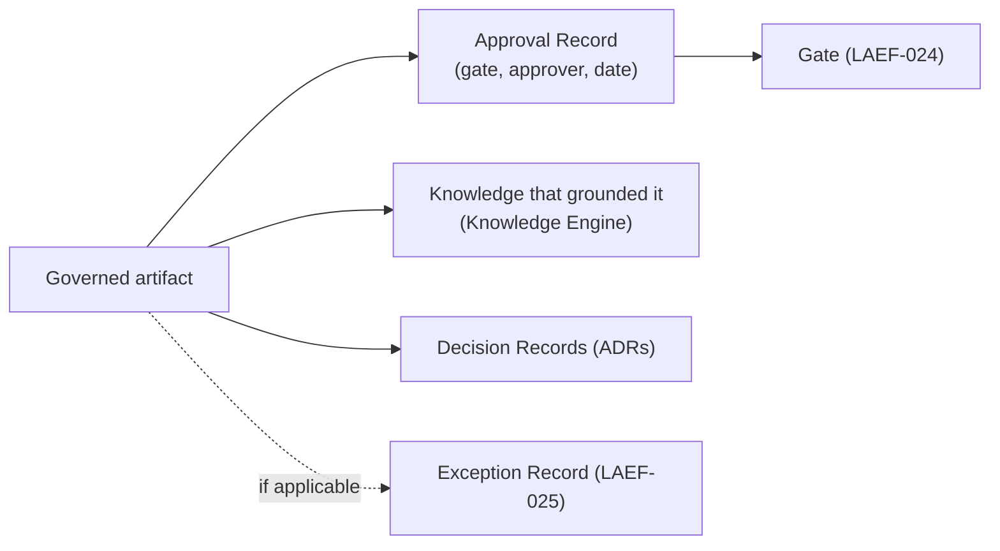
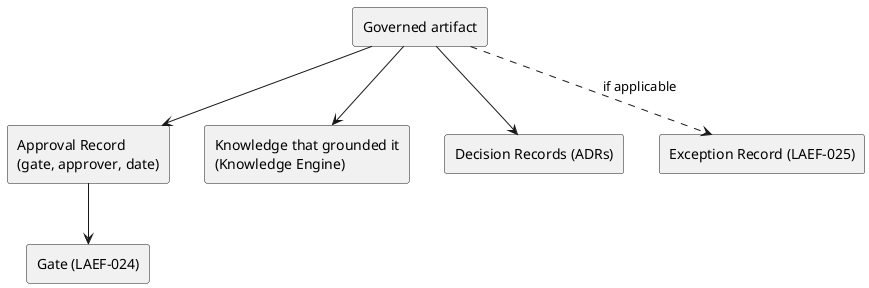

# LAEF Audit & Traceability Specification

| Field | Value |
|-------|-------|
| Document ID | LAEF-026 |
| Document Title | Audit & Traceability Specification |
| Book | LAEF — LOUTAS AI Engineering Framework |
| Knowledge Base Area | 16-AI-Engineering-Framework |
| Framework Layer | Core / Governance |
| Version | 1.0 |
| Status | Approved |
| Owner | Enterprise AI Governance Office |
| Approval Authority | Product Owner |
| Review Cycle | Annual, and on every major LAEF milestone |
| Last Updated | 2026-07-31 |

---

# Purpose

This document specifies the detailed **audit and traceability requirements** for the LOUTAS AI Engineering Framework (LAEF): the structure of each audit record, how records are retained, and how any artifact is traced back to the approval that authorized it and the knowledge that grounded it.

It is a Phase 4 detailed governance document that **expands LAEF-005 §9 (Auditability)** under the scope map of LAEF-022.

---

# Scope

This document applies to the LAEF audit trail and to every AI system that contributes to LOUTAS Care — referred to throughout as **"The AI Agent."**

It defines governance content only. It **references** the roles in LAEF-023, the gates in LAEF-024, and the exception process in LAEF-025, and does **not** redefine them. It does **not** restate LAEF-005 §9 or define implementation. It conforms to LAEF-008 and is model-agnostic.

---

# 1. Position in the Framework

- This is a Phase 4 detailed governance document under the scope map **LAEF-022**.
- It **expands LAEF-005 §9**; the audit principles and trail components remain owned by LAEF-005 and are referenced here.
- It **conforms** to LAEF-008 and the anti-duplication rules of LAEF-022 §5.

---

# 2. Audit Principles (Referenced)

From LAEF-005 §9 (referenced, not restated): LAEF governance is **auditable by construction**; the audit trail is **append-only** (records are added, never rewritten or deleted); and from any artifact it must be possible to trace back to the approval that authorized it and the knowledge that grounded it.

---

# 3. How to Read the Audit Trail

The audit trail is made of four record types, each with a fixed source:

- **Revision History** — in each document; every version and change.
- **Approval Record** — at each gate; who approved what, and when.
- **Exception Record** — in the Exception Register; every requested and granted exception.
- **Decision Record (ADR)** — in the `ADR/` directory; architectural decisions and rationale.

Reading the trail means following these records from an artifact back to its authorization and grounding.

---

# 4. Audit Record Types & Structure

## 4.1 Revision History Entry
Fields: version, date, description. Present in every document; append-only.

## 4.2 Approval Record
Fields: artifact approved, gate (LAEF-024), approver (Accountable per LAEF-023), date, decision (approved/returned), evidence reference. Produced at every gate.

## 4.3 Exception Record
The append-only Exception Register entry defined in **LAEF-025 §5** (Exception ID, rule excepted, scope, expiry, approver, status, review/closure). Referenced here, not redefined.

## 4.4 Decision Record (ADR)
Fields: ADR ID, decision, rationale, status, related documents. Held in the `ADR/` directory.

---

# 5. Audit Record Summary Table

| Record Type | Source | Key Fields | Append-only | Traces to |
|-------------|--------|-----------|:-----------:|-----------|
| Revision History | Each document | version, date, description | Yes | prior versions |
| Approval Record | Each gate (LAEF-024) | artifact, gate, approver, date, decision, evidence | Yes | the approved artifact |
| Exception Record | Exception Register (LAEF-025) | exception ID, rule, scope, expiry, approver, status | Yes | the excepted rule/gate |
| Decision Record (ADR) | `ADR/` directory | ADR ID, decision, rationale, status | Yes | dependent work |

---

# 6. Traceability Requirements

From any governed artifact, it must be possible to trace:

- **Back to authorization** — the Approval Record and gate that authorized it.
- **Back to grounding** — the knowledge (and, where relevant, the ADRs) that grounded it.
- **Back to any exception** — if an exception applied, its Exception Register entry.

Each link in the chain is an append-only record; no link may be broken by editing or deleting a record.

---

# 7. Traceability Chain (Diagram)

**Mermaid**

**PlantUML**

**Explanation.** From any governed artifact the trail leads to the Approval Record and the gate that authorized it, to the knowledge that grounded it, and to the decision records (ADRs) that shaped it — plus an Exception Record if an exception applied. Every node is an append-only record, so the chain is always intact and reconstructable.

> **Audit Design Principles**
> - **The audit trail is append-only** — records are added, never rewritten or deleted.
> - **Every governed artifact is traceable** to the approval that authorized it and the knowledge that grounded it.
> - **Superseded records are retained**, not removed.
> - **Records are immutable** — a correction is a new appended record, never an edit.

---

# 8. Retention

- Audit records are retained for the life of the framework.
- Records are **never deleted**; a superseded record remains in place, and its replacement is appended.
- The Revision History, Approval Records, Exception Register, and ADRs together form the permanent trail.

---

# 9. Worked Example — Tracing an Approved Document

To audit an approved LAEF document, begin at the artifact and follow the trail:

1. The document's **Revision History** shows the version approved and when.
2. The **Approval Record** shows the Product Owner approved it at the Document Approval Gate (LAEF-024) on a given date, with the review result as evidence.
3. The document's **Dependencies** and the knowledge it cites show the **grounding** — the approved sources it was built on (retrieved via the Knowledge Engine).
4. Any **ADR** it reflects (for example ADR-011 for a workflow-related document) is linked in its Related Documents.
5. If an **exception** ever applied, the Exception Register entry (LAEF-025) is reachable from the record.

From the single artifact, an auditor reaches its authorization and its grounding without gaps — which is exactly what "auditable by construction" means.

---

# 10. Boundaries & Deferrals

- **Audit principles and trail components** are owned by LAEF-005 §9 and referenced, not restated.
- **Approval Records** are produced at the gates in **LAEF-024**; **Exception Records** are defined in **LAEF-025**; **roles** in **LAEF-023**.
- **LAEF governance is distinct** from the product `01-Governance` area and its own audit mechanisms.
- **Implementation and tooling** (how records are stored) are out of scope.

---

# 11. Conformance to LAEF-008 and LAEF-022

| Item | This Document |
|------|---------------|
| Expands exactly one LAEF-005 section | Yes — §9 Auditability |
| References, does not restate, LAEF-005 | Yes |
| Single owner per topic (audit & traceability) | Yes |
| Cross-references gates/exceptions/roles rather than duplicating | Yes (LAEF-024 / 025 / 023) |
| No redefinition of the GovernanceContract or Decision Engine | Yes |
| Model-agnostic; no anti-patterns | Yes |

Verification and enforcement remain governed by LAEF-005.

---

# Compliance

This document is authoritative once approved by the Product Owner.

It conforms to LAEF-008 and LAEF-022, expands LAEF-005 §9, and does not contradict LAEF-004 or any v1.2 document. Any change to a normative architectural rule requires an approved ADR (LAEF-008 §14). Updates follow LAEF-006. This document complies with GOV-002 Document Template Standard and GOV-003 Document Numbering Standard.

---

# Dependencies

- LAEF-005 Governance Overview
- LAEF-008 Layer Architecture Foundations & Design Principles
- LAEF-022 Governance Detail Design Specification
- LAEF-023 Decision-Rights & Authority Matrix
- LAEF-024 Approval Gates Specification
- LAEF-025 Exception Handling Procedure
- GOV-002 Document Template Standard

---

# Related Documents

- LAEF-024 Approval Gates Specification *(produces Approval Records)*
- LAEF-025 Exception Handling Procedure *(produces Exception Records)*
- LAEF-027 Compliance Verification Procedure *(planned; consumes the audit trail)*
- LAEF-005 Governance Overview §9 *(audit principles and trail components)*

---

# Revision History

| Version | Date | Description |
|---------|------|-------------|
| 1.0 (Draft) | 2026-07-31 | Initial draft issued for approval; detailed audit-record structures, traceability requirements, retention, traceability-chain diagram, design-principles callout, and worked example expanding LAEF-005 §9; conformant to LAEF-008 and LAEF-022 |
| 1.0 (Approved) | 2026-07-31 | Approved by Product Owner without content changes |
