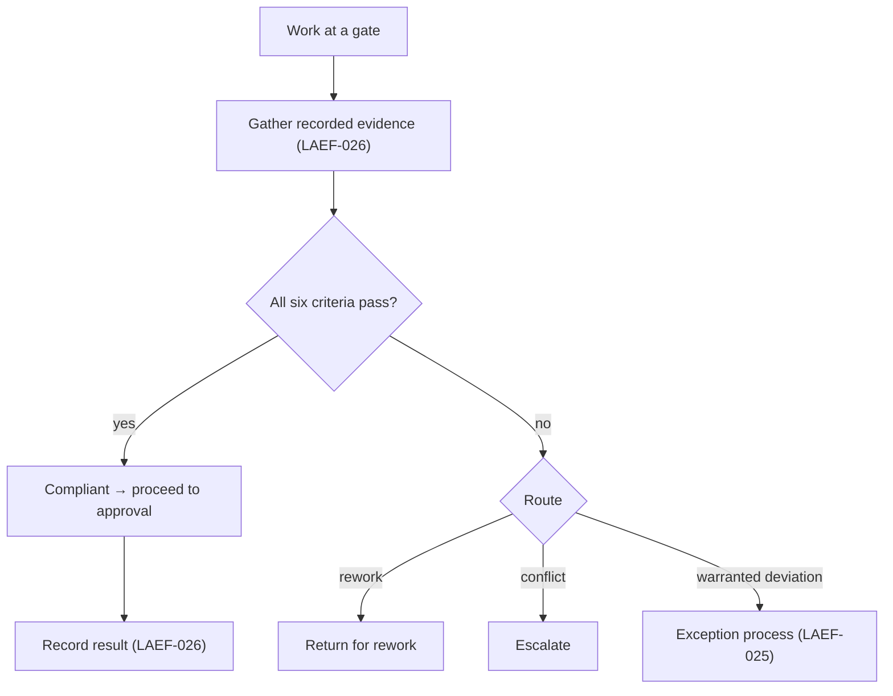
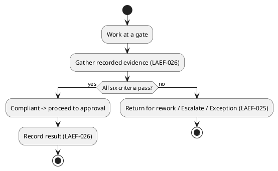

# LAEF Compliance Verification Procedure

| Field | Value |
|-------|-------|
| Document ID | LAEF-027 |
| Document Title | Compliance Verification Procedure |
| Book | LAEF — LOUTAS AI Engineering Framework |
| Knowledge Base Area | 16-AI-Engineering-Framework |
| Framework Layer | Core / Governance |
| Version | 1.0 |
| Status | Approved |
| Owner | Enterprise AI Governance Office |
| Approval Authority | Product Owner |
| Review Cycle | Annual, and on every major LAEF milestone |
| Last Updated | 2026-07-31 |

---

# Purpose

This document specifies the detailed **compliance verification procedure** for the LOUTAS AI Engineering Framework (LAEF): how conformance is verified at the gates and how it is operationally enforced.

It is a Phase 4 detailed governance document that **expands LAEF-005 §5 (Compliance) and §6 (Operational Enforcement)** under the scope map of LAEF-022. It is the final document of Phase 4.

---

# Scope

This document applies to compliance verification across LAEF and to every AI system that contributes to LOUTAS Care — referred to throughout as **"The AI Agent."**

It defines governance content only. It **references** the roles in LAEF-023, the gates in LAEF-024, the exception process in LAEF-025, and the audit trail in LAEF-026, and does **not** redefine them. It does **not** restate LAEF-005 or define implementation. It conforms to LAEF-008 and is model-agnostic.

---

# 1. Position in the Framework

- This is a Phase 4 detailed governance document under the scope map **LAEF-022**.
- It **expands LAEF-005 §5 and §6**; the compliance criteria and enforcement model remain owned by LAEF-005 and are referenced here.
- It **consumes** the outputs of LAEF-023 through LAEF-026 rather than redefining them.
- It **conforms** to LAEF-008 and the anti-duplication rules of LAEF-022 §5.

---

# 2. Compliance Criteria (Referenced)

From LAEF-005 §5 (referenced, not restated), compliance is confirmed at the gates against six criteria: **knowledge-grounded, architecture-compliant, scope-compliant, reuse-first, quality-met, documented**. Compliance is assessed at the gates, never assumed.

---

## How to Read a Compliance Verification

At a glance, a compliance verification moves through these stages:

- **Evidence Collection** — gather the recorded evidence for each criterion (LAEF-026).
- **Verification** — check each compliance criterion against its evidence.
- **Decision** — compliant (proceed) or non-compliant (return / escalate / exception).
- **Recording** — record the verification result in the gate's approval record.
- **Next Gate** — compliant work proceeds to the next gate.

# 3. How to Read a Verification

Each criterion is verified the same way:

- **Criterion** — the compliance requirement being checked.
- **Evidence** — the recorded evidence used to check it (from the audit trail, LAEF-026).
- **Verifier** — who checks it (per LAEF-023).
- **Pass condition** — what must hold to pass.
- **On fail** — return for rework or escalate.

---

# 4. Verification Procedure

1. **At the gate.** Verification happens at the relevant gate (LAEF-024); it is not assumed between gates.
2. **Gather evidence.** The verifier assembles the recorded evidence for each criterion from the audit trail (LAEF-026).
3. **Check each criterion.** Each of the six criteria is checked against its evidence.
4. **Determine outcome.** If all criteria pass, the work is compliant and proceeds to approval. If any fails, the work is returned for rework or escalated — never absorbed.
5. **Record.** The verification result is recorded as part of the gate's approval record (LAEF-026).
6. **Exception (only if warranted).** A genuinely warranted deviation follows the exception process (LAEF-025); it is never a silent pass.

---

# 5. Verification Summary Table

| Criterion | Evidence | Verifier | Pass condition | On fail |
|-----------|----------|----------|----------------|---------|
| Knowledge-grounded | Knowledge grounding / provenance | Reviewer | Work traced to the Knowledge Base | Return / escalate |
| Architecture-compliant | Conformance table; ADRs | Reviewer (Architecture Authority consulted) | Aligns with approved architecture | Escalate |
| Scope-compliant | Approved plan (Planning Gate) | Reviewer | Within approved scope | Escalate |
| Reuse-first | Reuse analysis | Reviewer | Reuse/extend before build | Return |
| Quality-met | Quality result (Quality Engine, LAEF-020) | Reviewer | Meets the quality bar | Return for rework |
| Documented | Document + decision records | Reviewer | Documentation present | Return |

---

## Compliance Verification Summary Matrix

| Compliance Criterion | Evidence Source | Responsible Verifier | Pass Condition | Failure Action |
|----------------------|-----------------|----------------------|----------------|----------------|
| Knowledge-grounded | Knowledge grounding / provenance (LAEF-026) | Reviewer | Work traced to the Knowledge Base | Return / escalate |
| Architecture-compliant | Conformance table; ADRs | Reviewer (AA consulted) | Aligns with approved architecture | Escalate |
| Scope-compliant | Approved plan (Planning Gate) | Reviewer | Within approved scope | Escalate |
| Reuse-first | Reuse analysis | Reviewer | Reuse/extend before build | Return |
| Quality-met | Quality Engine result (LAEF-020) | Reviewer | Meets the quality bar | Return for rework |
| Documented | Document + decision records | Reviewer | Documentation present | Return |

# 6. Operational Enforcement (Referenced)

From LAEF-005 §6 (referenced, not restated): enforcement is **structural** — the architecture routes work through points where non-compliance is caught (knowledge-first, governance/scope, quality gate, human approval). Consequences are **graduated and non-punitive**: return for rework, escalation, or — where a deviation is genuinely warranted — the exception process (LAEF-025). An artifact that bypassed a gate is **not authoritative** regardless of its content.

Operational enforcement is **preventive, not punitive**. The purpose of governance is to preserve architectural integrity, consistency, quality, and traceability — not to introduce unnecessary process. The graduated consequences exist to catch and correct non-compliance early, never to penalize contributors.

---

# 7. Verification Flow (Diagram)

**Mermaid**

**PlantUML**

**Explanation.** At a gate, the verifier gathers the recorded evidence and checks all six compliance criteria. If every criterion passes, the work is compliant and proceeds to approval, with the result recorded. If any fails, the work is routed — returned for rework, escalated, or, where a deviation is genuinely warranted, sent through the exception process. Nothing non-compliant is silently absorbed.

> **Compliance Design Principles**
> - **Compliance is evidence-based.**
> - **Verification occurs at governance gates.**
> - **Non-compliance is visible and never silently absorbed.**
> - **Governance protects consistency, quality, and traceability.**

---

# 8. Worked Example — Verifying a Document at the Document Approval Gate

A new architecture document reaches the Document Approval Gate (LAEF-024). The Reviewer verifies the six criteria: it is **knowledge-grounded** (traced to the Knowledge Base), **architecture-compliant** (its conformance table and any ADR check out), **scope-compliant** (within the plan approved at the Planning Gate), **reuse-first** (its reuse analysis shows existing components were reused), **quality-met** (the Quality Engine result meets the bar), and **documented** (the document and its decision records are present). All six pass, so the Reviewer recommends approval and the Product Owner approves; the verification result is recorded.

Had the quality result fallen short, the document would have been returned for rework rather than approved — and if a genuinely warranted deviation existed, it would have gone through the exception process (LAEF-025), never a silent pass.

---

# 9. Boundaries & Deferrals

- **Compliance criteria and the enforcement model** are owned by LAEF-005 §5–§6 and referenced, not restated.
- **Roles** are defined in **LAEF-023**; **gates** in **LAEF-024**; **exceptions** in **LAEF-025**; **audit evidence** in **LAEF-026**.
- **Quality checks** are performed by the **Quality Engine (LAEF-020)**; this procedure consumes their result.
- **Governance application** is performed by the **Decision Engine (LAEF-017)**; this document defines the verification content it applies.
- **LAEF governance is distinct** from the product `01-Governance` area.
- **Implementation and tooling** are out of scope.

---

# 10. Phase 4 Completion Summary

With this document, the Phase 4 detailed governance set is complete:

- **Decision Rights** are fully specified — LAEF-023 Decision-Rights & Authority Matrix.
- **Approval Gates** are fully specified — LAEF-024 Approval Gates Specification.
- **Exception Handling** is fully specified — LAEF-025 Exception Handling Procedure.
- **Audit & Traceability** are fully specified — LAEF-026 Audit & Traceability Specification.
- **Compliance Verification** is fully specified — LAEF-027 Compliance Verification Procedure.

Together these five documents complete the operational governance model outlined by LAEF-005 (Governance Overview) and establish the governance baseline for **LAEF v1.3**.

# 11. Conformance to LAEF-008 and LAEF-022

| Item | This Document |
|------|---------------|
| Expands the assigned LAEF-005 sections | Yes — §5 Compliance and §6 Operational Enforcement |
| References, does not restate, LAEF-005 | Yes |
| Single owner per topic (compliance verification) | Yes |
| Cross-references roles/gates/exceptions/audit rather than duplicating | Yes (LAEF-023 / 024 / 025 / 026) |
| No redefinition of the GovernanceContract or Decision Engine | Yes |
| Model-agnostic; no anti-patterns | Yes |

Verification and enforcement remain governed by LAEF-005.

With the approval of this document, **Phase 4 — Governance is complete**, and all five detailed governance documents (LAEF-023 through LAEF-027) have been produced under the LAEF-022 scope map.

---

# Compliance

This document is authoritative once approved by the Product Owner.

It conforms to LAEF-008 and LAEF-022, expands LAEF-005 §5–§6, and does not contradict LAEF-004 or any v1.2 document. Any change to a normative architectural rule requires an approved ADR (LAEF-008 §14). Updates follow LAEF-006. This document complies with GOV-002 Document Template Standard and GOV-003 Document Numbering Standard.

---

# Dependencies

- LAEF-005 Governance Overview
- LAEF-008 Layer Architecture Foundations & Design Principles
- LAEF-020 Quality Engine Specification
- LAEF-022 Governance Detail Design Specification
- LAEF-023 Decision-Rights & Authority Matrix
- LAEF-024 Approval Gates Specification
- LAEF-025 Exception Handling Procedure
- LAEF-026 Audit & Traceability Specification
- GOV-002 Document Template Standard

---

# Related Documents

- LAEF-024 Approval Gates Specification *(verification happens at the gates)*
- LAEF-026 Audit & Traceability Specification *(supplies verification evidence)*
- LAEF-017 Decision Engine Specification *(applies governance)*
- LAEF-005 Governance Overview §5–§6 *(compliance and enforcement model)*

---

# Revision History

| Version | Date | Description |
|---------|------|-------------|
| 1.0 (Draft) | 2026-07-31 | Initial draft issued for approval; detailed compliance verification procedure expanding LAEF-005 §5–§6 — criteria checklist, procedure, verification summary table, flow diagram, design-principles callout, and worked example; completes Phase 4; conformant to LAEF-008 and LAEF-022 |
| 1.0 (Approved) | 2026-07-31 | Approved by Product Owner with documentation enhancements: How to Read a Compliance Verification, Compliance Verification Summary Matrix, preventive-not-punitive statement, refined Compliance Design Principles, and Phase 4 Completion Summary; no change to compliance model, enforcement model, or scope |
